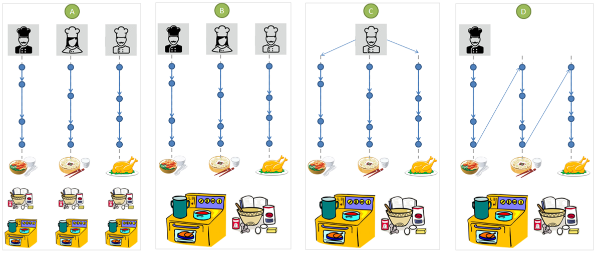
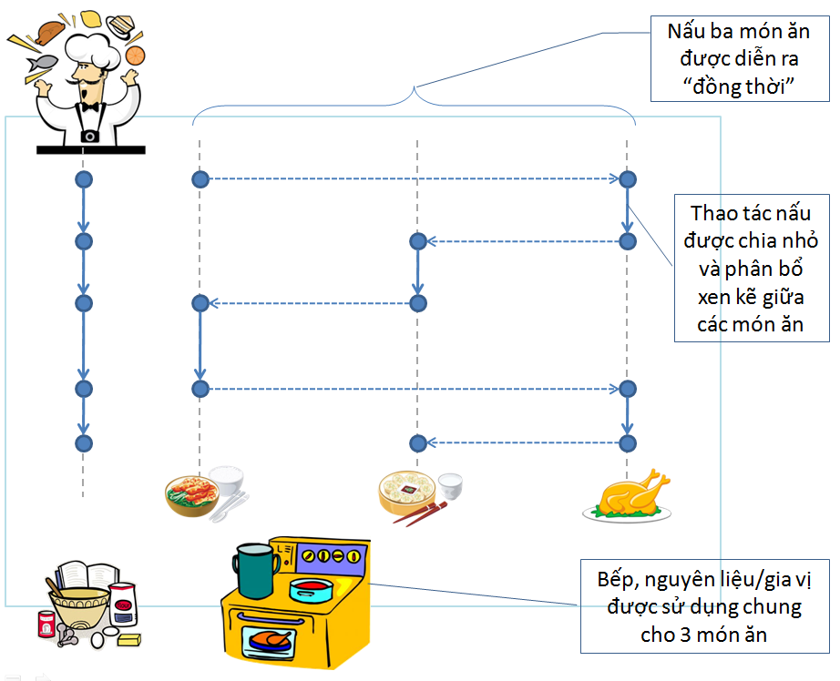
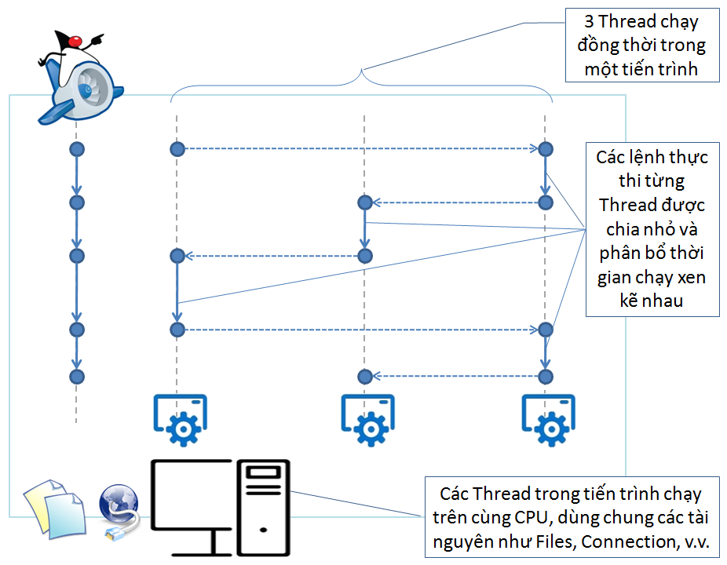

# Java concurrency
## git

```git
git commit -a -m "Change Java concurrency project"
```

### Pushing an Amended Commit
If you haven’t pushed the last commit yet to your remote, a single push is enough. Otherwise, you’ll have to push using the -f option since you’ve rewritten your commit history:
```git
git commit --amend --no-edit
git push
```

## Tổng quan về Java Concurrency

Tính toán đồng thời (Concurrency computing) là một trong các đặc trưng nổi bật đã tạo nên thế mạnh của ngôn ngữ Java. Nhờ có tính năng này, chúng ta có thể tạo ra các chương trình bằng Java xử lý nhiều nhiệm vụ cùng lúc, đồng thời tận dụng thời gian nhàn rỗi để tăng tốc độ và hiệu năng của chương trình.
Tính toán đồng thời là gì?

Tính toán đồng thời là quá trình xử lý nhiều nhiệm vụ được diễn ra trong cùng một khoảng thời gian. Khái niệm này trái ngược với tính toán tuần tự (Sequentially computing) là quá trình xử lý chỉ một nhiệm vụ trong mọi thời điểm, xong việc này mới bắt đầu xử lý việc tiếp theo. Một khái niệm khác có liên quan cũng cần phân biệt với Tính toán đồng thời, đó là khái niệm Tính toán song song (Parallel computing). Mặc dù cả hai khái niệm đều có ý nghĩa là xử lý nhiều nhiệm vụ cùng một lúc, tuy nhiên trong tính toán song song, hai lệnh thực thi cho hai nhiệm vụ khác nhau hoàn toàn độc lập với nhau và có thể xảy ra vào cùng thời điểm, trên hai máy tính hoặc bộ xử lý riêng biệt. Tính toán song song không thể thực hiện trên một máy tính chỉ có bộ xử lý đơn lõi được. Còn trong Tính toán đồng thời, về mặt tổng thể các nhiệm vụ diễn ra cùng nhau trong một khoảng thời gian chung, nhưng các lệnh xử lý các nhiệm vụ có khả năng phải thực thi xen kẽ nhau liên tiếp trên cùng một bộ vi xử lý đơn lõi trong một máy tính. Nói một cách đơn giản, Tính toàn đồng thời thực hiện nhiều nhiệm vụ cùng lúc, bằng những câu lệnh thực thi tuần tự.

Mặc dù mọi sự so sánh đều khập khiễn, tuy nhiên để dễ hình dung về các phương thức tổ chức xử lý dữ liệu theo kiểu tuần tự, đồng thời hoặc song song, chúng ta sẽ xem xét ví dụ minh họa sau để so sánh giữa các khái niệm trình bày ở trên. Giả sử một nhà hàng cần chuẩn bị 3 món ăn cho một bàn ăn khách đặt. Tùy theo quy mô và ràng buộc về thời gian thực hiện, nhà hàng đó có thể thực hiện theo các cách sau:

* Cách (A). Nhiều người nấu, mỗi người nấu một món, chế biến nguyên liệu và gia vị riêng biệt, thực hiện trong căn bếp riêng;
* Cách (B). Nhiều người nấu, mỗi người nấu một món, nhưng chế biến nguyên liệu và gia vị chung, trong một bếp chung;
* Cách (C). Một người nấu nhiều món cùng lúc, chế biến nguyên liệu và gia vị chung, trong một căn bếp;
* Cách (D). Một người nấu nhiều món, mỗi thời điểm chỉ nấu một món, nấu xong món này mới thực hiện món khác.



Nếu chúng ta tương ứng:

* Người nấu (đầu bếp) với chương trình phần mềm;
* Nấu một món ăn tương ứng với một nhiệm vụ cần xử lý;
* Nguyên liệu và gia vị tương ứng với dữ liệu (Tệp, kết nối mạng, …);
* Nhà bếp tương ứng với máy tính hoặc bộ xử lý.

Ta sẽ thấy có sự tương đồng giữa các cách thức tổ chức quá trình xử lý dữ liệu trong lập trình với cách thức tổ chức nấu ăn cho một bữa ăn. Thật vậy, cách (A) tương ứng với việc sử dụng nhiều chương trình, mỗi chương trình chạy trên nhiều máy tính hoặc bộ xử lý khác nhau, sử dụng dữ liệu tách biệt (có thể trùng lặp) để thực hiện riêng nhiệm vụ được giao. Trong lập trình, đây chính là Tính toán song song (Parallel Computing) theo mô hình MPMD (Multiple Program, Multiple Data).

Cách (B) tương ứng với cách tổ chức xử lý bằng cách sử dụng nhiều chương trình, mỗi chương trình xử lý một nhiệm vụ, tất cả chương trình sử dụng chung dữ liệu trên cùng một máy tính. Mô hình này chính là mô hình hệ điều hành đa nhiệm (Multitask Operating System) như Windows, Linux, MacOS mà chúng ta đã quen thuộc.

Cách (C) tương ứng với Tính toán đồng thời, trong đó một chương trình xử lý nhiều nhiệm vụ đồng thời theo cách chia nhỏ từng nhiệm vụ thành các thao tác, thực thi các thao tác (không phân biệt của nhiệm vụ nào) xen kẽ nhau trong khoảng thời gian được phân bổ hợp lý. Khái niệm “đồng thời” không áp dụng cho từng thao tác (tương ứng với lệnh thực thi trong máy tính), tức là không thể thực hiện các thao tác cùng một lúc (kiểu như người nấu ăn vừa băm thịt, vừa thái hành). Ở đây, khái niệm “đồng thời” được áp dụng cho nguyên cả nhiệm vụ, hiểu theo nghĩa có hai hay nhiều nhiệm vụ cùng “đang” trong quá trình được xử lý, nhưng các hành động cụ thể thực hiện các nhiệm vụ được diễn ra xen kẽ tuần tự (nhưng không đồng thời).



Cách (D) tương ứng với lập trình tuần tự, trong đó chương trình xử lý tuần tự hết nhiệm vụ này rồi mới bắt đầu xử lý nhiệm vụ khác. Mỗi thời điểm chỉ có một nhiệm vụ đang được xử lý.

Cũng với ví dụ trên, chúng ta có thể thấy cách (C) là dạng xử lý phổ biến nhất, giống như hàng triệu những người nội trợ hằng ngày nấu ăn theo cách này: một bữa ăn với nhiều món ăn, sử dụng chung nhiều nguyên liệu, và làm trong khuôn viên một căn bếp trong gia đình. Và đa số các bà nội trợ nấu nhiều món ăn “cùng lúc” để tận dụng thời gian nhàn rỗi lúc chờ đợi các món ăn được nấu chín cũng như kết hợp chuẩn bị nguyên liệu chung cho nhiều món ăn. Lưu ý các thao tác nấu ăn vẫn thực hiện tuần tự và xen kẽ lẫn nhau giữa các món.

### Lập trình đồng thời trong Java

Trong Java, lập trình đồng thời được thiết kế theo mô hình Multithreading (xử lý đa luồng), trong đó chương trình bao gồm nhiều Thread (luồng), mỗi Thread chạy theo các bước thực thi lệnh của riêng mình, nhưng tất cả các luồng đều có khả năng truy cập được bất kỳ đối tượng và tài nguyên của chương trình. Người lập trình phải chịu trách nhiệm trong việc phân bổ và phối hợp chính xác giữa các Thread trong việc truy cập (đọc/ghi) các đối tượng và tài nguyên chung. Điều này cũng giống như người đầu bếp phân chia và phối hợp các thao tác chế biến nấu cho nhiều món ăn một cách nhịp nhàng, chính xác để tránh nhầm lẫn nguyên liệu và gia vị, đồng thời tận dụng được thời gian nhàn rỗi của dụng cụ và bếp để đạt hiệu quả cao nhất.

Mỗi chương trình Java được chạy trên nền một máy ảo Java (Java Virtual Machine). Máy ảo Java là dạng Máy ảo tiến trình (Process Virtual Machine), do đó mỗi chương trình Java là một tiến trình của hệ điều hành. Hàm main() trong chương trình Java sẽ tạo ra Thread mặc định. Một chương trình Java đơn giản chỉ có một Thread được tạo ra từ hàm main(). Máy ảo Java cho phép chương trình Java có thể tạo ra nhiều Thread khác. Nếu muốn xử lý đồng thời nhiều nhiệm vụ, người lập trình phải viết mã lệnh để hàm main() gọi đến để tạo ra các Thread khác.



Để tạo ra Thread, người lập trình cần thực hiện các bước sau:

1. Định nghĩa lớp đối tượng chứa mã lệnh thực thi của Thread cần tạo, bằng một trong hai cách: a) tạo lớp con kế thừa trực tiếp từ lớp đối tượng java.lang.Thread; hoặc b) Tạo lớp đối tượng cài đặt Interface java.lang.Runnable.
2. Nạp đè (overriding) hàm run() kế thừa từ lớp java.lang.Thread hoặc giao diện java.lang.Runnable. Trong thân hàm run() viết mã lệnh cho nhiệm vụ mà mình muốn Thread thực hiện.
3. Bên trong hàm main (hoặc các phương thức mà hàm main() sẽ gọi đến), tạo đối tượng thể hiện (instance) của lớp Thread vừa tạo, sau đó gọi hàm start() để kích hoạt Thread.

Chương trình ví dụ minh họa được tạo ra như sau:

Lớp đối tượng SimpleThread định nghĩa một Thread đơn giản, chỉ hiển thị thông báo ra màn hình cửa sổ console:

```java
import java.util.Random;

public class SimpleThread extends Thread {
    
    private int n = 0;

    public SimpleThread(int k) {
        this.n = k;
    }
    
    public void run() {
        System.out.println("Thread#" + n + " is running...");
        try {
            Thread.sleep(new Random().nextInt(5000));
        } catch (InterruptedException e) {}
        System.out.println("Thread#" + n + " has been done!");
    }
}
```


Lớp đối tượng App chứa hàm main() là hàm tạo Thread mặc định của chương trình Java. Bên trong hàm main() có chứa lệnh tạo ra 5 Thread con, sau đó kích hoạt những Thread con này thực thi:

```java

public class App {
    public static void main( String[] args ) {
        Thread[] subThreads = new Thread[5];

        Thread mainThread = Thread.currentThread();
        System.out.println("Main thread's name:" + mainThread.getName());

        for(int i=0; i<subThreads.length; i++) {
            subThreads[i] = new SimpleThread(i);
        }

        System.out.println("Start sub-threads:");
        for(int i=0; i<subThreads.length; i++) {
            subThreads[i].start();
        }

        System.out.println("Main thread has been done!");
    }
}
```
