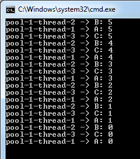

# Java Concurrency: Scheduling Tasks to Execute After a Given Delay or Periodically
This Java Concurrency tutorial guides you how to schedule tasks to execute after a given delay or to execute periodically using a ScheduledExecutorService object in the java.util.concurrent package.

The ScheduledExecutorService interface defines convenient methods for scheduling tasks:

* schedule(Callable<V> callable, long delay, TimeUnit unit): executes a Callable task after the specified delay.
* schedule(Runnable command, long delay, TimeUnit unit): Executes a Runnable task after a given delay.
* scheduleAtFixedRate(Runnable command, long initialDelay, long delay, TimeUnit unit): Executes a periodic task after an initial delay, then repeat after every given period. If any execution of this task takes longer than its period, then subsequent executions may start late, but will not concurrently execute.
* scheduleWithFixedDelay(Runnable command, long initialDelay, long delay, TimeUnit unit): Executes a periodic task after an initial delay, then repeat after every given delay between the termination of one execution and the commencement of the next.

All these methods return a ScheduleFuture object which is a Future with an additional method for checking the remaining delay time:

```java
long getDelay(TimeUnit unit)
```
The TimeUnit can be in NANOSECONDS, MILLISECONDS, SECONDS, MINUTES, HOURS, and DAYS.

And a ScheduledExecutorService object can be created via factory methods of the Executors utility class:

* newScheduledThreadPool(int poolSize): creates a thread pool that can schedule tasks to execute concurrently.
* newSingleThreadScheduledExecutor(): creates a single-threaded executor that can schedule tasks to execute sequentially.

Now, let’s see some examples.

## 1. Scheduling a Task to Execute After a Given Delay
Submit a task to a single-threaded scheduled executor with a delay time. Here’s the idiom:

```java
scheduler = newSingleThreadScheduledExecutor();
scheduler.schedule(task, delayTime, timeUnit);
```
The following program is a simple example that executes a task after 5 seconds:

```java
import java.util.concurrent.*;
 
/**
 * SimpleScheduledExecutorExample.java
 *
 * This program demonstrates how to schedule a task to execute after
 * a given delay.
 *
 * @author www.codejava.net
 */
public class SimpleScheduledExecutorExample {
    public static void main(String[] args) {
        ScheduledExecutorService scheduler
                            = Executors.newSingleThreadScheduledExecutor();
 
        Runnable task = new Runnable() {
            public void run() {
                System.out.println("Hi!");
            }
        };
 
        int delay = 5;
        scheduler.schedule(task, delay, TimeUnit.SECONDS);
        scheduler.shutdown();
    }
}
```
As you can see, this program simply prints the message “Hi!” after a delay of 5 seconds, and then terminates.

And the following program demonstrates how to schedule a Callable task that returns a value:

```java
import java.util.concurrent.*;
 
/**
 * CallableScheduledExecutorExample.java
 *
 * This program demonstrates how to schedule a Callable task to execute after
 * a given delay, and wait for the result becomes available.
 *
 * @author www.codejava.net
 */
public class CallableScheduledExecutorExample {
    public static void main(String[] args) {
 
        ScheduledExecutorService scheduler
                            = Executors.newSingleThreadScheduledExecutor();
 
        Callable<Integer> task = new Callable<Integer>() {
            public Integer call() {
                // fake computation time
                try {
                    Thread.sleep(5000);
                } catch (InterruptedException ex) {
                    ex.printStackTrace();
                }
 
                return 1000000;
            }
        };
 
        int delay = 5;
 
        Future<Integer> result = scheduler.schedule(task, delay, TimeUnit.SECONDS);
 
        try {
 
            Integer value = result.get();
 
            System.out.println("value = " + value);
 
        } catch (InterruptedException | ExecutionException ex) {
            ex.printStackTrace();
        }
 
        scheduler.shutdown();
    }
}
```
Run this program and you will see the result after 10 seconds because the task is delayed to start after 5 seconds, and it takes another 5 seconds to do the computation and return the value.

 

## 2. Scheduling a Task to Execute at a Fixed Rate
Submit a task to a single-threaded scheduled executor with an initial delay time and the periodic delay time. Here’s the idiom:

```java
scheduler = newSingleThreadScheduledExecutor();
scheduler.scheduleAtFixedRate(task, initialDelayTime, periodicDelayTime, timeUnit);
```
For example, the following program plays a sound ‘beep’ for every 2 seconds:

```java
import java.util.concurrent.*;
 
/**
 * BeepClock.java
 *
 * This program demonstrates how to schedule a task to execute after
 * an initial delay, and repeat after a fixed rate.
 *
 */
public class BeepClock implements Runnable {
 
    public void run() {
        System.out.print("\007");
    }
 
    public static void main(String[] args) {
        ScheduledExecutorService scheduler
                            = Executors.newSingleThreadScheduledExecutor();
 
 
        Runnable task = new BeepClock();
        int initialDelay = 4;
        int periodicDelay = 2;
 
        scheduler.scheduleAtFixedRate(task, initialDelay, periodicDelay,
                                                        TimeUnit.SECONDS);
    }
}
```

Notice that, with the execution of periodic tasks, do not call shutdown() on the executor because it causes the program to terminate immediately.

## 3. Scheduling Multiple Tasks to Execute Concurrently at a Fixed Delay
Submit a task to a scheduled thread pool executor with an initial delay time and the periodic delay time. Here’s the idiom:

```java
scheduler = newScheduledThreadPool();
scheduler.scheduleWithFixedDelay(task1, initialDelayTime1, periodicDelayTime1, timeUnit);
scheduler.scheduleWithFixedDelay(task2, initialDelayTime2, periodicDelayTime2, timeUnit);
scheduler.scheduleWithFixedDelay(task3, initialDelayTime3, periodicDelayTime3, timeUnit);
```
For example, the following program uses a pool of 3 threads to schedule 3 countdown clocks to execute concurrently:

```java
import java.util.concurrent.*;
 
/**
 * ConcurrentScheduledTasksExample.java
 *
 * This program demonstrates how to schedule multple tasks to execute after
 * a given delay, and execute periodically after a fixed delay.
 *
 * @author www.codejava.net
 */
 public class ConcurrentScheduledTasksExample {
 
    public static void main(String[] args) {
 
        ScheduledExecutorService scheduler = Executors.newScheduledThreadPool(3);
 
        CountDownClock clock1 = new CountDownClock("A");
        CountDownClock clock2 = new CountDownClock("B");
        CountDownClock clock3 = new CountDownClock("C");
 
        scheduler.scheduleWithFixedDelay(clock1, 3, 10, TimeUnit.SECONDS);
        scheduler.scheduleWithFixedDelay(clock2, 3, 15, TimeUnit.SECONDS);
        scheduler.scheduleWithFixedDelay(clock3, 3, 20, TimeUnit.SECONDS);
 
    }
}
```
Here, you can see 3 clocks A, B and C are scheduled to start at the same time, after an initial delay of 3 seconds, but their periodic delay times are different.

Here’s the code of the countdown clock:

```java
/**
 * CountDownClock.java
 *
 * This class represents a coutdown clock.
 *
 * @author www.codejava.net
 */
public class CountDownClock extends Thread {
    private String clockName;
 
    public CountDownClock(String clockName) {
        this.clockName = clockName;
    }
 
    public void run() {
        String threadName = Thread.currentThread().getName();
 
        for (int i = 5; i >= 0; i--) {
 
            System.out.printf("%s -> %s: %d\n", threadName, clockName, i);
 
            try {
                Thread.sleep(1000);
            } catch (InterruptedException ex) {
                ex.printStackTrace();
            }
        }
    }
}
```
The following screenshot shows output of the program above:



## 4. Cancelling a Scheduled Task
You can use the returned ScheduleFuture object to cancel a scheduled task like this:

```java
Future<?> future = scheduler.scheduleWithFixedDelay(…);
boolean mayInterruptIfRunning = true;
future.cancel(mayInterruptIfRunning);
```
The boolean flag mayInterruptIfRunning specifies whether the thread executing the task should be interrupted or not.

For example, the following is an updated version of the program above. It stops the 3 clocks after 2 minutes, by using another scheduled task:

```java
import java.util.concurrent.*;
 
/**
 * ConcurrentScheduledTasksExampleWithCancel.java
 *
 * This program demonstrates how to schedule multiple tasks to execute after
 * an initial delay, and repeat after a fixed delay.
 * And all tasks are cancelled after a specified time.
 *
 * @author www.codejava.net
 */
public class ConcurrentScheduledTasksExampleWithCancel {
    public static void main(String[] args) {
        ScheduledExecutorService scheduler = Executors.newScheduledThreadPool(3);
 
        CountDownClock clock1 = new CountDownClock("A");
        CountDownClock clock2 = new CountDownClock("B");
        CountDownClock clock3 = new CountDownClock("C");
 
        Future<?> f1 = scheduler.scheduleWithFixedDelay(clock1, 3, 10, TimeUnit.SECONDS);
        Future<?> f2 = scheduler.scheduleWithFixedDelay(clock2, 3, 15, TimeUnit.SECONDS);
        Future<?> f3 = scheduler.scheduleWithFixedDelay(clock3, 3, 20, TimeUnit.SECONDS);
 
        Runnable cancelTask = new Runnable() {
            public void run() {
                f1.cancel(true);
                f2.cancel(true);
                f3.cancel(true);
            }
        };
 
        scheduler.schedule(cancelTask, 120, TimeUnit.SECONDS);
 
    }
}
```


Recompile and run the program again and observe the result.

@see <a href="https://www.codejava.net/java-core/concurrency/java-concurrency-scheduling-tasks-to-execute-after-a-given-delay-or-periodically">https://www.codejava.net/java-core/concurrency/java-concurrency-scheduling-tasks-to-execute-after-a-given-delay-or-periodically</a>


