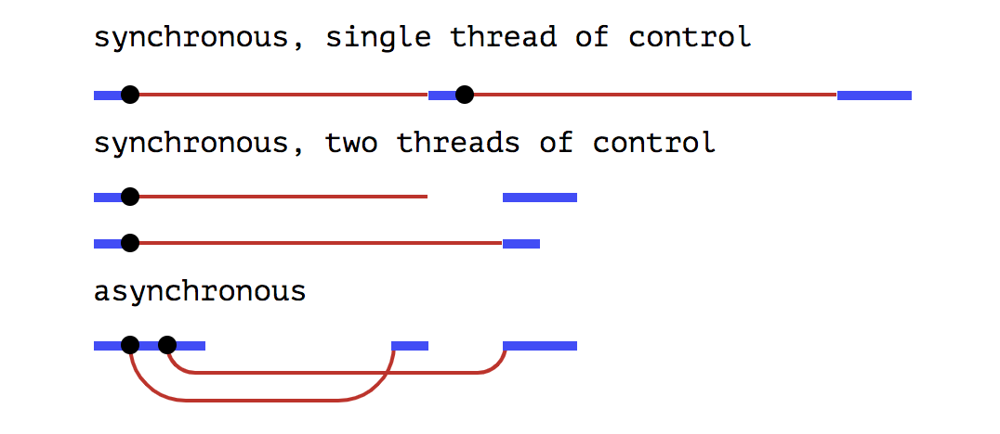

# CompletableFuture : A new era of asynchronous programming

<i>Asynchronous programming</i> is a form of parallel programming that allows a unit of work to run separately from the primary application thread. When the work is complete, it notifies the main thread (as well as whether the work was completed or failed).

On the other hand, In a synchronous programming model, things happen one at a time. When we call a function that performs a long-running action, it blocks our program for the time that action takes and returns as well as unblocks the primary application thread only when the action has finished and it can return the result.

Waiting for actions to finish is implicit in the synchronous model, while it is explicit, under our control, in the asynchronous one.



There are different ways to implement asynchronous programming in Java using any of the below mechanisms e.g. Futures, ExecutorService, CompletionService, Callback interfaces, ThreadPools etc.

But Java 8 has introduced a new feature called CompletableFuture which can be extensively used in case of implementation of asynchronous programming in Java.

## What is CompletableFuture and how is it different from Future:

According to Oracle documentation, a CompletableFuture is a Future that may be explicitly completed (setting its value and status), and may be used as a CompletionStage, supporting dependent functions and actions that trigger upon its completion.

When two or more threads attempt to complete, completeExceptionally, or cancel a CompletableFuture, only one of them succeeds.

CompletableFuture class belongs to the java.util.concurrent package.

### Signature:

```java
public class CompletableFuture<T>
extends Object
implements Future<T>, CompletionStage<T>
```

CompletableFuture implements Future and CompletionStage interfaces and provides a huge set of convenience methods for creating, chaining and combining multiple Futures. It also has a very comprehensive exception handling support. CompletableFuture overcomes below limitations of Future:

* Futures can not be explicitly completed even when it has encountered an exception scenario.
* Future provides a get() method which blocks until the result is available. further action can not be performed on a Future’s result without blocking the primary application thread.
* Asynchronous workflows can not be created by chaining multiple Futures together.
* Futures which are running in parallel, can not be combined together.
* Future API does not have any exception handling construct.

## Implementation of CompletableFuture:

### How to start:

We can create an instance of CompletableFuture class with a no-arg constructor to represent some future result. The simplest forward step would be to hand it out to the consumers and complete it at some time in the future using the CompletableFuture.complete() method.

We can try to get the result of this CompletableFuture using CompletableFuture.get() method, the get() method blocks until the Future is complete.

### CompletableFuture.runAsync() :

If we want to run some background task asynchronously and do not want to return anything from that task, that is an ideal use-case of CompletableFuture.runAsync() method. It takes a Runnable object and returns CompletableFuture<Void>.

```java
private static void completableFutureRunAsync() throws ExecutionException,
			InterruptedException {

		System.out.println("Run async a Runnable in a Completable Future...");

		// Run a task specified by a Runnable Object asynchronously.
		CompletableFuture<Void> future = CompletableFuture
				.runAsync(ConcurrencyUtil
						.createRunnableTask(
								"i'm an async runnable running in a completable future",
								5000));

		// Block and wait for the future to complete - nothing is returned
		System.out.println(future.get());

		System.out.println("------------------------------");
	}
```

The Runnable object can also be passed in the form of a lambda expression:

```java
private static void completableFutureRunAsyncWithLambda()
			throws ExecutionException, InterruptedException {

		System.out.println("Run async a Runnable in a Completable Future...");

		// Run a task specified by a Runnable Object asynchronously.
		CompletableFuture<Void> future = CompletableFuture
				.runAsync(() -> {
					try {
						System.out.println(String
								.format("%s: %s", Thread.currentThread()
										.getName(),
										"i'm an async runnable running in a completable future"));
						TimeUnit.MILLISECONDS.sleep(5000);
					} catch (InterruptedException e) {
						e.printStackTrace();
					}
				});

		// Block and wait for the future to complete - nothing is returned
		System.out.println(future.get());

		System.out.println("------------------------------");
	}
```


### CompletableFuture.supplyAsync() :

On contrary to the above use-case, if we want to run some background task asynchronously and want to return anything from that task, we should use CompletableFuture.supplyAsync(). It takes a Supplier<T> and returns CompletableFuture<T> where T is the type of the value obtained by calling the given supplier.

A Supplier<T> is a simple functional interface which represents a supplier of results. It has a single get() method where we can write our background task and return the result.

