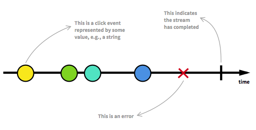
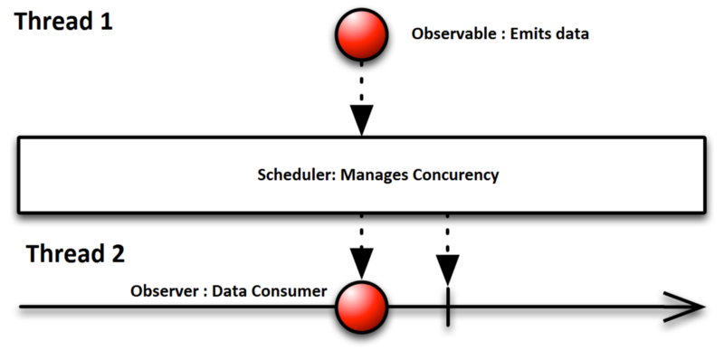
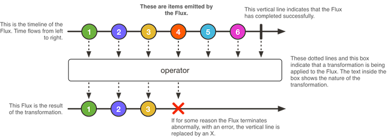
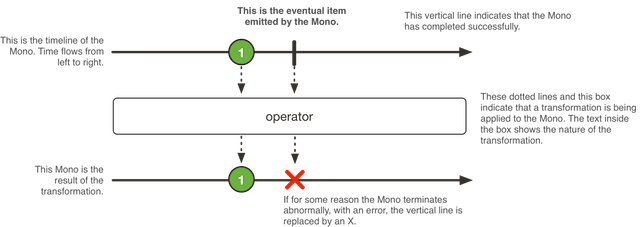
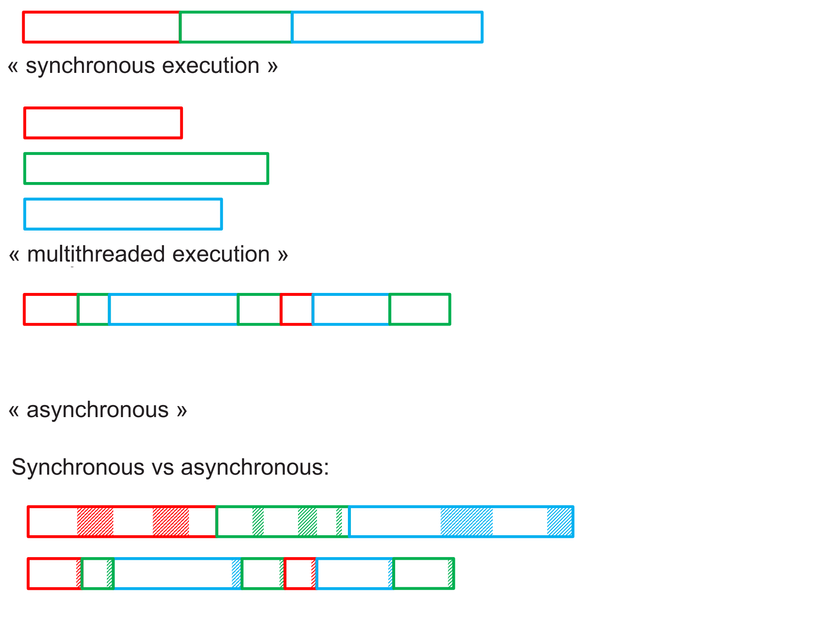

# Asynchronous
## Giới thiệu Reactive Programming với Reactor
### Giới thiệu
Các ứng dụng hiện nay yêu cầu một tốc độ phản hồi cao để nâng cao trải nghiệm người dùng, giúp hệ thống mượt mà, linh hoạt, không bị đóng băng luồng. Các yêu cầu này cũng là kết quả hướng tới khi chúng ta sử dụng mô hình lập trình theo Reactive Programming.

Trong bài viết này, chúng ta sẽ cố gắng làm sáng tỏ mô hình lập trình này thông qua một số khái niệm Synchronous và Asynchronous , Blocking và Non-Blocking trước.

### Synchronous và Asynchronous
Synchronous (Xử lý đồng bộ): là xử lý mà chương trình sẽ chạy theo từng bước, nghĩa là thực hiện xong đoạn code trên mới tới đoạn code kế tiếp và sẽ theo thứ tự từ trên xuống dưới, từ trái qua phải. Đây cũng là nguyên tắc cơ bản mà các bạn đã được học.

Asynchronous (Xử lý bất đồng bộ): Ngược lại với xử lý đồng bộ, nghĩa là chương trình có thể hoạt động nhảy cóc, function phía dưới có thể hoạt động mà không cần phải chờ function hay một đoạn code nào đó phía trên thực hiện xong. Dưới đây là minh họa cho việc làm việc với dữ liệu đồng bộ và bất đồng bộ :


Như ta thấy nếu các công việc không liên quan đến nhau thì bất đồng bộ giúp ta tiết kiệm thời gian xử lý hơn và mang lại cho người dùng trải nghiệm tốt hơn.

### Blocking và Non-Blocking
Chúng ta có thể hiểu một cách đơn giản khi chúng ta muốn lấy một danh sách Student.

Lập trình theo mô hình Blocking thì phải chờ đợi chương trình thực hiện lấy tất cả Student rồi mới thực hiện các thao tác tiếp theo, hay được gọi là bị đóng băng luồng chờ quá trình đóng gói tất cả Student hoàn tất. Do đó sẽ dẫn tốn thời gian chờ đợi nếu số lượng danh sách rất lớn.

Lập trình theo mô hình Non-Blocking thì hoạt động ngược lại, không cần phải chờ đợi hoàn thiện cả danh sách Student mà với mỗi Student nào được đưa ra thì thực hiện thao tác luôn với nó. Điều này dẫn tới không bị đóng băng luồng, kể cả số lượng danh sách lớn.

### Reactive Programming
Nói một cách ngắn gọn, Reactive Programming là mô hình lập trình mà ở đó dữ liệu được truyền tải dưới dạng luồng ( stream). Mô hình này dựa trên nguyên tắc Asynchronous và Non-Blocking để làm việc với dữ liệu.

Dưới đây là một số khái niệm mà bạn cần phải biết khi làm việc với mô hình này:

* <b>Publisher</b>: Là nhà cung cấp dữ liệu, hoặc là nơi phát ra nguồn dữ liệu.

* <b>Subscriber</b>: Lắng nghe Publisher, yêu cầu dữ liệu mới. Hay được gọi Là người tiêu thụ dữ liệu.

* <b>Backpressure</b>: Là khả năng mà Subscriber cho phép Publisher có thể xử lý bao nhiêu yêu cầu tại thời điểm đó. Bởi vì Subscriber chịu trách nhiệm về luồng dữ liệu, không phải Publisher vì nó chỉ cung cấp dữ liệu.

* <b>Stream</b>: Luồng dữ liệu bao gồm các dữ liệu trả về , các lỗi xảy ra và luồng này phải là luồng bất đồng bộ.

Như vậy dữ liệu của chúng ra sẽ được chuyển thành một dòng (data stream) do đó tránh được việc bị blocking và các dữ liệu phát ra thì đều được subcriber lắng nghe dẫn đến quá trình xử lý và báo lỗi diễn ra một cách đơn giản hơn.

### Reactive programming là gì?

Có rất nhiều giải thích định nghĩa rườm rà khó hiểu. Wikipedia quá chung và lý thuyết, . Stackoverflow có câu trả lời rõ ràng nhưng không phù hợp với người mới bắt đầu.v.v.. Vì vậy tôi cắt bớt lại như sau :

>Reactive programming is programming with asynchronous data streams

Ở khái niệm trên chúng ta cần chú ý đến 2 điểm quan trọng Stream & Ansynchronous

* Stream : Khi thực hiện 1 task bất kỳ thường chúng ta chỉ quan tâm đến 3 yếu tố :

 * Giá trị trả về từ task đó (Data)
 * Thông báo lỗi (Erro nếu có)
 * Thời điểm task finish (Completed)

Khi lập trình đồng bộ (synchronous) việc xác định 3 yếu tố trên không khó khăn, nhưng khi lập trình bất đồng bộ (asynchronous) việc xác định 3 yếu tố này là không hề dễ dàng. Như vậy để giải quyết vấn đề này ta cần có 1 cơ chế giúp xác định được 3 yếu tố trên cả khi lập trình đồng bộ & bất đồng bộ. Funtion Reactive Programming giải quyết vấn đề này bằng cách sử dụng stream để truyền tải dữ liệu: nó có thể sẽ emit ra 3 thứ : 1 value, 1 error, 1 completed (tín hiệu kết thúc 1 task ) theo 1 trình tự thời gian từ nơi phát ra (Producer) tới nơi lắng nghe (Subscriber).



### Tại sao nên dùng nó?

* Nếu chỉ dừng lại ở đó thì FRP cũng không có gì đặc biệt, điều tạo nên sức mạnh của FRP là việc áp dụng functional programming cho phép filter (filter, take, scan, …), chuyển đổi từ stream này qua stream khác (map, flatMap, reduce), hoặc merge nhiều stream thành một stream mới (combine, merge, zip, …) khá dễ dàng mà không làm thay đổi trạng thái của stream ban đầu.
* Việc sử dụng FRP sẽ cải thiện được trải nghiệm người dùng, khi chúng ta muốn ứng dụng phản hồi nhanh hơn.Lợi ích tiếp theo là giúp hạn chế lưu trữ, quản lý các state trung gian. Trong ví dụ clickStream trên, nếu như sử dụng cách lập trình thông thường, thì phải khai báo rất nhiều biến (state) để lưu trữ các bước trung gian. Ví dụ: timer, click count collection, … Trong FRP, các bước này là không cần thiết nhờ khả năng chuyển đổi stream (map, flatMap, reduce, ….).
* Một điểm mạnh khác của RP là giúp cho việc xử lý lỗi trong lập trình bất đồng bộ nhẹ nhàng hơn rất nhiều. Nếu bạn nào từng handle error khi lập trình bất đồng bộ, multiple thread, thì sẽ thấy việc này không hề dễ dàng. RP giúp tách biệt việc xử lý lỗi với logic. Việc này giúp cho code trong sáng hơn rất nhiều.

### Rx
Rx được tạo thành từ 3 điểm chính
>**RX = OBSERVABLE + OBSERVER + SCHEDULERS**

* Observable : Hiểu đơn giản nó là một nhà cung cấp,là nguồn chứa dữ liệu, thông thường nó sẽ xử lý và bắt đầu cung cấp dữ liệu cho các compent khác lắng nghe nó. Một Observable có thể phát ra bất kỳ số lượng item nào (including zero item), hoặc nó có thể chấm dứt với một message thành công hoặc lỗi.
* Observers : Observable là nhà cung cấp thì Observer là nơi tiêu thụ dữ liệu của nhà cung cấp Observable emitted. Việc đầu tiên để nhận được dữ liệu từ Observable nó sẽ đăng ký (subscibe) bằng cách sử dụng phương thức subscibeOn(), khi đó bất cứ khi nào observable phát ra dữ liệu thì tất cả các Observers đăng kí sẽ nhận được dữ liệu trong onNext() callback, trong hàm này chúng ta có thể thực hiện các thao tác khác nhau ví dụ phân tích cú pháp JSON reponse, hoặc update UI. Nếu có 1 error được ném ra từ Observable thì Observer đăng kí sẽ nhận được lỗi trong onError().
* Schedulers : Như ở trên ta đã biết được khái niệm Rx là lập trình bất đồng bộ (asynchronous) bởi vậy chúng ta cần phải quản lý được thread. Chính vì vậy Rx cung cấp Scheduler là thành phần để cho Observable & Observers biết được nên chạy trên thread nào. Bạn có thể dùng observeOn() để giao tiếp tới observers,ngoài ra có thể sử dụng scheduleOn() để giao tiếp với Observable, điều đó chỉ ra rằng nó sẽ nên chạy trên thread nào. Mặc định thread cung cấp trong RxJava như là Schedulers.newThread() sẽ tạo mới 1 thread chạy dưới dạng background, còn Schedulers.io() sẽ thực thi mã trên IO thread.

### Các bước đơn giản để sử dụng Rx trong ứng dụng



* Bước 1 : Tạo observable emit data

```java
Observable<String> database = Observable      //Observable. This will emit the data
                .just(new String[]{"1", "2", "3", "4"});    //Operator
```

Ở đây database là 1 Observable để phát ra dữ liệu. Trong trường hợp này nó phát ra dữ liệu bằng cách sử dụng strings.just() là 1 operator

* Bước 2 : Tạo observers để tiêu thụ dữ liệu

```java
Observer<String> observer = new Observer<String>() {
           @Override
            public void onCompleted() {
                //...
            }

            @Override
            public void onError(Throwable e) {
                //...
            }

            @Override
            public void onNext(String s) {
                //...
            }
        };
```

Trong đoạn code trên observer nhận dữ liệu được phát ra bởi Observable trong hàm onNext() và sử dụng nó, nếu có lỗi ở Observable chúng ta có thể bắt được trong onError() của observer.

* Bước 3 : Manage concurrency

```java
database.subscribeOn(Schedulers.newThread())          //Observable runs on new background thread.
        .observeOn(AndroidSchedulers.mainThread())    //Observer will run on main UI thread.
        .subscribe(observer);                         //Subscribe the observer
```

Trong bước cuối cùng này, chúng ta sẽ xác định việc Observable và Observer chạy trên thread nào để quản lý.subscribeOn(Schedulers.newThread()) xác định database observable chạy trên một background thread mới được tự động tạo ra. Còn lại observeOn(AndroidSchedulers.mainThread()) yêu cầu observer chạy trên mainthread. Đây là những gì cơ bản nhât về Reactive programming.

### Reactor
Reactor là một nền tảng để ta triển khai việc lập trình theo phong cách reactive programming. Nó được tích hợp trực tiếp với Java 8 funcion APIs như CompletableFuture, Stream, Duration.

Reactor cung cấp 2 loại về Publisher :

* Flux: là một steam phát ra từ 0...n phần tử.



* Mono: là một steam phát ra từ 0...1 phần tử.



Vậy là các bạn có thể hiểu được Reactive Programming phải không nào. 

## Java 8 với CompletableFuture
### I. Thế nào là Asynchronous 
Giả sử chúng ta có 3 task cần phải thực hiện. ví dụ: T1; T2 và T3 Cách đơn giản nhất chúng ta thực hiện chúng đó là T1 >> T2 >> T3 (Thực hiện tuần tự, làm T1 xong rồi làm đến T2, hết T2 rồi làm tiếp T3). Cách này gọi là synchronous execution (thực hiện đồng bộ)

Cách thứ hai đó là chúng ta thực hiện chúng đồng thời với nhau T1 >> T2 >> T3 >> multithreaded execution (thực hiện đa luồng)

Giờ đây trên java 8, chúng ta được cung cấp thêm một cách thức thứ 3 nữa để thực hiện việc này đó là asynchronous

>T1(part 1) >> T2(part 1) >> T3(part 1) >> T1(part 2) >> T2(part 2) >> T3(part 2)



### II. Thực hiện Asynchronous trên Java 

Ví dụ:

```java
queryEngine.select("select user from User")
.forEach(user -> System.out.prinln(user)) ;
```

Chúng ta có thể sử dụng ExecutorService

```java
Callable<String> task = () -> "select user from User" ;
Future<String> future = executorService.submit(task) ;
List<User> users = future.get() ; // blocking
users.forEach(System.out::println) ;
```

Nhược điểm của cách này là khi chúng ta lấy kết quả trả về, vẫn có đoạn code bị block lại trên main thread.

Giờ đây trên java 8, chúng ta có thể sử dụng CompletionStage / CompletableFuture (CompletionStage là interface, CompletableFuture là class implement java 8 cung cấp) để implement đoạn code trên như sau:

```java
CompletableFuture<Void> completableFuture = CompletableFuture.runAsync(() -> {
    queryEngine.select("select user from User")
}, executor);
```

get data

```java
completableFuture.thenRun(users -> {
    users.forEach(System.out::println) 
});
```

CompletionStage là một mô hình cho một nhiệm vụ:

* thực hiện một hành động có thể trở lại một giá trị khi một hành động khác hoàn thành
* có thể kích hoạt các nhiệm vụ khác Vì vậy CompletionStage là một phần của Chain (chuỗi)

Ưu điểm của CompletionStage là giúp ta dễ dàng kết hợp giữa các task vs nhau, kết hợp nhiều kiểu 

1 - 1 (sau khi thực hiện T1, thực hiện T2)

```java
public <U> CompletionStage<U> thenApply(Function<? super T,? extends U> fn);

public CompletionStage<Void> thenRunAsync(Runnable action, Executor executor);

public CompletionStage<Void> thenComposeAsync(Function<? super T, ? extends CompletionStage<U>> fn);
```

2 - 1 (sau khi thực hiện T1, T2 thực hiện T3)

```java
public <U, V> CompletionStage<V> thenCombineAsync(CompletionStage<U> other, BiFunction<T, U, V> function) ;

public <U> CompletionStage<Void> thenAcceptBoth(CompletionStage<U> other, BiConsumer<T, U> action) ;

public CompletionStage<Void> runAfterBothAsync(CompletionStage<?> other, Runnable action, Executor executor) ;
```

Một ví dụ khác cho việc phân tích một trang HTML và hiển thị link page có trên trang đó

```java
CompletableFuture.supplyAsync(
    () -> readPage("http://whatever.com/")  // đọc source code từ trang html
)
.thenApply(Parser::getLinks) // sau đó lấy những link xuất hiện trên đó
.thenAcceptAsync(
    DisplayPanel::display, // thành công thì hiển thị trang
    SwingUtilities::invokeLater // chạy trên thread do SwingUtilities invoke vào main thread.
) ;
```

### III. Unit Test

```java
public class HomeController extends Controller {

public CompletionStage<Result> edit(Long id) {

   CompletionStage<Map<String, String>> companiesFuture = companyRepository.options();

   return computerRepository.lookup(id).thenCombineAsync(companiesFuture, (computerOptional, companies) -> {
       Computer c = computerOptional.get();
       Form<Computer> computerForm = formFactory.form(Computer.class).fill(c);
       return ok(views.html.computer.editForm.render(id, computerForm, companies));
   }, httpExecutionContext.current());
}
```

Method Test

```java
ComputerRepository computerRepository = mock(ComputerRepository.class);

   @Override
   protected Application provideApplication() {
       return new GuiceApplicationBuilder().overrides(bind(ComputerRepository.class).toInstance(computerRepository)).build();
   }

   @Test
   public void edit() {
       final ComputerRepository computerRepository = app.injector().instanceOf(ComputerRepository.class);
       CompletionStage/<Optional<Computer>> computer = CompletableFuture.supplyAsync(()->{
           return Optional.of(new Computer());
       });
       when(computerRepository.lookup(21L)).thenReturn(computer);
       final CompletionStage<Optional<Computer>> stage = computerRepository.lookup(21L);

       Result result = route(app, controllers.routes.HomeController.edit(21L));
       assertThat(result.status()).isEqualTo(OK);
   }

}
```

### IV. Tổng kết 

CompletionStage/CompletableFuture giúp chúng ta thực hiện việc lập trình bất đồng bộ một cách dễ dàng hơn, giờ đây chúng ta có thể coi các Task như một thành phần của chương trình. Có thể sử lý thứ tự thự hiện, điều kiện để thực hiện Task một cách linh hoạt, mềm dẻo hơn.
