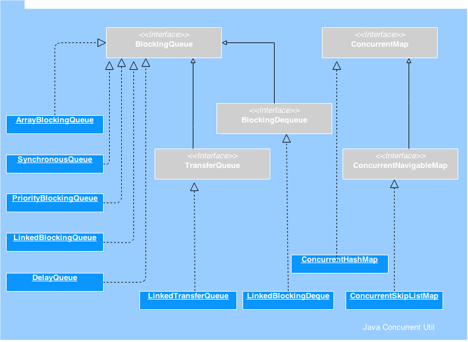

# Java Concurrent Collections
java.util.concurrent package is to enable developers write better concurrent Java applications. This concurrent package includes some additions to the Java Collections Framework. These are called as Java Concurrent Collections.

I have been writing a tutorial series about those classes in the past few weeks. This article is a summary and index of those Java concurrent collection classes. Those collections classes can be classified as Queue based and Map based.

Java Concurrent Collection Classes

* BlockingQueue – an interface that is at the base of all Queue based concurrent collections. While adding an element to a BlockingQueue, if there is no space it can wait till it becomes available and when retrieving, it will wait till an element is available if it is empty.
* ArrayBlockingQueue – a blocking queue class based on bounded Java Array. Once instantiated, cannot be resized.
* SynchronousQueue – a blocking queue class with capacity of zero always.
* PriorityBlockingQueue – a priority queue based blocking queue. It is an unbounded concurrent collection.
* LinkedBlockingQueue – an optionally bounded Java concurrent collection. Orders elements based on FIFO order.
* DelayQueue – a queue where only delay expired elements can be taken out. Its an unbounded concurrent collection.
* BlockingDeque – an interface that extends BlockingQueue and adds the operations of Deque.
* LinkedBlockingDeque – an implementation class of BlockingDequeue.
* TransferQueue – a Java concurrent collection interface that extends BlockingQueue and adds method where the producer will wait for the consumer to receive elements.
* LinkedTransferQueue – an implementation class of TransferQueue.
* ConcurrentMap – a Java concurrent collection interface and a type of Map which provides thread safety and atomicity guarantees.
* ConcurrentHashMap – an implementation class of ConcurrentMap.
* ConcurrentNavigableMap – a Java concurrent collection interface that extends ConcurrentMap and adds operations of NavigableMap.
* ConcurrentSkipListMap – an implementation class of ConcurrentNavigableMap.
