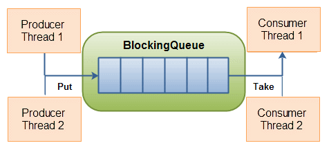
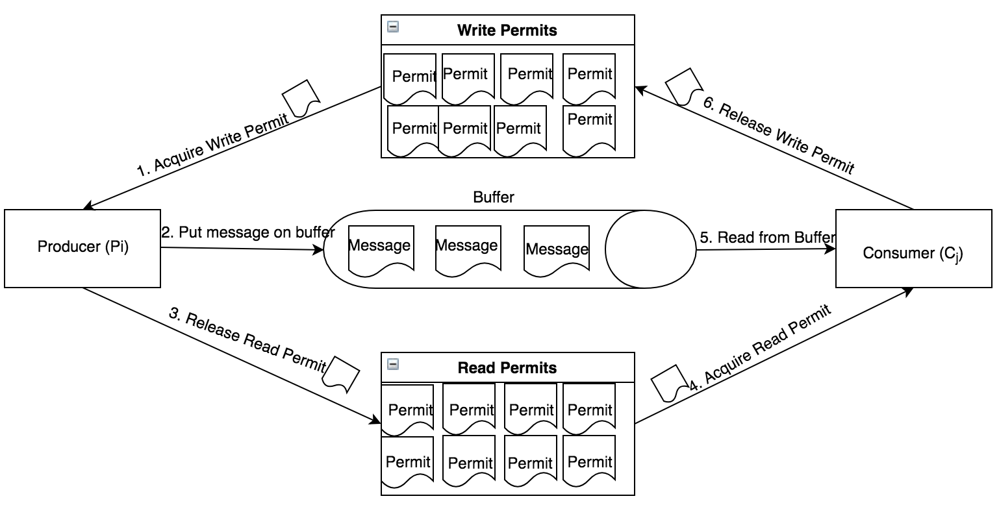

# Vấn đề Người sản xuất (Producer) – Người tiêu dùng (Consumer) và đồng bộ hóa các luồng trong Java
Producer/ Consumer là một ví dụ kinh điển về vấn đề đồng hóa các luồng (multi-threading synchronization). Trong bài này tôi sẽ giới thiệu với các bạn vấn đề này và cách giải quyết để giúp các bạn hiểu rõ hơn về Java concurrency và mutli-threading.

## Mô tả vấn đề Producer/ Consumer
Vấn đề mô tả hai đối tượng nhà sản xuất (Producer) và người tiêu dùng (Consumer), cả hai cùng chia sẻ một bộ đệm có kích thước cố định được sử dụng như một hàng đợi (queue).

* Producer: công việc của nhà sản xuất là tạo dữ liệu, đưa nó vào bộ đệm và bắt đầu lại.
* Consumer: công việc người tiêu dùng là tiêu thụ dữ liệu (nghĩa là loại bỏ nó khỏi bộ đệm), từng phần một và xử lý nó.
* Consumer và Producer hoạt động song song với nhau.

Vấn đề là đảm bảo rằng nhà sản xuất không thể thêm dữ liệu vào bộ đệm nếu nó đầy và người tiêu dùng không thể xóa dữ liệu khỏi bộ đệm trống, đồng thời đảm bảo an toàn cho luồng (thread-safe).



## Giải pháp để giải quyết vấn đề Producer/ Consumer
Ý tưởng:

* Giải pháp cho nhà sản xuất là đi ngủ (wait) nếu bộ đệm đầy. Lần tiếp theo người tiêu dùng xóa một mục khỏi bộ đệm, nó đánh thức (notify) nhà sản xuất, bắt đầu đưa dữ liệu vào bộ đệm.
* Theo cách tương tự, người tiêu dùng có thể đi ngủ (wait) nếu thấy bộ đệm trống. Lần tiếp theo nhà sản xuất đưa dữ liệu vào bộ đệm, nó đánh thức (notify) người tiêu dùng đang ngủ (wait).
* Trong khi làm tất cả điều này, phải đảm bảo an toàn cho luồng (thread safe).

Có nhiều giải pháp cho vấn đề Producer Consumer trong Java:

* Sử dụng synchronized.
* Sử dụng BlockingQueue.
* Sử dụng Semaphore.
* Sử dụng JMS (Java Messaging Service): JMS là một implementation của vấn đề Producer Consumer. Nhiều nhà sản xuất và nhiều người tiêu dùng có thể kết nối với JMS và phân phối công việc. Tôi sẽ giới thiệu với các bạn JMS ở một bài viết khác.
Trong bài này, tôi sẽ giới thiệu với các bạn cách sử dụng BlockingQueue và Semaphore.

## Sử dụng BlockingQueue
Để giải quyết vấn đề, chúng ta sẽ cần 3 class:

<ul><li> Blocking Queue :</li>
    <ul><li>Sử dụng synchronized để đảm bảo thread-safe.</li>
<li>put() : sử dụng wait() để chờ khi queue đã đầy (full), và notifyAll() để thông báo khi thêm data mới vào queue.</li>
<li>take() : sử dụng wait() để chờ khi queue rỗng (empty), và notifyAll() để thông báo khi lấy data ra khỏi queue.</li>
</ul>
<li>Producer Thread(s) : các thread mô phỏng các nhà sản xuất.</li>
<li> Consumer Thread(s) : các thread mô phỏng các người tiêu dùng.</li>
</ul>
Các bạn có thể sử dụng BlockingQueue có sẵn trong package java.util.concurrent . Trong bài này, tôi sẽ tự tạo một BlockingQueue để mô phỏng cơ chế hoạt động của Blocking Queue cho các bạn dễ hiểu.


BlockingQueue.java

```java
package producerconsumer.semaphore;

import java.util.LinkedList;

public class BlockingQueue<T> {
	private static final int compacity = 10;
	private final LinkedList<T> items = new LinkedList<>();

	public synchronized void put(T value) throws InterruptedException {
		while (items.size() == compacity) {
			System.out.println("Queue is full");
			wait();
		}
		items.addLast(value);
		notifyAll();
	}

	public synchronized T take() throws InterruptedException {
		while (items.size() == 0) {
			System.out.println("Queue is empty");
			wait();
		}
		notifyAll();
		return items.removeFirst();
	}

	public synchronized int size() {
		return items.size();
	}
}
```

Producer.java

```java
package producerconsumer.semaphore;

import java.util.concurrent.ThreadLocalRandom;

public class Producer implements Runnable {

	private final BlockingQueue<Integer> queue;

	Producer(BlockingQueue<Integer> queue) {
		this.queue = queue;
	}

	public void run() {
		try {
			while (true) {
				queue.put(produce());
				System.out.println("Produced resource - Queue size() = " + queue.size());
			}
		} catch (InterruptedException e) {
			e.printStackTrace();
		}
	}

	private Integer produce() throws InterruptedException {
		Thread.sleep(50); // simulate time to produce the data
		return ThreadLocalRandom.current().nextInt(1, 100);
	}
}
```
Consumer.java

```java
package producerconsumer.semaphore;

import java.util.concurrent.ThreadLocalRandom;

public class Consumer implements Runnable {
 
    private final BlockingQueue<Integer> queue;
 
    Consumer(BlockingQueue<Integer> queue) {
        this.queue = queue;
    }
 
    public void run() {
        try {
            while (true) {
                queue.take();
                System.out.println("Consumed resource - Queue size() = " + queue.size());
                Thread.sleep(ThreadLocalRandom.current().nextInt(50, 300)); // simulate time passing
            }
        } catch (InterruptedException e) {
            e.printStackTrace();
        }
    }
}

```
Main.java

```java
package producerconsumer.semaphore;

public class Main {

	public static void main(String[] args) throws InterruptedException {
		BlockingQueue<Integer> boundedBuffer = new BlockingQueue<>();

		Producer producer = new Producer(boundedBuffer);
		Consumer consumer1 = new Consumer(boundedBuffer);
		Consumer consumer2 = new Consumer(boundedBuffer);
		Consumer consumer3 = new Consumer(boundedBuffer);

		new Thread(producer).start();
		new Thread(consumer1).start();
		new Thread(consumer2).start();
		new Thread(consumer3).start();

		Thread.sleep(5000); // After 5s have another comsumer
		Consumer consumer4 = new Consumer(boundedBuffer);
		new Thread(consumer4).start();
	}
}
```

Output chương trình:

```java
Queue is empty
Queue is empty
Queue is empty
Queue is empty
Produced resource - Queue size() = 0
Consumed resource - Queue size() = 0
Queue is empty
Produced resource - Queue size() = 0
Consumed resource - Queue size() = 0
Produced resource - Queue size() = 1
Consumed resource - Queue size() = 0
Queue is empty
Produced resource - Queue size() = 1
Consumed resource - Queue size() = 0
....
Produced resource - Queue size() = 10
Queue is full
Consumed resource - Queue size() = 9
Produced resource - Queue size() = 10
Queue is full
Consumed resource - Queue size() = 9
Produced resource - Queue size() = 10
Consumed resource - Queue size() = 9
....
Produced resource - Queue size() = 10
Consumed resource - Queue size() = 9
Consumed resource - Queue size() = 8
Produced resource - Queue size() = 9
Consumed resource - Queue size() = 8
...
Consumed resource - Queue size() = 1
Produced resource - Queue size() = 2
Consumed resource - Queue size() = 1
Consumed resource - Queue size() = 0
Queue is empty
Produced resource - Queue size() = 1
Consumed resource - Queue size() = 0
...
```

## Sử dụng Semaphore
Tương tự như BlockingQueue ở trên, chúng ta cũng cần 3 class:

<ul><li> Queue : sử dụng 2 Semaphore để đồng bộ hóa dữ liệu.</li>
 <ul><li>Semaphore Producer: được set giá trị là maximum của buffer size. Giá trị này tương ứng với số lượng item có thể được thêm vào buffer.</li>
<li>Semaphore Consumer: được set giá trị là 0. Giá trị này tương ứng với số lượng item có thể được lấy ra khỏi buffer.</li></ul>
<li> Producer Thread(s) : các thread mô phỏng các nhà sản xuất.</li>
<li> Consumer Thread(s) : các thread mô phỏng các người tiêu dùng.</li>
</ul>



Ví dụ:

```java
package producerconsumer.semaphore;

import java.util.Stack;
import java.util.concurrent.Semaphore;
import java.util.concurrent.ThreadLocalRandom;

public class ProducerConsumerSemaphore {

	private static final int BUFFER_SIZE = 4;
	private final Semaphore writePermits = new Semaphore(BUFFER_SIZE);
	private final Semaphore readPermits = new Semaphore(0);
	private final Stack<Integer> buffer = new Stack<>();

	class Producer implements Runnable {
		private String name;

		public Producer(String name) {
			this.name = name;
		}

		@Override
		public void run() {
			try {
				while (true) {
					System.out.println(name + ": acquiring lock...");
					System.out.println(
							name + ": Producer available Semaphore permits now: " + writePermits.availablePermits());
					writePermits.acquire();
					System.out.println(name + ": got the permit!");

					Thread.sleep(50); // simulate time to work
					int data = ThreadLocalRandom.current().nextInt(100);
					System.out.println(name + ": produced data " + buffer.push(data));

					System.out.println(name + ": releasing lock...");
					readPermits.release();
					System.out.println(
							name + ": Consumer available Semaphore permits now: " + readPermits.availablePermits());
				}
			} catch (InterruptedException e) {
				e.printStackTrace();
			}
		}
	}

	class Consumer implements Runnable {
		private String name;

		public Consumer(String name) {
			this.name = name;
		}

		@Override
		public void run() {
			try {
				while (true) {
					System.out.println(name + ": acquiring lock...");
					System.out.println(
							name + ": Consumer available Semaphore permits now: " + readPermits.availablePermits());
					readPermits.acquire();

					Thread.sleep(ThreadLocalRandom.current().nextInt(50, 300)); // simulate
																				// time
																				// to
																				// work
					System.out.println(name + ": consumed data " + buffer.pop());

					System.out.println(name + ": releasing lock...");
					writePermits.release();
					System.out.println(
							name + ": Producer available Semaphore permits now: " + writePermits.availablePermits());
				}
			} catch (InterruptedException e) {
				e.printStackTrace();
			}
		}
	}

	public static void main(String[] args) throws InterruptedException {
		ProducerConsumerSemaphore obj = new ProducerConsumerSemaphore();
		Producer producer = obj.new Producer("Producer 1");
		new Thread(producer).start();

		for (int i = 1; i <= 3; i++) {
			Consumer consumer = obj.new Consumer("Consumer " + i);
			new Thread(consumer).start();
		}

		Thread.sleep(5000); // After 5s have another comsumer
		Consumer consumer = obj.new Consumer("Consumer " + 4);
		new Thread(consumer).start();
	}
}
```

Chạy chương trình trên, ta có kết quả sau:

```java

Producer 1: acquiring lock...
Producer 1: Producer available Semaphore permits now: 4
Producer 1: got the permit!
Consumer 1: acquiring lock...
Consumer 1: Consumer available Semaphore permits now: 0
Consumer 2: acquiring lock...
Consumer 2: Consumer available Semaphore permits now: 0
Consumer 3: acquiring lock...
Consumer 3: Consumer available Semaphore permits now: 0
Producer 1: produced data 94
Producer 1: releasing lock...
Producer 1: Consumer available Semaphore permits now: 0
Producer 1: acquiring lock...
Producer 1: Producer available Semaphore permits now: 3
Producer 1: got the permit!
Producer 1: produced data 85
Producer 1: releasing lock...
Producer 1: Consumer available Semaphore permits now: 1
Producer 1: acquiring lock...
Producer 1: Producer available Semaphore permits now: 2
...
Consumer 2: Producer available Semaphore permits now: 1
Consumer 2: acquiring lock...
Consumer 2: Consumer available Semaphore permits now: 0
Producer 1: produced data 9
Producer 1: releasing lock...
Producer 1: Consumer available Semaphore permits now: 1
Producer 1: acquiring lock...
Producer 1: Producer available Semaphore permits now: 1
Producer 1: got the permit!
...
```

## Tại sao vấn đề Producer/ Consumer lại quan trọng?
Có thể được sử dụng để phân phối công việc giữa các worker khác nhau, dễ dàng tăng hoặc giảm theo yêu cầu. Như bạn thấy trong ví dụ trên, ban đầu một Producer có thể sản xuất đủ cho 3 Consumer. Nhưng sau đó, có thêm một Consumer thì hệ thống sản xuất không đáp ứng được, do đó chúng ta cần tăng hiệu suất của Producer lên hoặc tạo thêm một Producer khác để đủ phục vụ cho Consumer, tránh tình trạng thiếu sản phẩm.

* Producer và Consumer được kết nối thông qua BlockingQueue, nó không biết sự hiện diện của nhau, tách rời các mối quan tâm (separation of concern), giúp hệ thống thống có thiết kế tốt hơn, nên dễ dàng nâng cấp và mở rộng.

* Producer và Consumer không cần phải có sẵn cùng một lúc. Consumer có thể nhận các nhiệm vụ được sản xuất bởi Producer tại một thời điểm khác nhau.
