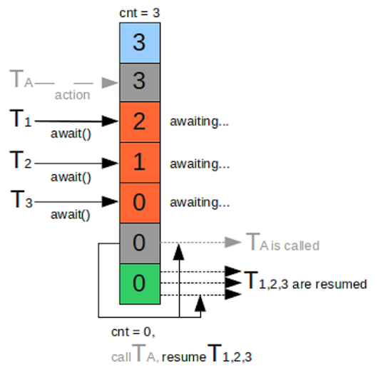

# Sử dụng CyclicBarrier trong Java
Trong bài trước, chúng ta đã cùng tìm hiểu về cách sử dụng CountDownLatch trong Java. Trong bài này, chúng ta sẽ cùng tìm hiểu về cách sử dụng CyclicBarrier , sự khác biệt của nó so với CountDownLatch.

## Giới thiệu CyclicBarrier
CyclicBarrier là một tiện ích thuộc gói java.util.concurrent, được giới thiệu trong Java 5. CyclicBarrier được sử dụng để tạo luồng chờ đợi cho nhau ở một điểm chung, còn được gọi là rào cản (barrier).

Nó được sử dụng khi các luồng khác xử lý một phần của tính toán và khi tất cả các luồng đã hoàn thành việc thực hiện, kết quả cần phải được kết hợp trong luồng chính. Nói cách khác, một CyclicBarrier được sử dụng khi nhiều luồng thực hiện các tác vụ phụ khác nhau và đầu ra của các nhiệm vụ phụ này cần phải được kết hợp để tạo thành đầu ra cuối cùng.

CyclicBarrier tương tự như CountDownLatch, nhưng sau khi hoàn thành việc thực thi, thay vì gọi countDown() mỗi thread gọi await(). Và khi Thread cuối cùng gọi await(), nó báo hiệu rằng nó đã đạt đến rào cản (barrier). Khi đó, tất cả các Thread bắt đầu xử lý lại, còn được gọi là một rào cản bị hỏng (broken).



Sự khác biệt giữa CyclicBarrier và CountDownLatch:

* Một CountDownLatch chỉ có thể được sử dụng một lần trong một chương trình (cho đến khi nó đếm đến 0).
* Một CyclicBarrier có thể được sử dụng lại khi tất cả các Thread trong một rào cản được hoàn thành (released).

Bạn có thể sử dụng CyclicBarrier bất cứ nơi nào sử dụng CountDownLatch, nhưng ngược lại là không thể bởi vì bạn không thể sử dụng lại latch một khi đếm (countdown) đạt đến số 0.

Một số cách sử dụng của CyclicBarrier là viết unit test cho chương trình đa luồng, để mô phỏng sự đa luồng trong một lớp test hoặc tính kết quả cuối cùng sau khi một task vụ đã hoàn thành.

## Ví dụ sử dụng CyclicBarrier
Ví dụ: Một chương trình chỉ được start sau khi 3 service của nó đã được start. Với yêu cầu này, chúng ta có thể sử dụng phương thức join() của lớp Thread hoặc sử dụng lớp CountDownLatch theo hướng dẫn của bài trước. Tuy nhiên, còn một cách khác là sử dụng CyclicBarrier.

Để dễ hiểu, tôi thêm các dòng log trước và sau khi service thực thi để bạn thấy được cách hoạt động của CyclicBarrier. Khi service thực thi xong, sẽ gọi phương thức await() để thông báo là nó đã hoàn thành.

ServiceOne.java

```java
package synchronizers.cyclicbarrier;

import java.util.concurrent.CyclicBarrier;

public class ServiceOne implements Runnable {
 
    private final CyclicBarrier cyclicBarrier;
 
    public ServiceOne(CyclicBarrier cyclicBarrier) {
        this.cyclicBarrier = cyclicBarrier;
    }
 
    @Override
    public void run() {
        System.out.println("Starting service One...");
        try {
            Thread.sleep(3000);
        } catch (InterruptedException e1) {
            e1.printStackTrace();
        }
        System.out.println("Service One has finished its work... waiting for others...");
        try {
            cyclicBarrier.await();
        } catch (Exception e) {
            System.out.println("Service one interrupted!");
            e.printStackTrace();
        }
        System.out.println("The wait is over, lets complete Service One!");
 
    }
 
}
```

ServiceTwo.java

``java
package synchronizers.cyclicbarrier;

import java.util.concurrent.CyclicBarrier;

public class ServiceTwo implements Runnable {

	private final CyclicBarrier cyclicBarrier;

	public ServiceTwo(CyclicBarrier cyclicBarrier) {
		this.cyclicBarrier = cyclicBarrier;
	}

	@Override
	public void run() {
		System.out.println("Starting service Two....");

		try {
			Thread.sleep(5000);
		} catch (InterruptedException e1) {
			e1.printStackTrace();
		}
		System.out.println("Service Two has finished its work.. waiting for others...");
		try {
			cyclicBarrier.await();
		} catch (Exception e) {
			System.out.println("Service two interrupted!");
			e.printStackTrace();
		}
		System.out.println("The wait is over, lets complete Service two!");

	}

}
```
ServiceThree.java

```java
package synchronizers.cyclicbarrier;

import java.util.concurrent.CyclicBarrier;

public class ServiceThree implements Runnable {

	private final CyclicBarrier cyclicBarrier;

	public ServiceThree(CyclicBarrier cyclicBarrier) {
		this.cyclicBarrier = cyclicBarrier;
	}

	@Override
	public void run() {
		System.out.println("Starting service Three....");

		try {
			Thread.sleep(1000);
		} catch (InterruptedException e1) {
			e1.printStackTrace();
		}
		System.out.println("Service Three has finished its work.. waiting for others...");
		try {
			cyclicBarrier.await();
		} catch (Exception e) {
			System.out.println("Service Three interrupted!");
			e.printStackTrace();
		}
		System.out.println("The wait is over, lets complete Service Three!");
	}
}
```
Chương trình chính sẽ chờ tất cả các Service hoàn thành trước khi tiếp tục xử lý.

```java
package synchronizers.cyclicbarrier;

import java.util.Date;
import java.util.concurrent.CyclicBarrier;

public class CyclicBarrierExample {
	public static void main(String[] args) {

		// 4 threads are part of the barrier, ServiceOne, ServiceTwo,
		// ServiceThree and
		// this main thread calling them.
		final CyclicBarrier barrier = new CyclicBarrier(4);

		Thread service1 = new Thread(new ServiceOne(barrier));
		Thread service2 = new Thread(new ServiceTwo(barrier));
		Thread service3 = new Thread(new ServiceThree(barrier));

		System.out.println("Starting both the services at" + new Date());

		service1.start();
		service2.start();
		service3.start();

		try {
			barrier.await();
		} catch (Exception e) {
			System.out.println("Main Thread interrupted!");
			e.printStackTrace();
		}
		System.out.println("Ending both the services at" + new Date());
	}
}

```

Như bạn thấy:

* Tôi đã khởi tạo một CyclicBarrier với số lượng Thread là 4, bao gồm: service1, service2, service3 và luồng của chương trình chính.
* Chương trình chính sẽ start 3 service: service, service2 và service3.
* Khi service 1 hoàn thành, nó sẽ gọi await() để thông báo nó đã hoàn thành phần việc của nó, chờ service khác xử lý.
* Khi service2 hoàn thành, nó cũng gọi await() để thông báo nó đã hoàn thành phần việc của nó, chờ service khác xử lý.
* Khi service3 hoàn thành, nó cũng gọi await() để thông báo nó đã hoàn thành phần việc của nó, chờ service khác xử lý.
* Khi cả 3 service đã hoàn thành, chương trình chính sẽ được gọi thực thi và các service cũng sẽ tiếp tục xử lý phần việc còn lại (resume).
