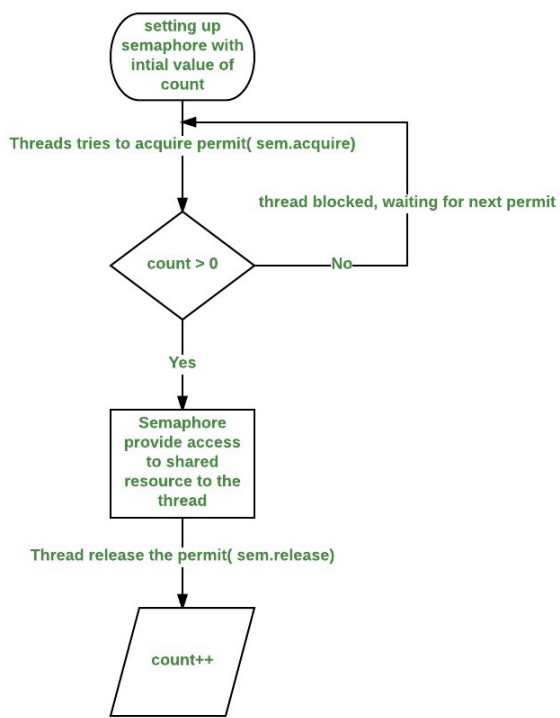

# Semaphore trong Java
## Semaphore là gì?
Semaphore là một cơ chế giúp quản lý các nguồn chia sẻ và đảm bảo access không bị tắc nghẽn.

Có hai loại semaphore: binary semaphore và counting semaphore.

* Binary semaphore (Mutex): được dùng làm lock vì nó chỉ có 2 giá trị là 0 và 1. Hai giá trị này đại diện cho trạng thái lock hay unlock.
* Counting semaphore: thực hiện đếm resource để cho biết mức độ sẵn sàng của resource.

## Cơ chế hoạt động
Một Semaphore lưu trữ một danh sách các permit (hay ticket), mỗi khi gọi acquire() sẽ lấy 1 ticket từ Semaphore, mỗi khi gọi release() sẽ trả ticket về Semaphore. Nếu ticket không có sẵn, acquire() sẽ bị lock cho đến khi có ticket. Để kiểm tra số lượng ticket còn lại, sử dụng phương thức availablePermits().



Ví dụ chúng ta gọi các phương thức tuần tự như sau:

```java
// Tạo một Semaphore có 5 ticket
Semaphore semaphore = new Semaphore(5);
 
// Yêu cầu lấy 1 ticket để sử dụng
semaphore.acquire(); // 5-1
 
// Đếm về số lượng ticket có sẵn
int numberOfAvailableTickets = semaphore.availablePermits(); // 4
 
// Trả 1 ticket về Semaphore
semaphore.release(); // 4+1
 
// Đếm về số lượng ticket có sẵn
semaphore.availablePermits(); // 5
```
## Ví dụ sử dụng Semaphore
Giả sử một ngân hàng có 4 cây ATM, mỗi cây chỉ có thể phục vụ được một khách hàng tại một thời điểm. Chương trình bên dưới cho thấy Semaphore có thể đảm bảo chỉ tối đa 4 người có thể truy cập tại một thời điểm.

WorkerThread.java
```java
package synchronizers.semaphore;

import java.util.concurrent.Semaphore;

public class WorkerThread extends Thread {

	private final Semaphore semaphore;
	private String name;

	public WorkerThread(Semaphore semaphore, String name) {
		this.semaphore = semaphore;
		this.name = name;
	}

	public void run() {
		try {
			System.out.println(name + ": acquiring lock...");
			System.out.println(name + ": available Semaphore permits now: " + semaphore.availablePermits());
			semaphore.acquire();
			System.out.println(name + ": got the permit!");

			try {
				System.out.println(name + ": is performing operation, available Semaphore permits : "
						+ semaphore.availablePermits());
				Thread.sleep(100); // simulate time to work
			} finally {
				// calling release() after a successful acquire()
				System.out.println(name + ": releasing lock...");
				semaphore.release();
				System.out.println(name + ": available Semaphore permits now: " + semaphore.availablePermits());
			}
		} catch (InterruptedException e) {
			e.printStackTrace();
		}
	}
}
```
SemaphoreExample.java

```java
package synchronizers.semaphore;

import java.util.concurrent.Semaphore;

public class SemaphoreExample {

	private static Semaphore semaphore = new Semaphore(4);

	public static void main(String[] args) {
		System.out.println("Total available Semaphore permits: " + semaphore.availablePermits());
		for (int i = 1; i <= 6; i++) {
			WorkerThread atmWorker = new WorkerThread(semaphore, "AMT " + i);
			atmWorker.start();
		}
	}
}
```
Chạy chương trình trên, ta có kết quả sau:

```java
Total available Semaphore permits: 4
AMT 1: acquiring lock...
AMT 1: available Semaphore permits now: 4
AMT 1: got the permit!
AMT 1: is performing operation, available Semaphore permits : 3
AMT 2: acquiring lock...
AMT 2: available Semaphore permits now: 3
AMT 2: got the permit!
AMT 2: is performing operation, available Semaphore permits : 2
AMT 3: acquiring lock...
A...
```

## Ví dụ sử dụng Mutex
Mutex là một Semaphore với bộ đếm là 1. Tình huống có thể sử dụng là lock tài khoản khi rút tiền. Tại một thời điểm chỉ 1 thao tác rút tiền được chấp nhận.

Chúng ta sẽ sử dụng lại worker ở trên. Giả sử có 6 user cùng login vào một tài khoản ở các cây ATM khác nhau để thực hiện rút tiền, nếu chúng ta không sử dụng cơ chế synchronized thì cả 6 người đều có thể rút tiền cùng lúc và có thể rút nhiều hơn số tiền hiện có trong tài khoản.


Đoạn code bên dưới sử dụng Mutex giúp chúng ta kiểm soát được vấn đề này một cách dễ dàng.

```java
package synchronizers.semaphore;

import java.util.concurrent.Semaphore;

public class MutexExample {
 
    private static Semaphore semaphore = new Semaphore(1);
 
    public static void main(String[] args) {
        System.out.println("Total available Semaphore permits: " + semaphore.availablePermits());
        for (int i = 1; i <= 6; i++) {
            WorkerThread atmWorker = new WorkerThread(semaphore, "AMT " + i);
            atmWorker.start();
        }
    }
}
```

Chạy chương trình trên, chúng ta có kết quả sau

```java
Total available Semaphore permits: 1
AMT 1: acquiring lock...
AMT 2: acquiring lock...
AMT 1: available Semaphore permits now: 1
AMT 2: available Semaphore permits now: 1
AMT 1: got the permit!
AMT 1: is performing operation, available Semaphore permits : 0
AMT 3: acquiring lock...
AMT 3: available Semaphore permits now: 0
AMT 4: acquiring lock...
AMT 4: available Semaphore permits now: 0
AMT 5: acquiring lock...
AMT 6: acquiring lock...
AMT 6: available Semaphore permits now: 0
AMT 5: available Semaphore permits now: 0
AMT 1: releasing lock...
```

