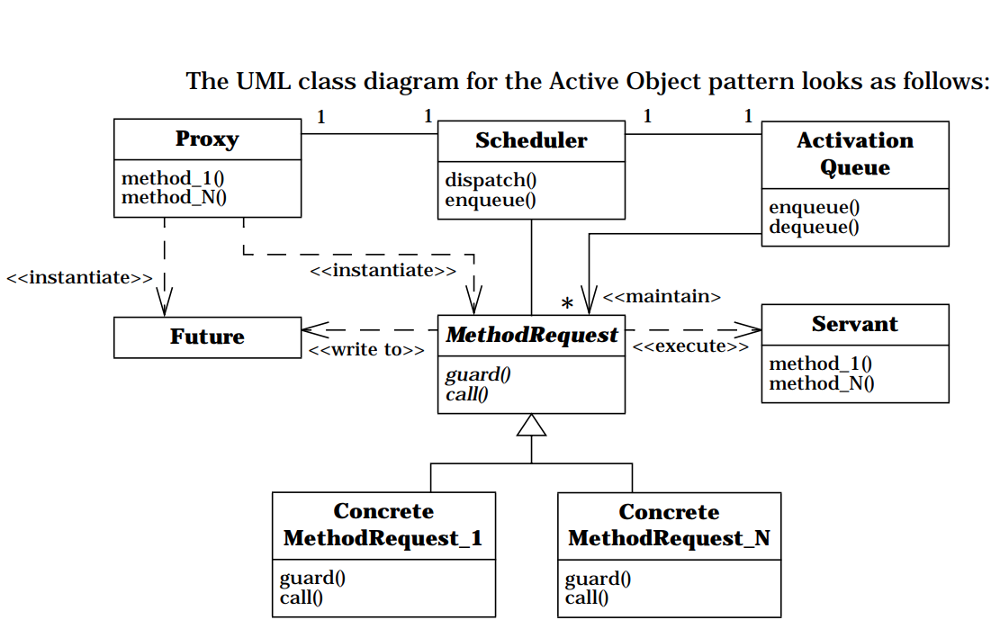
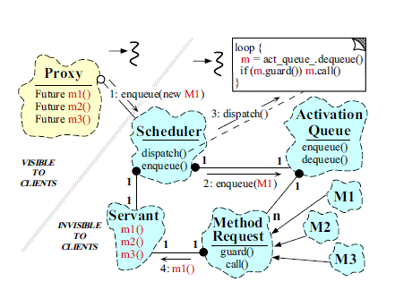

# Concurrency Pattern - Active Object
>Active Object là một design pattern sử dụng trong lập trình đa luồng, nó giải quyết bài toán concurrency bằng cách tách bạch lời gọi hàm và thực thi của các đối tượng. Mỗi đối tượng Active Object sở hữu một luồng riêng để thực thi tác vụ, một scheduler quản lý thứ tự thực hiện tác vụ, nhờ đó cung cấp lời gọi hàm bất đồng bộ để giải quyết vấn đề tương tranh trong tính toán song song.



Mẫu thiết kế gồm những phần sau:

* Servant là đối tượng gốc có các phương thức client muốn gọi thực thi
* Proxy cung cấp public interface cho client gọi trực tiếp
* Method request interface định nghĩa các phương thức của active object
* Activation Queue chứa danh sách các request chờ xử lý từ client
* Một scheduler sẽ ra quyết định request nào sẽ được xử lý tiếp theo
* Hàm callback hoặc một Future để client nhận kết quả

Hình màu đẹp chôm từ stack overflow:



## Hoạt động
Khi Client gửi một request tới proxy, proxy trả về Object Future sẽ dc dùng để nhận kết quả của active object (nếu có). Đồng thời tạo một MethodRequest chứa yêu cầu xử lý của client, đẩy vào Queue. Scheduler sẽ tuần tự lấy các request từ queue ra và call. hàm call sẽ thực thi các phương thức của Servant đồng thời trả về kết quả cho client thông qua Future.

## Ví dụ dễ hiểu
Ví dụ một lớp java bình thường:

```java
public class MyClass {

    private double val = 0.0;
    
    void doSomething() {
        val = 1.0;
    }

    void doSomethingElse() {
        val = 2.0;
    }
}
```

Trong lập trình đa luồng, khi hai phương thức doSomething và doSomethingElse được thực hiện bởi các luồng khác nhau cùng lúc, giá trị của val sẽ không xác định được, nó phụ thuộc vào thứ tự xử lý - vốn không được quản lý ở đây. Đây là lỗi race condition kinh điển mà hầu hết lập trình viên đều gặp trong đời. Trong trường hợp đơn giản, bạn chỉ cần dùng phép đồng bộ với từ khoá ```java synchronized ``` thần thánh để xử lý. Hoặc bạn sử dụng một pattern như Active Object:

```java
public class MyActiveObject {

	private double val = 0.0;

	private BlockingQueue<Runnable> dispatchQueue = new LinkedBlockingQueue<Runnable>();

	public MyActiveObject() {
		new Thread(new Runnable() {

			@Override
			public void run() {
				while (true) {
					try {
						dispatchQueue.take().run();
					} catch (InterruptedException e) {
						// okay, just terminate the dispatcher
					}
				}
			}
		}).start();
	}

	void doSomething() throws InterruptedException {
		dispatchQueue.put(new Runnable() {
			@Override
			public void run() {
				val = 1.0;
			}
		});
	}

	void doSomethingElse() throws InterruptedException {
		dispatchQueue.put(new Runnable() {
			@Override
			public void run() {
				val = 2.0;
			}
		});
	}
}
```

Dùng Java 8 viết thì sạch đẹp hơn xíu:

```java
public class MyActiveObjectUsingJava8 {
	private double val;

	// container for tasks
	// decides which request to execute next
	// asyncMode=true means our worker thread processes its local task queue in
	// the FIFO order
	// only single thread may modify internal state
	private final ForkJoinPool fj = new ForkJoinPool(1, ForkJoinPool.defaultForkJoinWorkerThreadFactory, null, true);

	// implementation of active object method
	public void doSomething() throws InterruptedException {
		fj.execute(() -> {
			val = 1.0;
		});
	}

	// implementation of active object method
	public void doSomethingElse() throws InterruptedException {
		fj.execute(() -> {
			val = 2.0;
		});
	}
}
```

Như vậy, active object tự nó có riêng một thread, và các tác vụ bên ngoài yêu cầu sẽ được đẩy vào một blocking queue nội bộ. Thread chỉ cần bốc ra tuần tự và xử lý. Phiên bản Active Object hoàn toàn thread-safe. Dù cho doSomething và doSomethingElse có được gọi tuần tự hay song song, cuối cùng chúng sẽ vẫn dc xử lý tuần tự.

## Ưu nhược điểm:
### Ưu điểm
* Tách bạch gọi hàm và thực thi hàm, dễ cài đặt
* Gọi hàm bất đồng bộ: client không nhất thiết phải chờ đến khi hàm thực thi xong.
* Kết hợp sử dụng nhiều active object có thể tăng khả năng xử lý song song của hệ thống.

### Nhược điểm
* Hiệu suất thấp hơn: so với các phương thức đồng bộ khác, pattern yêu cầu nhiều xử lý hơn để gọi hàm.
* Khó debug hơn đối với những chương trình có active object

## Sử dụng
* Active Object pattern đã được dùng để thiết kế các Object Request Broker, như CORBA [OMG98b] và DCOM [Box97]
* ACE Framework là một framework opensource được dùng trong lập trình mạng
* Actors

## Refs:
* Wikipedia
* Prefer Using Active Objects Instead of Naked Threads - Herb Sutter
* Java Active Objects A Proposal by Allen Holub
* Active Objects Design Pattern - Jeremiahd Jordan
* Explain “Active-object” pattern - Bence Pattogato
* Active Object - Douglas C. Schmidt
* Active Object - R. Greg Lavender and Douglas C. Schmidt
* see <a href="https://blog.botbie.io/2018/11/14/concurrency-pattern-active-object">https://blog.botbie.io/2018/11/14/concurrency-pattern-active-object</a>

