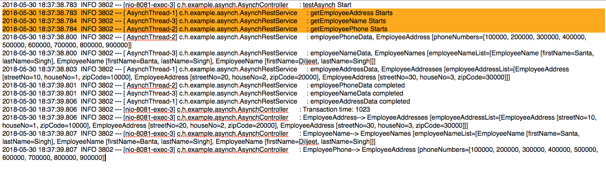
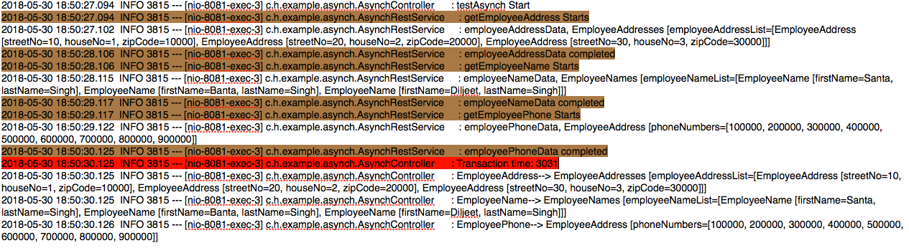

# Spring @Async rest controller example – Spring @EnableAsync

Learn to create asynchronous controller methods in Spring framework with the help of @Async and @EnableAsync annotations, async thread pool on top of Java ExecutorService framework.

## 1. Spring @Async rest controller

Spring comes with @EnableAsync annotation and can be applied on application classes for asynchronous behavior. This annotation will look for methods marked with @Async annotation and run in background thread pools. The @Async annotated methods can return CompletableFuture to hold the result of an asynchronous computation.

To enable async configuration in spring, follow these steps:

### 1.1. Create async thread pool

AsyncConfiguration.java

```java
@Configuration
@EnableAsync
public class AsynchConfiguration 
{
    @Bean(name = "asyncExecutor")
    public Executor asyncExecutor() 
    {
        ThreadPoolTaskExecutor executor = new ThreadPoolTaskExecutor();
        executor.setCorePoolSize(3);
        executor.setMaxPoolSize(3);
        executor.setQueueCapacity(100);
        executor.setThreadNamePrefix("AsynchThread-");
        executor.initialize();
        return executor;
    }
}
```
### 1.2. @Async controller methods

Methods which shall run asynchronously, annotate them with @Async annotation and method return type should return

```java
@Async("asyncExecutor")
public CompletableFuture<EmployeeNames> methodOne() throws InterruptedException {
    //code
}
```

### 1.3. Combine async method results
Inside REST Controller

```java
CompletableFuture.allOf(methodOne, methodTwo, methodThree).join();
```

## 2. Spring @Async rest controller example

In this demo, we will create an REST API which will fetch data from three (3) remote services asynchronously and when responses from all 3 services is available then aggregate the responses. e.g.

1. Invoke EmployeeName API
2. Invoke EmployeeAddress API
3. Invoke EmployeePhone API
4. Wait for responses from above services
5. Aggregate all three API responses and build final response to send back to client

### 2.1. EmployeeName, EmployeeAddress and EmployeePhone APIs to be accessed async way

EmployeeDataController.java

```java
package com.howtodoinjava.example.sampleservice.controller;
 
import java.util.ArrayList;
import java.util.List;
 
import org.slf4j.Logger;
import org.slf4j.LoggerFactory;
import org.springframework.web.bind.annotation.RequestMapping;
import org.springframework.web.bind.annotation.RequestMethod;
import org.springframework.web.bind.annotation.RestController;
 
import com.howtodoinjava.example.sampleservice.model.EmployeeAddress;
import com.howtodoinjava.example.sampleservice.model.EmployeeAddresses;
import com.howtodoinjava.example.sampleservice.model.EmployeeName;
import com.howtodoinjava.example.sampleservice.model.EmployeeNames;
import com.howtodoinjava.example.sampleservice.model.EmployeePhone;
 
@RestController
public class EmployeeDataController 
{
    private static Logger log = LoggerFactory.getLogger(EmployeeDataController.class);
 
    @RequestMapping(value = "/addresses", method = RequestMethod.GET)
    public EmployeeAddresses getAddresses() 
    {
        log.info("get addresses Start");
 
        EmployeeAddresses employeeAddressesList = new EmployeeAddresses();
 
        EmployeeAddress employeeAddress1 = new EmployeeAddress();
        EmployeeAddress employeeAddress2 = new EmployeeAddress();
         
        List<EmployeeAddress> addressList = new ArrayList<EmployeeAddress>();
         
        {
            employeeAddress1.setHouseNo("1111");
            employeeAddress1.setStreetNo("111");
            employeeAddress1.setZipCode("111111");
             
            employeeAddress2.setHouseNo("222");
            employeeAddress2.setStreetNo("222");
            employeeAddress2.setZipCode("222222");
             
            addressList.add(employeeAddress1);
            addressList.add(employeeAddress2);
             
            employeeAddressesList.setEmployeeAddressList(addressList);
        }
 
        return employeeAddressesList;
    }
 
    @RequestMapping(value = "/phones", method = RequestMethod.GET)
    public EmployeePhone getPhoneNumbers() 
    {
        log.info("get phones Start");
 
        EmployeePhone employeePhone = new EmployeePhone();
        {
            ArrayList<String> phoneNumberList = new ArrayList<String>();
             
            phoneNumberList.add("100000");
            phoneNumberList.add("200000");
             
            employeePhone.setPhoneNumbers(phoneNumberList);
        }
 
        return employeePhone;
    }
 
    @RequestMapping(value = "/names", method = RequestMethod.GET)
    public EmployeeNames getEmployeeName() 
    {
        log.info("get names Start");
 
        EmployeeNames employeeNamesList = new EmployeeNames();
 
        EmployeeName employeeName1 = new EmployeeName();
        EmployeeName employeeName2 = new EmployeeName();
         
        List<EmployeeName> employeeList = new ArrayList<EmployeeName>();
        {
            employeeName1.setFirstName("Santa");
            employeeName1.setLastName("Singh");
        }
        {
            employeeName2.setFirstName("Banta");
            employeeName2.setLastName("Singh");
        }
 
        employeeList.add(employeeName1);
        employeeList.add(employeeName2);
 
        employeeNamesList.setEmployeeNameList(employeeList);
 
        return employeeNamesList;
    }
}
```

### 2.2. Async thread pool configuration
AsyncConfiguration.java

```java
import java.util.concurrent.Executor;
 
import org.springframework.context.annotation.Bean;
import org.springframework.context.annotation.Configuration;
import org.springframework.scheduling.annotation.EnableAsync;
import org.springframework.scheduling.concurrent.ThreadPoolTaskExecutor;
 
@Configuration
@EnableAsync
public class AsyncConfiguration 
{
    @Bean(name = "asyncExecutor")
    public Executor asyncExecutor() {
        ThreadPoolTaskExecutor executor = new ThreadPoolTaskExecutor();
        executor.setCorePoolSize(3);
        executor.setMaxPoolSize(3);
        executor.setQueueCapacity(100);
        executor.setThreadNamePrefix("AsynchThread-");
        executor.initialize();
        return executor;
    }
}
```

### 2.3. Spring @Async controller methods
AsyncService.java

```java
package com.howtodoinjava.example.async.service;
 
import java.util.concurrent.CompletableFuture;
 
import org.slf4j.Logger;
import org.slf4j.LoggerFactory;
import org.springframework.beans.factory.annotation.Autowired;
import org.springframework.context.annotation.Bean;
import org.springframework.scheduling.annotation.Async;
import org.springframework.stereotype.Service;
import org.springframework.web.client.RestTemplate;
 
import com.howtodoinjava.example.async.model.EmployeeAddresses;
import com.howtodoinjava.example.async.model.EmployeeNames;
import com.howtodoinjava.example.async.model.EmployeePhone;
 
@Service
public class AsyncService {
 
    private static Logger log = LoggerFactory.getLogger(AsyncService.class);
 
    @Autowired
    private RestTemplate restTemplate;
 
    @Bean
    public RestTemplate restTemplate() {
        return new RestTemplate();
    }
 
    @Async("asyncExecutor")
    public CompletableFuture<EmployeeNames> getEmployeeName() throws InterruptedException 
    {
        log.info("getEmployeeName starts");
 
        EmployeeNames employeeNameData = restTemplate.getForObject("http://localhost:8080/name", EmployeeNames.class);
 
        log.info("employeeNameData, {}", employeeNameData);
        Thread.sleep(1000L);    //Intentional delay
        log.info("employeeNameData completed");
        return CompletableFuture.completedFuture(employeeNameData);
    }
 
    @Async("asyncExecutor")
    public CompletableFuture<EmployeeAddresses> getEmployeeAddress() throws InterruptedException 
    {
        log.info("getEmployeeAddress starts");
 
        EmployeeAddresses employeeAddressData = restTemplate.getForObject("http://localhost:8080/address", EmployeeAddresses.class);
 
        log.info("employeeAddressData, {}", employeeAddressData);
        Thread.sleep(1000L);    //Intentional delay
        log.info("employeeAddressData completed");
        return CompletableFuture.completedFuture(employeeAddressData);
    }
 
    @Async("asyncExecutor")
    public CompletableFuture<EmployeePhone> getEmployeePhone() throws InterruptedException 
    {
        log.info("getEmployeePhone starts");
 
        EmployeePhone employeePhoneData = restTemplate.getForObject("http://localhost:8080/phone", EmployeePhone.class);
 
        log.info("employeePhoneData, {}", employeePhoneData);
        Thread.sleep(1000L);    //Intentional delay
        log.info("employeePhoneData completed");
        return CompletableFuture.completedFuture(employeePhoneData);
    }
}
```

### 2.4. Call async methods and aggregate results

```java
package com.howtodoinjava.example.async.controller;
 
import java.util.concurrent.CompletableFuture;
import java.util.concurrent.ExecutionException;
 
import org.slf4j.Logger;
import org.slf4j.LoggerFactory;
import org.springframework.beans.factory.annotation.Autowired;
import org.springframework.web.bind.annotation.RequestMapping;
import org.springframework.web.bind.annotation.RequestMethod;
import org.springframework.web.bind.annotation.RestController;
 
import com.howtodoinjava.example.async.model.EmployeeAddresses;
import com.howtodoinjava.example.async.model.EmployeeNames;
import com.howtodoinjava.example.async.model.EmployeePhone;
import com.howtodoinjava.example.async.service.AsyncService;
 
@RestController
public class AsyncController {
 
    private static Logger log = LoggerFactory.getLogger(AsyncController.class);
 
    @Autowired
    private AsyncService service;
 
    @RequestMapping(value = "/testAsynch", method = RequestMethod.GET)
    public void testAsynch() throws InterruptedException, ExecutionException 
    {
        log.info("testAsynch Start");
 
        CompletableFuture<EmployeeAddresses> employeeAddress = service.getEmployeeAddress();
        CompletableFuture<EmployeeNames> employeeName = service.getEmployeeName();
        CompletableFuture<EmployeePhone> employeePhone = service.getEmployeePhone();
 
        // Wait until they are all done
        CompletableFuture.allOf(employeeAddress, employeeName, employeePhone).join();
         
        log.info("EmployeeAddress--> " + employeeAddress.get());
        log.info("EmployeeName--> " + employeeName.get());
        log.info("EmployeePhone--> " + employeePhone.get());
    }
}
```

## 2.5. How to run the demo

Download and start both the applications.

Hit the API: <a href='http://localhost:8081/testAsynch'> http://localhost:8081/testAsynch</a>

Observe the output in console.

### 2.5.1. With @Aync Enabled



### 2.5.2. Without Aync Enabled

