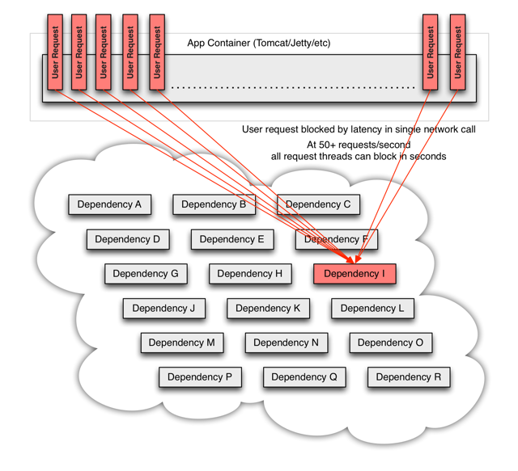
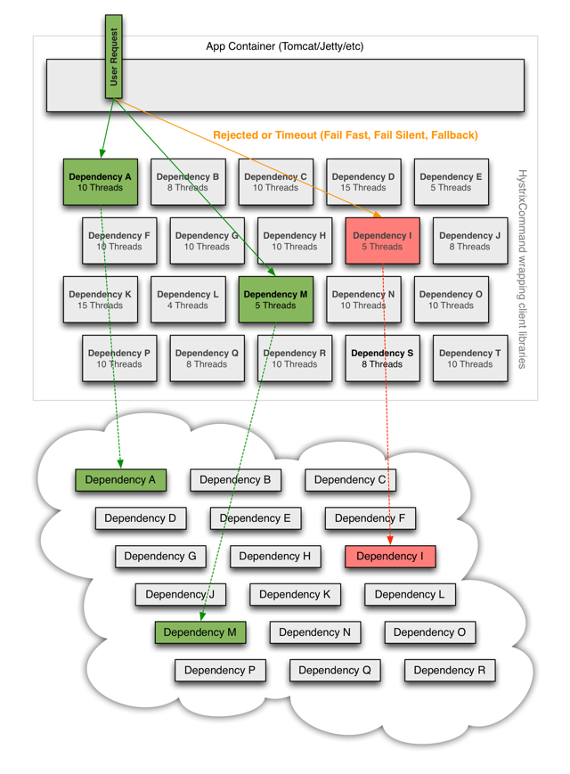
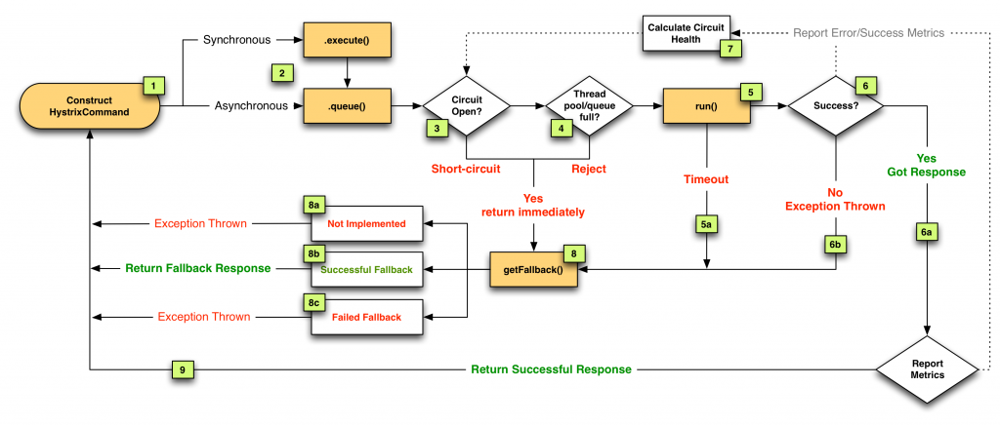

# Application with Hystrix

In previous post http://www.javacodegeeks.com/2014/07/rxjava-java8-java-ee-7-arquillian-bliss.html we talked about microservices and how to orchestrate them using Reactive Extensions using (RxJava). But what’s happen when one or many services fail because they have been halted or they throw an exception? In a distributed system like microservices architecture it is normal that a remote service may fail so communication between them should be fault tolerant and manage the latency in network calls properly.

And this is exactly what Hystrix does. Hystrix is a latency and fault tolerance library designed to isolate points of access to remote systems, services and 3rd party libraries, stop cascading failure and enable resilience in complex distributed systems where failure is inevitable.

In a distributed architecture like microservices, one service may require to use other services as dependencies to accomplish his work. Every point in an application that reaches out over the network or into a client library that can potentially result in network requests is a source of failure. Worse than failures, these applications can also result in increased latencies between services. And this leaves us to another big problem, suppose you are developing a service on a Tomcat which will open two connections to two services, if one of this service takes more time than expected to send back a response, you will be spending one thread of Tomcat pool (the one of current request) doing nothing rather than waiting an answer. If you don’t have a high traffic site this may be acceptable, but if you have a considerable amount of traffic all resources may become saturated and and block the whole server.

An schema from this scenario is provided on Hystrix wiki:


The way to avoid previous problem is to add a thread layer which isolates each dependency from each other. So each dependency (service) may contain a thread pool to execute that service. In Hystrix this layer is implemented by HystricxCommand object, so each call to an external service is wrapped to be executed within a different thread.

An schema of this scenario is provided on Hystrix wiki:



But also Hystrix provides other features:

* Each thread has a timeout so a call may not be infinity waiting for a response.
* Perform fallbacks wherever feasible to protect users from failure.
* Measure success, failures (exceptions thrown by client), timeouts, and thread rejections and allows monitorizations.
* Implements a circuit-breaker pattern which automatically or manually to stop all requests to an external service for a period of time if error percentage passes a threshold.

So let’s start with a very simple example:

```java
public class HelloWorldCommand extends HystrixCommand<String> {
 
    public HelloWorldCommand() {
        super(HystrixCommandGroupKey.Factory.asKey("HelloWorld"));
    }
 
    @Override
    protected String run() throws Exception {
        return "Hello World";
    }
}
```
And then we can execute that command in a synchronous way by using execute method.

```java
new HelloWorldCommand().execute();
```

Although this command is synchronous, it is executed in a different thread. By default Hystrix creates a thread pool for each command defined inside the same HystrixCommandGroupKey. In our example Hystrix creates a thread pool linked to all commands grouped to HelloWorld thread pool. Then for every execution, one thread is get from pool for executing the command.

But of course we can execute a command asynchornously (which perfectly fits to asynchronous JAX-RS 2.0 or Servlet 3.0 specifications). To do it simply run:

```java
Future<String> helloWorldResult = new HelloWorldCommand().queue();
//some more work
Stirng message = helloWorldResult.get();
```

In fact synchronous calls are implemented internally by Hystrix as return new HelloWorldCommand().queue().get(); internally.

We have seen that we can execute a command synchronously and asynchronously, but there is a third method which is reactive execution using RxJava (you can read more about RxJava in my previous post http://www.javacodegeeks.com/2014/07/rxjava-java8-java-ee-7-arquillian-bliss.html).

To do it you simply need to call observe method:

```
Observable<String> obs = new HelloWorldCommand().observe();
obs.subscribe((v) -> {
    System.out.println("onNext: " + v);
}
```

But sometimes things can go wrong and execution of command may throw an exception. All exceptions thrown from the run() method except for HystrixBadRequestException count as failures and trigger getFallback() and circuit-breaker logic (more to come about circuit-breaker). Any business exception that you don’t want to count as service failure (for example illegal arguments) must be wrapped in HystrixBadRequestException.

But what happens with service failures, what Hystrix can do for us? In summary Hystrix can offer two things:

1. A method to do something in case of a service failure. This method may return an empty, default value or stubbed value, or for example can invoke another service that can accomplish the same logic as the failing one.
2. Some kind of logic to open and close the circuit automatically.

## Fallback

The method that is called when an exception occurs (except for HystrixBadRequestException) is getFallback(). You can override this method and provide your own implementation.

```java
public class HelloWorldCommand extends HystrixCommand<String> {
 
    public HelloWorldCommand() {
        super(HystrixCommandGroupKey.Factory.asKey("HelloWorld"));
    }
 
    @Override
    protected String getFallback() {
        return "Good Bye";
    }
 
    @Override
    protected String run() throws Exception {
        //return "Hello World";
        throw new IllegalArgumentException();
    }
}
```

## Circuit breaker

Circuit breaker is a software pattern to detect failures and avoid receiving the same error constantly. But also if the service is remote you can throw an error without waiting for TCP connection timeout.

Suppose next typical example: A system need to access database like 100 times per second and it fails. Same error will be thrown 100 times per second and because connection to remote Database implies a TCP connection, each client will wait until TCP timeout expires.

So it would be much useful if system could detect that a service is failing and avoid clients do more requests until some period of time. And this is what circuit breaker does. For each execution check if the circuit is open (tripped) which means that an error has occurred and the request will be not sent to service and fallback logic will be executed. But if the circuit is closed then the request is processed and may work.

Hystrix maintains an statistical database of number of success request vs failed requests. When Hystrix detects that in a defined spare of time, a threshold of failed commands has reached, it will open the circuit so future request will be able to return the error as soon as possible without having to consume resources to a service which probably is offline. But the good news is that Hystrix is also the responsible of closing the circuit. After elapsed time Hystrix will try to run again an incoming request, if this request is successful, then it will close the circuit and if not it will maintain the circuit opened.

In next diagram from Hystrix website you can see the interaction between Hystrix and circuit.



Now that we have seen the basics of Hystrix, let’s see how to write tests to check that Hystrix works as expected.

Last thing before test. In Hystrix there is an special class called HystrixRequestContext. This class contains the state and manages the lifecycle of a request. You need to initialize this class if for example you want to Hystrix manages caching results or for logging purposes. Typically this class is initialized just before starting the business logic (for example in a Servlet Filter), and finished after request is processed.

Let’s use previous HelloWorldComand to validate that fallback method is called when circuit is open.

```java
public class HelloWorldCommand extends HystrixCommand<String> {
 
    public HelloWorldCommand() {
        super(HystrixCommandGroupKey.Factory.asKey("HelloWorld"));
    }
 
    @Override
    protected String getFallback() {
        return "Good Bye";
    }
 
    @Override
    protected String run() throws Exception {
        return "Hello World";
    }
}
```

And the test. Keep in mind that I have added a lot of asserts in the test for academic purpose.

```java
@Test
public void should_execute_fallback_method_when_circuit_is_open() {
   
  //Initialize HystrixRequestContext to be able to get some metrics
  HystrixRequestContext context = HystrixRequestContext.initializeContext();
  HystrixCommandMetrics creditCardMetrics = HystrixCommandMetrics.getInstance(HystrixCommandKey.Factory.asKey(HelloWorldRestCommand.class.getSimpleName()));
   
  //We use Archaius to set the circuit as closed.
  ConfigurationManager.getConfigInstance().setProperty("hystrix.command.default.circuitBreaker.forceOpen", false);
   
  String successMessage = new HelloWorldRestCommand().execute();
  assertThat(successMessage, is("Hello World"));
   
  //We use Archaius to open the circuit
  ConfigurationManager.getConfigInstance().setProperty("hystrix.command.default.circuitBreaker.forceOpen", true);
   
  String failMessage = new HelloWorldRestCommand().execute();
  assertThat(failMessage, is("Good Bye"));
   
  //Prints Request => HelloWorldRestCommand SUCCESS 19ms, HelloWorldRestCommand SHORT_CIRCUITED, FALLBACK_SUCCESS][0_ms] 
  System.out.println("Request => " + HystrixRequestLog.getCurrentRequest().getExecutedCommandsAsString());
   
  assertThat(creditCardMetrics.getHealthCounts().getTotalRequests(), is(2));
  assertThat(creditCardMetrics.getHealthCounts().getErrorCount(), is(1));
 
}
```

This is a very simple example, because execute method and fallback method are pretty simple, but if you think that execute method may contain complex logic and fallback method can be as complex too (for example retrieving data from another server, generate some kind of stubbed data, …), then writing integration or functional tests that validates all this flow it starts having sense. Keep in mind that sometimes your fallback logic may depends on previous calls from current user or other users.

Hystrix also offers other features like cashing results so any command already executed within same HystrixRequestContext may return a cache result (https://github.com/Netflix/Hystrix/wiki/How-To-Use#Caching). Another feature it offers is collapsing. It enables automated batching of requests into a single HystrixCommand instance execution. It can use batch size and time as the triggers for executing a batch.

As you may see Hystrix is a really simple yet powerful library, that you should take under consideration if your applications call external services.

We keep learning,