# RxJava, phần 1: Giới thiệu
RxJava là 1 trong những từ khóa hot nhất trong cộng đồng lập trình viên Java/Android thời gian gần đây. RxJava đem lại cho Java/Android Reactive Programming, 1 mẫu hình lập trình tuy mạnh mẽ nhưng lại rất khó tiếp cận đối với những lập trình viên Android vốn đã quen với kiểu lập trình mệnh lệnh (Imperative Programming). Ở bài viết này chúng ta sẽ cùng tìm hiểu lí do chúng ta áp dụng Reactive Programming vào lập trình Android và các bước cơ bản để có thể bắt đầu sử dụng nó.

## Why RxJava
Với một nền tảng mà Java vẫn đang thống trị như Android, lập trình đa luồng vốn không phải là 1 công việc dễ dàng. Chúng ta có Thread và Future để thực thi các tác vụ bất đồng bộ đơn giản, nhưng sử dụng chúng để xử lý các tiến trình phức tạp hơn 1 chút thì lại là 1 câu chuyện khác. Một trong những use case phổ biến nhất trong Android là thực thi 1 tác vụ nào đó ở background và sau đó update kết quả lên UI. Ví dụ chúng ta sẽ truyền lên server id của 1 user, server sẽ trả về kết quả dưới dạng JSON, chúng ta convert JSON sang object User và sau đó hiển thị thông tin của User đó lên UI. Với case này thì chúng ta thường sử dụng AsyncTask:

```java
public class RequestUserData extends AsyncTask<String, Void, User> {

    protected User doInBackground(String... strings) {
        try {
            User user = requestAndConvert(strings[0]);
            return user;
        } catch (Exception e) {
        }
    }

    protected void onPostExecute(User user) {
        super.onPostExecute(user);
        updateUserInfo(user);
    }
}
```

Rất đơn giản đúng không nào? Chờ chút. Nếu chúng ta muốn thông báo cho user biết khi lỗi xảy ra thì phải làm thế nào? Dĩ nhiên chúng ta ko thể làm việc đó trong doInBackground() bởi vì nó ko chạy trên main thread của Android. Nhưng nếu muốn update ở onPostExecute() thì chúng ta lại cần context để có thể update lên UI. Vậy thì ta lại phải truyền reference của Activity vào cho AsyncTask. Nhưng nếu quá trình request này nó mất khoảng vài phút mới xong nhưng user lại xoay màn hình thì sao? Lúc đó Activity sẽ bị destroy và recreate, nhưng AsyncTask lại vẫn giữ reference đến Activity đó và gây ra memory leak.

Vâng, quá nhiều vấn đề cho 1 tác vụ tưởng chừng như rất đơn giản. Hãy cùng tưởng tượng ra 1 tình huống nâng cao hơn: sau khi request thông tin user, tôi muốn request thêm cả các cài đặt và tin nhắn của user đó 1 cách đồng thời, sau đó kết hợp 2 kết quả lại và hiển thị lên màn hình. Chúng ta sẽ cần đến vài AsyncTask để làm công việc đó, và còn cần sử dụng cả cơ chế lock như Semaphore (để chờ cho 2 tiến trình cùng kết thúc). Về cơ bản, bài toán này có thể được giải quyết nhưng nó mất quá nhiều công sức và tệ nhất là chúng ta phải nghĩ đến những vấn đề chẳng hề liên quan đến cái chúng ta muốn làm.

Các vấn đề này có thể được giải quyết bằng việc sử dụng RxJava đúng cách. Qua series này tôi hi vọng chúng ta sẽ có thêm được những kiến thức cần thiết về Reactive Programming cũng như dễ dàng giải quyết được những bài toán tương tự.

## Setup

* https://github.com/ReactiveX/RxJava

* https://github.com/ReactiveX/RxAndroid

## Cấu trúc cơ bản

Những thành phần cơ bản nhất tạo nên RP là Observable và Subscriber.

* Observable phát ra item.
* Subsriber sẽ sử dụng những item đó.

Một Observable có thể tạo ra 0 hoặc nhiều item, sau đó nó sẽ kết thúc vì đã hoàn thành hoặc do xảy ra lỗi. Với mỗi Subscriber mà nó có, Observable sẽ gọi đến onNext() tương ứng với số item mà nó có, sau đó sẽ gọi đến onCompleted() hoặc onError() dựa vào kết quả của việc kết thúc.
Cách tạo

RxJava cung cấp cho chúng ta 10 hàm dùng để tạo mới 1 Observable. Ở bài viết này tôi xin chỉ đề cập đến những hàm cơ bản, 1 phần là do kiến thức còn hạn chế, phần khác là để tránh việc bài viết trở nên quá dài gây nhàm chán.

### 1. Observable.from()
>Observable.from() nhận một tập các item và phát ra mỗi lần một item:

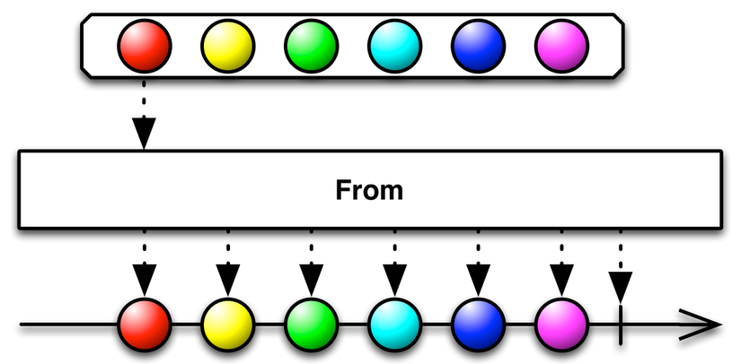

```java
Observable.from("url1", "url2", "url3")
        .subscribe({ url -> System.out.println(url) })
```

Chúng ta có thể sử dụng trong trường hợp cụ thể :

```java
query("db")
        .subscribe({ urls ->
            Observable.from(urls)
                    .subscribe({ url -> System.out.println(url) })
        })
```

Chúng ta đã xử lý được vấn đề vòng lặp for-each bằng cách sử dụng Observable.from(), nhưng mà code lại trở nên phức tạp hơn vì có tới hai subscription. Code trở nên xấu và khó thay đổi hơn, nó cũng phá vỡ một vài tính năng quan trọng của RxJava. Và chúng ta sẽ sử dụng 1 cách tốt hơn dưới đây.

```java
package com.rxjava.tutorials;

import org.apache.log4j.Logger;

import concurrencies.utilities.Log4jUtils;
import concurrencies.utilities.LogTest;
import rx.Observable;
import rx.Subscriber;

public class Part01 {
	static Logger logger = Logger.getLogger(LogTest.class.getName());

	public static void main(String[] args) {
		logger = Log4jUtils.initLog4j();
		Observable.from(new Integer[] { 1, 2, 3 }).subscribe(
				new Subscriber<Integer>() {
					public void onCompleted() {

					}

					public void onError(Throwable e) {

					}

					public void onNext(Integer integer) {
						logger.info("onNext " + String.valueOf(integer));
					}
				});

	}

}

```

Sẽ in ra khi chạy:

```java

I/onNext: 1
I/onNext: 2
I/onNext: 3
```

>Giải thích: Observable.from() nhận vào số parameter không hạn chế và có thể thuộc mọi type (ở đây ta truyền vào 3 số 1, 2, 3). Observable.subscribe() sẽ tạo ra 1 Subscriber với 3 hàm onCompleted(), onError() và onNext() để sử dụng các item được truyền vào ở trên.


### 2. Observable.just()

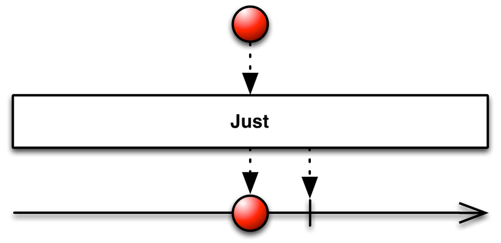

```java
Observable.just(1,2,3).subscribe(new Subscriber<Integer>() {
            public void onCompleted() {

            }

            public void onError(Throwable e) {

            }

            public void onNext(Integer integer) {
               Log.i("onNext", String.valueOf(integer));
            }
        });
```

Đoạn code này sẽ cho ra output tương tự như khi dùng Observable.from(). Vậy thì just() có điểm gì khác so với from()?

```java
Integer[] integers = {1,2,3};

Observable.just(integers).subscribe(new Subscriber<Integer[]>() {
   public void onNext(Integer[] integers) {
       Log.i("onNext", Arrays.toString(integers));
   }
}

Observable.from(integers).subscribe(new Subscriber<Integer>() {
   public void onNext(Integer integer) {
       Log.i("onNext", String.valueOf(integer));
   }
}
```

```java

just()

I/onNext: [1, 2, 3]
```

```java
from()

I/onNext: 1
I/onNext: 2
I/onNext: 3
```

Với just(), khi chúng ta truyền vào 1 array hoặc list item, nó sẽ phát ra array và list item đó và Subscriber cũng sẽ nhận vào parameter là 1 array hoặc list tương ứng. Còn đối với from(), nó sẽ phát ra từng item trong list (sẽ gọi đến onNext() số lần bằng với size của list trong điều kiện ko có lỗi xảy ra).

### 3. Observable.defer()
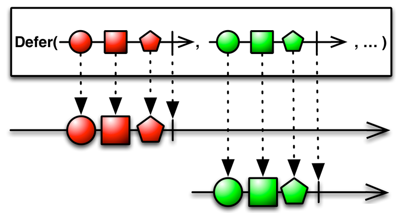

Cùng xem đoạn code sau:

```java
Movie movie = new Movie("Captain America: Civil War");
Observable<Movie> movieObservable = Observable.just(movie);
movie = new Movie("Batman v Superman: Dawn of Justice");
movieObservable.subscribe(new Subscriber<Movie>() {
      public void onNext(Movie movie) {
          Log.i("onNext", movie.name);
      }
});
```

Theo bạn thì onNext sẽ in ra kết quả gì? Nếu bạn trả lời là "Batman v Superman: Dawn of Justice" thì bạn đã nhầm rồi, nó phải là "Captain America: Civil War" bởi vì đó là giá trị của movie.name khi just() được gọi đến. just(), from() và các hàm khác sẽ lưu giá trị của item khi Observable được tạo ra chứ ko phải khi nó được subscribe bởi 1 Subscriber. Trong nhiều trường hợp, chúng ta sẽ muốn data của mình là mới nhất ở thời điểm request, vậy nên nếu chúng ta không subscribe ngay khi khởi tạo thì rất có khả năng data sẽ không phải mới nhất.

Đáp án cho bài toán này là sử dụng hàm Observable.defer(). defer() sẽ chỉ khởi tạo Observable khi nó có ít nhất 1 Subscriber, và nó sẽ tạo mới 1 Observable cho mỗi Subscriber mà nó có.

```java
movie = new Movie("Captain America: Civil War");
        Observable<Movie> movieObservable = Observable.defer(new Func0<Observable<Movie>>() {
            public Observable<Movie> call() {
                return Observable.just(movie);
            }
        });
        movie = new Movie("Batman v Superman: Dawn of Justice");
        movieObservable.subscribe(new Subscriber<Movie>() {
            public void onNext(Movie movie) {
                Log.i("onNext", movie.name);
            }
        });
```

```java
I/onNext: Batman v Superman: Dawn of Justice
```

### 4. Observable.interval()
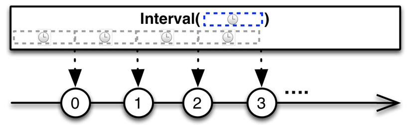

```interval()``` sẽ phát ra 1 item thuộc kiểu Long sau mỗi khoảng delay.

```java
Observable.interval(2, TimeUnit.SECONDS).subscribe(new Subscriber<Long>() {
            public void onNext(Long aLong) {
                if(aLong == 5)
                    unsubscribe();
                Log.i("onNext", "" + aLong);
            }
        });
```

Với đoạn code này, onNext() sẽ được gọi đến sau mỗi 2 giây và sau 6 lần nó sẽ kết thúc (bằng hàm unsubscribe). interval() khá hiệu quả khi chúng ta muốn schedule các lần update data (ví dụ update data mỗi 5 phút).
### 5. Observable.create()

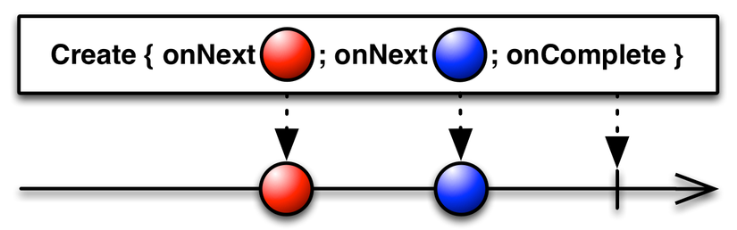

Với create(), chúng ta sẽ tạo Observable một cách thủ công. Với đoạn code dưới đây:

```java
 Observable.create(new Observable.OnSubscribe<Integer>() {
            public void call(Subscriber<? super Integer> subscriber) {
                subscriber.onNext(1);
                subscriber.onNext(2);
                subscriber.onNext(3);
                subscriber.onCompleted();
            }
        }).subscribe(new Subscriber<Integer>() {
            public void onNext(Integer integer) {
                Log.i("onNext", "" + integer);
        }
});

```
sẽ cho ra output tương tự như sử dụng ```Observable.just(1,2,3). create()``` còn đem lại behavior như defer() - lưu giá trị của item khi đc subscribe chứ ko phải khi khởi tạo. Tuy nhiên trong hầu hết các trường hợp bạn không nên dùng đến hàm này vì nó có 1 số quy tắc mà chúng ta phải tuân thủ như chỉ được gọi ```Subscriber.onComplete()``` hoặc ```Subscriber.onError()``` duy nhất 1 lần và không được gọi thêm hàm nào sau đó.
## Kết luận

Vậy là chúng ta đã học qua 1 số cách cơ bản và phổ biến nhất để tạo ra Observable. (Các bạn có thể tham khảo 5 hàm còn lại tại http://reactivex.io/documentation/operators.html#creating)

# RxJava, phần 2: Threading concept

Chào mừng các bạn đã trở lại với series Cùng học RxJava. Ở bài trước chúng ta đã tìm hiểu về 1 số cách cơ bản để tạo ra Observable - 1 trong những thành phần chủ yếu cấu tạo nên RxJava nói chung và thư viện ReactiveX nói riêng. Tuy nhiên để hiểu được cách áp dụng những Observable này vào thực tế thì chúng ta cần phải tìm hiểu về threading concept của ReactiveX trước, và đó là khái niệm mà chúng ta sẽ học ở bài post này.

## A free-threaded model

Trái với những gì mà mọi người thường nghĩ khi nhắc đến ReactiveX, ở trạng thái mặc định nó hoàn toàn <b>không chạy đa luồng</b>.

Cấu trúc của Rx bao gồm: 1 Observable theo sau bởi 0 hay nhiều Operator theo sau bởi 1 Subscriber.

>Operator là 1 tập hợp những hàm có thể dùng giữa Observable gốc và Subscriber với nhiều chức năng như tính toán, lọc hay biến đổi dữ liệu. Chúng ta sẽ học thêm về Operator ở những bài post sau.

Với cấu trúc này thì concept threading mặc định là:

* Các phần tính toán để tạo nên Observable gốc được chạy trên thread mà hàm subscribe() được gọi đến.
* Các phần tính toán của 1 Operator được chạy trên thread mà Operator ở trước nó được chạy. Nếu trước nó không có 1 Operator nào khác, nó sẽ được chạy trên thread tạo ra Observable gốc.
* Các phần tính toán của 1 Subscriber được chạy trên thread mà Operator ở trước nó được chạy. Nếu trước nó không có 1 Operator nào khác, nó sẽ được chạy trên thread tạo ra Observable gốc.

Code sample:

```java
private Observable<Integer> getANumberObservable() {
        return Observable.defer(new Func0<Observable<Integer>>() {
            @Override public Observable<Integer> call() {
                Log.i("Observable thread", Thread.currentThread().getName());
                return Observable.just(1);
            }
        });
}

//Run this inside onCreate() of an Activity
getANumberObservable()
               .map(new Func1<Integer, String>() {
                    @Override
                    public String call(Integer integer) {
                        Log.i("Operator thread", Thread.currentThread().getName());
                        return String.valueOf(integer);
                    }
                })
                .subscribe(new Action1<String>() {
                    @Override
                        public void call(String s) {
                        Log.i("Subscriber thread", Thread.currentThread().getName());
                    }
                });
```

Sẽ log ra output:

```java
Observable thread: main
Operator thread: main
Subscriber thread: main
```

Giải thích:

* getANumberObservable() là hàm để tạo ra Observable gốc và được chạy trên main thread vì hàm subscribe() được gọi trên main thread..
* map() là 1 trong các Operator và cũng được chạy trên main thread bởi vì trước nó không có 1 Operator nào khác nên mặc định nó sẽ chạy trên thread đã tạo ra Observable.
* Hàm call() (hay tất cả các hàm nằm trong subscribe() như onNext(), onCompleted(), onError()) là hàm tính toán của Subscriber, được chạy trên main thread bởi vì Operator trước nó là map() cũng chạy trên main thread.

Dễ thấy rằng mặc định Rx chỉ chạy trên thread mà hàm subscribe() được gọi đến. Tuy có bản chất là mô hình luồng tự do nhưng không có nghĩa rằng Rx sẽ tự động sử dụng đa luồng cho bạn, nó chỉ mang ý nghĩa là bạn có thể chọn bất cứ thread nào để thực thi công việc trên đó.

Nói như vậy cũng không có nghĩa rằng bạn không thể lập trình đa luồng với Rx. Rx cung cấp cho chúng ta 1 cơ chế xử lý đa luồng rất tiện dụng và hữu ích, đó chính là Scheduling.

## Scheduler

Về cơ bản thì 1 Scheduler sẽ định nghĩa ra thread để chạy 1 khối lượng công việc. RxJava cung cấp những lựa chọn Scheduler như sau:

1. immediate(): Tạo ra và trả về 1 Scheduler để thực thi công việc trên thread hiện tại.
2. trampoline(): Tạo ra và trả về 1 Scheduler để sắp xếp 1 hàng chờ cho công việc trên thread hiện tại để thực thi khi công việc hiện tại kết thúc.
3. newThread(): Tạo ra và trả về 1 Scheduler để tạo ra 1 thread mới cho mỗi đơn vị công việc.
4. computation(): Tạo ra và trả về 1 Scheduler với mục đích xử lý các công việc tính toán, được hỗ trợ bởi 1 thread pool giới hạn với size bằng với số CPU hiện có.
5. io(): Tạo ra và trả về 1 Scheduler với mục đích xử lý các công việc không mang nặng tính chất tính toán, được hỗ trợ bởi 1 thread pool không giới hạn có thể mở rộng khi cần. Có thể được dùng để thực thi các tiến trình bất đồng bộ không gây ảnh hưởng lớn tới CPU.

OK, đọc qua chắc các bạn cũng có thể hiểu được 1 chút về việc nên dùng Scheduler nào cho công việc nào. Đến đây chúng ta sẽ làm quen với 2 hàm mới để dùng các Scheduler trên, đó là subscribeOn() và observeOn(). Đây là 2 khái niệm thường bị nhầm lẫn rất nhiều bởi các lập trình viên mới làm quen với Rx, nên sau đây tôi sẽ giải thích cụ thể cách sử dụng cũng như sự khác nhau giữa 2 hàm này.

## subscribeOn()

Hàm subscribeOn() nhận vào tham số là 1 Scheduler, sẽ quyết định việc xử lý các phần tính toán để tạo nên 1 Observable trên thread cung cấp bởi Scheduler đó.

```java
getANumberObservable()
               .subscribeOn(Schedulers.newThread())
               .map(new Func1<Integer, String>() {
                    @Override
                    public String call(Integer integer) {
                        Log.i("Operator thread", Thread.currentThread().getName());
                        return String.valueOf(integer);
                    }
                })
                .subscribe(new Action1<String>() {
                    @Override
                        public void call(String s) {
                        Log.i("Subscriber thread", Thread.currentThread().getName());
                    }
                });
```

```java
Observable thread: RxNewThreadScheduler-1
Operator thread: RxNewThreadScheduler-1
Subscriber thread: RxNewThreadScheduler-1
```

Với đoạn code trên, hàm gọi subscribeOn(Schedulers.newThread()) sẽ làm cho tất cả các operation được thực thi trên 1 thread mới. Như đã nhắc đến ở trên về biểu hiện luồng mặc định thì các phần tính toán của Operator sẽ chạy trên thread mà Observable được tạo và phần code của Subscriber được chạy trên thread của Operator.

### Vị trí gọi subscribeOn() không quan trọng

Bạn có thể gọi hàm này ở bất cứ chỗ nào giữa Observable và Subscriber bởi vì nó chỉ có tác dụng khi hàm subscribe() được gọi đến. Đoạn code dưới đây...

```java
getANumberObservable()
               .map(new Func1<Integer, String>() {
                    @Override
                    public String call(Integer integer) {
                        Log.i("Operator thread", Thread.currentThread().getName());
                        return String.valueOf(integer);
                    }
                })
                .subscribeOn(Schedulers.newThread())
                .subscribe(new Action1<String>() {
                    @Override
                        public void call(String s) {
                        Log.i("Subscriber thread", Thread.currentThread().getName());
                    }
                });

```
...cũng sẽ cho ra output như ở trên, mặc dù vị trí gọi subscribeOn() đã thay đổi.

### Tương tác giữa các hàm khởi tạo Observable đối với subscribeOn()

Bạn cần lưu ý điều này khi sử dụng các hàm như Observable.just(), Observable.from() hay Observable.range(): Những hàm này sẽ nhận vào giá trị ngay khi chúng được khởi tạo nên subscribeOn() sẽ không có tác dụng; Nguyên nhân là do subscribeOn() chỉ có tác dụng khi hàm subscribe() được gọi đến, mà những hàm khởi tạo nói trên lại khởi tạo Observable trước khi gọi subscriber() nên các bạn cần tránh đưa vào các giá trị mà cần tính toán trong 1 khoảng thời gian dài (blocking) vào các hàm khởi tạo đó.

```java
Observable.just(someLongBlockingOperation()) // never do this
                .subscribeOn(Schedulers.newThread()) // wont have any effect on the previous call
                .subscribe(new Action1<String>() {
                    @Override
                        public void call(String s) {
                        Log.i("Subscriber thread", Thread.currentThread().getName());
                    }
                });

```
Thay vào đó đối với các hàm blocking thì bạn có thể sử dụng Observable.create() hoặc Observable.defer(). 2 hàm này về cơ bản sẽ đảm bảo là Observable sẽ chỉ được khởi tạo khi hàm subscribe() được gọi đến.

```java
Observable.defer(new Func0<Observable<String>>() {
            @Override public Observable<String> call() {
                return Observable.just(someLongBlockingOperation()); // this will run on a new thread
            }
         })
         .subscribeOn(Schedulers.newThread())
         .subscribe(new Action1<String>() {
                    @Override
                        public void call(String s) {
                        Log.i("Subscriber thread", Thread.currentThread().getName());
                    }
         });
```

### Gọi nhiều subscribeOn()

Nếu bạn gọi nhiều lần hàm subscribeOn() với các Scheduler khác nhau thì cũng chỉ có hàm gọi đầu tiên từ trên xuống là có tác dụng thôi.

```java
getANumberObservable()
               .map(new Func1<Integer, String>() {
                    @Override
                    public String call(Integer integer) {
                        Log.i("Operator thread", Thread.currentThread().getName());
                        return String.valueOf(integer);
                    }
                })
                .subscribeOn(Schedulers.io()) // only this takes effect
                .subscribeOn(Schedulers.newThread()) // this wont produce any effect
                .subscribe(new Action1<String>() {
                    @Override
                        public void call(String s) {
                        Log.i("Subscriber thread", Thread.currentThread().getName());
                    }
                });

observeOn()
```

Hàm observeOn() nhận vào tham số là 1 Scheduler sẽ làm cho các Operator hay Subscriber được gọi đằng sau nó chạy trên thread được cung cấp bởi Scheduler đó.

```java
getANumberObservable() //this will run on main thread
                .observeOn(Schedulers.io())
                .map(new Func1<Integer, String>() { // this will run on a thread intended for I/O bound
                    @Override
                    public String call(Integer integer) {
                        Log.i("Operator thread", Thread.currentThread().getName());
                        return String.valueOf(integer);
                    }
                })
                .subscribe(new Action1<String>() {  // this will run on a thread intended for I/O bound
                    @Override
                        public void call(String s) {
                        Log.i("Subscriber thread", Thread.currentThread().getName());
                    }
                });
```

```java
Observable thread: main
Operator thread: RxIoScheduler-2 // io
Subscriber thread: RxIoScheduler-2 // io
```


Sau khi observeOn(Schedulers.io() được gọi đến, tất cả các hàm đằng sau nó đều sẽ chạy trên thread cung cấp bởi Schedulers.io().

### Gọi nhiều observeOn()

```java
getANumberObservable() //this will run on main thread
                .observeOn(Schedulers.newThread()) // Changing the thread
                .map(new Func1<Integer, String>() { // this will run on new thread
                    @Override
                    public String call(Integer integer) {
                        Log.i("Operator thread", Thread.currentThread().getName());
                        return String.valueOf(integer);
                    }
                })
                .observeOn(Schedulers.newThread()) // Changing the thread
                .subscribe(new Action1<String>() {  // this will run on a new thread different from the previous one
                    @Override
                        public void call(String s) {
                        Log.i("Subscriber thread", Thread.currentThread().getName());
                    }
                });
```

```java
Observable thread: main
Operator thread: RxNewThreadScheduler-2
Subscriber thread: RxNewThreadScheduler-1
```

Khi chúng ta có nhiều hàm gọi đến observeOn(), các Scheduler truyền vào sẽ có tác dụng giữa hàm gọi này cho đến hàm gọi tiếp theo. Nói cách khác, observeOn() sẽ thay đổi thread của tất cả các hàm chạy đằng sau nó cho đến khi có 1 hàm observeOn() khác được gọi đến. Trong trường hợp chúng ta truyền vào cùng 1 Scheduler vào nhiều hàm observeOn(), 1 thread mới cũng sẽ được tạo ra chứ ko phải dùng lại thread cũ.

observeOn() rất hữu ích khi chúng ta muốn thực thi các tác vụ trên thread mà chúng ta mong muốn. 1 trong những tác vụ cơ bản trong lập trình mobile chính là việc execute task dưới background thread (như là network request) sau đó update kết quả lên UI. Đối với Android, để đạt được điều này chúng ta cần phải sử dụng 2 thread khác nhau, 1 thread dùng để request và main thread để update UI. Tuy nhiên RxJava không cung cấp cho chúng ta 1 Scheduler nào để sắp xếp công việc trên main thread của Android. Vậy thì khi muốn update UI chúng ta phải làm thế nào?

## RxAndroid

Có lẽ nhiều bạn sẽ nghĩ rằng RxAndroid là 1 phiên bản Rx dành cho Android. Điều này cũng có phần đúng và có phần sai. Chính xác hơn thì RxAndroid là 1 phiên bản mở rộng của RxJava, nó không thể hoạt động độc lập mà không có RxJava. RxAndroid cung cấp cho RxJava thêm 1 Scheduler là AndroidSchedulers. Với hàm mainThread() từ Scheduler này, chúng ta có thể thực thi các tác vụ liên quan đến UI vì nó sẽ đảm bảo là code được execute trên main thread của Android.

## Kết

Ở bài viết này chúng ta đã học thêm được về concept multi threading trong RxJava, tuy nhiên để sử dụng đúng nó đối với Android thì bạn cần chú ý những điểm sau:

* Chọn đúng Schedulers ở subscribeOn(): Hàm này sẽ có ảnh hưởng đến việc tạo Observable gốc nên bạn cần chọn đúng dựa theo use case. Trong hầu hết các trường hợp như network request hay các công việc liên quan đến database thì chúng ta sử dụng Schedulers.io()
* Sử dụng observeOn() đúng cách: 1 trong những điểm mạnh của hàm này là nó cho phép chúng ta thực thi tác vụ trên nhiều thread khác nhau. Tuy vậy thì đối với use case phổ biến nhất trong lập trình Android, đó là update kết quả lên UI ở trong hàm subscribe() thì bạn cần phải sử dụng RxAndroid và đảm bảo là hàm observeOn(AndroidSchedulers.mainThread()) là hàm gọi cuối cùng trước khi gọi đến subscribe()

```java
fetchUserObservable() // This will run on thread intended for i/o
                .subscribeOn(Schedulers.io())
                .map(new Func1<String, User>() { // This will run on thread intended for i/o
                    @Override
                    public User call(String json) {
                        return parseUser(json);
                    }
                })
                .observeOn(AndroidSchedulers.mainThread()) // Changing the current thread to main thread
                .subscribe(new Subscriber<User>() { // This will run on main thread
                            @Override
                            public void onCompleted() {
                            }

                            @Override
                            public void onError(Throwable e) {
                            }

                            @Override
                            public void onNext(User user) {
                                updateUI(user);
                            }
                        })

```
* Không nhầm lẫn giữa subscribeOn() và observeOn(): subscribeOn() có tác dụng với Observable. observeOn() có tác dụng với các Operator và Subscriber được gọi sau nó.

Nội dung thảo luận hôm nay đến đây là hết. Hi vọng qua bài viết các bạn sẽ hiểu thêm về concept threading của RxJava và sẽ có thể áp dụng vào trong bài học lần sau.

# RxJava, phần 3: Core Operators

Xin chào các bạn. Ở 2 bài trước chúng ta đã học những khái niệm và concept cơ bản nhất của RxJava, tuy nhiên có thể nhiều bạn sẽ nghĩ rằng nếu RxJava chỉ có thế thì việc thêm nó vào dependencies có vẻ hơi bị "overkill". Ở bài này tôi sẽ bắt đầu chứng minh cho bạn thấy rằng RxJava không chỉ là 1 phiên bản tốt hơn của AsyncTask hay ListenableFuture, sức mạnh thật sự của nó nằm ở 1 tập hợp khổng lồ các toán tử (operators) có thể sẽ thay đổi cách mà bạn đã code từ trước đến giờ.

## Operator là gì?

Có thể nhiều bạn không để ý nhưng chúng ta đã học được 1 số Operator từ phần 1 của series, đó là các Operator dùng để tạo ra Observable. Ngoài ra thì chúng ta còn có rất nhiều Operator khác và được ReactiveX cho vào các category như Transformation, Combination, Filtering, Side-effect,... nhằm phục vụ cho các use case khác nhau.

getANumberObservable()
               .map(new Func1<Integer, String>() {
                    @Override
                    public String call(Integer integer) {
                        Log.i("Operator thread", Thread.currentThread().getName());
                        return String.valueOf(integer);
                    }
                })

                .subscribe(new Action1<String>() {
                    @Override
                        public void call(String s) {
                        Log.i("Subscriber thread", Thread.currentThread().getName());
                    }
                });

Trong đoạn code trên thì hàm map chính là 1 Operator. Hầu hết các operator đều hoạt động trên 1 Observable và sẽ trả về 1 Observable khác nên nó rất phù hợp để bạn nối (chain) các Operator với nhau để ra được Observable mong muốn trước khi gửi nó cho Subscriber. Cần lưu ý rằng đây là 1 serial execution; Ví dụ nếu bạn nối 3 operator map với nhau thì nó sẽ đc execute theo trình tự - map thứ 2 sẽ chỉ chạy khi map thứ nhất chạy xong, tương tự với map 3.
Vậy Operator để làm gì?

Câu trả lời là: Operator có thể làm được mọi thứ - tất nhiên là nếu bạn biết cách sử dụng chúng. Vì số lượng Operator là quá lớn nên sẽ là nhiệm vụ bất khả thi để liệt kê ra cách sử dụng của tất cả, do vậy trong bài này tôi sẽ chỉ tập trung giới thiệu 1 số Operator mà tôi coi nó là "core" - phù hợp với những use case phổ biến.

Chúng ta sẽ bắt đầu với việc setup để sử dụng Retrolambda. Do Android chưa support hoàn toàn lambda expression của Java 8 (bạn có thể sử dụng lambda bằng Jack nhưng hiện giờ Jack chưa production-ready) nên Retrolambda là lib không thể thiếu nếu bạn muốn dùng RxJava. OK, tôi đùa thôi, thật ra bạn không bắt buộc phải dùng Retrolambda nhưng như thế sẽ làm RxJava trông rất dài dòng vì nó có khá nhiều boilerplate code. Bạn chưa biết lambda expression là gì? Hãy xem trên wiki, Bạn không biết sử dụng lambda? Đừng lo, lúc đầu bạn cứ code như bình thường, Android Studio sẽ hỗ trợ bạn convert code sang lambda nên dùng nhiều sẽ quen. Ở bài này tôi cũng sẽ chỉ dùng lambda nên cố gắng xem nhé

https://github.com/evant/gradle-retrolambda

## Bài toán

Giả sử tôi có interface 2 hàm sau

```java
//Truyền vào 1 chuỗi String và trả về 1 Observable phát ra danh sách phim dưới định dạng JSON
Observable<String> searchMovie(String query);

//Truyền vào 1 chuỗi JSON và trả về 1 List<Movie>
List<Movie> parse(String json);
```
Yêu cầu: convert chuỗi JSON trả về sang ```List<Movie>``` sau đó truyền vào Adapter.

Vậy thì làm sao để áp dụng 2 hàm này với RxJava? Với những gì chúng ta đã học thì ta sẽ làm như sau:

```java
searchMovie("Doctor Strange")
  .subscribeOn(Schedulers.io())
  .observeOn(AndroidSchedulers.mainThread())
  .subscribe(new Action1<String>() {
      @Override
      public void call(String json) {
           list = parse(json);
           adapter.notifyDataSetChanged();
  });

```
Nhìn cũng ổn đúng không? Nhưng giả sử hàm searchMovie sẽ trả về 1 chuỗi JSON khá lớn và hàm parse của tôi lại rất chậm (do tôi code kém) thì sao? Như đã học ở bài trước thì hàm observeOn sẽ làm cho các hàm trong Subscriber chạy trên thread mà nó định nghĩa. Theo như yêu cầu thì chúng ta phải update adapter sau khi lấy được List<Movie> nên sẽ phải dùng hàm notifyDatasetChanged, nhưng hàm này lại chỉ có thể chạy trên main thread của Android => Nếu hàm parse chạy quá chậm thì nó sẽ block UI cho đến khi xong, có trường hợp còn làm cho app bị ANR => Người dùng sẽ không vui => Người dùng sẽ uninstall app của bạn => Bạn sẽ mất đi hàng trăm triệu đồng tiền thu nhập hàng tháng => Startup của bạn phá sản => Bạn phải trốn nợ và ngủ gầm cầu...

Đừng lo, đã có thuốc viêm họng Đ..nhầm, đã có Operator ở đây để giải cứu bạn. Với trường hợp này, chúng ta có thể sử dụng toán tử map để convert JSON sang List<Movie> như sau:

```java
searchMovie("Doctor Strange")
  .map(new Func1<String, List<Movie>() {
        @Override
        public List<Movie> call(String s) {
            return parse(s);
        }
   })
  .subscribeOn(Schedulers.io())
  .observeOn(AndroidSchedulers.mainThread())
  .subscribe(new Action1<List<Movie>>() {
      @Override
      public void call(List<Movie> movies) {
           list.clear();
           list.addAll(movies);
           adapter.notifyDataSetChanged();
  });
```

Nhìn dài dòng thế thôi chứ với lambda thì (ngon)

```java
searchMovie("Doctor Strange")
  .map(json -> parse(json))
  .subscribeOn(Schedulers.io())
  .observeOn(AndroidSchedulers.mainThread())
  .subscribe(movies -> {
      list.clear();
      list.addAll(movies);
      adapter.notifyDataSetChanged();
  });
```

Về cơ bản thì map là 1 hàm thuộc nhánh Transformation, nó có tác dụng biến đổi data phát ra từ Observable. Điểm tuyệt vời nhất của map là data trả về từ nó không nhất thiết phải cùng type với data nhận vào: Trong case trên, Observable gốc sẽ phát ra chuỗi JSON thuộc type String và hàm map sẽ sử dụng hàm parse để convert String sang ```List<Movie> => Subscriber``` sẽ nhận được ```List<Movie>``` chứ không phải String. Với vấn đề ở trên ta nói đến là hàm parse có thể sẽ mất nhiều thời gian để chạy xong thì câu trả lời cũng đã có từ bài trước: Nó sẽ chạy trên thread định nghĩa bởi hàm subscribeOn. Bạn có thể nối nhiều hàm map lại với nhau để ra được kết quả như ý trước khi mang đến cho Subscriber.

```java
searchMovie("Doctor Strange")
  .map(json -> parse(json))
  .map(movies -> unparse(movies)) //parse ngược lại vì tôi thích thế
  .subscribeOn(Schedulers.io())
  .observeOn(AndroidSchedulers.mainThread())
  .subscribe(json -> // ?? wheres my List<Movie>);
```

Đến đây lại phát sinh ra thêm 1 vấn đề khác: parse có thể throw JSONException. Đáng tiếc là map lại không giỏi trong việc handle exception lắm và nó bắt buộc chúng ta phải return 1 thứ gì đó vì nó có return type. Nếu tôi mới học thì có thể tôi sẽ làm như thế này:


```java
searchMovie("Doctor Strange")
  .map(json -> {
    try {
      return parse(json);
    } catch(JSONException e) {
      return null;
    }
  })
  .subscribeOn(Schedulers.io())
  .observeOn(AndroidSchedulers.mainThread())
  .subscribe(movies -> {
     if(movies != null) {
        list.clear();
        list.addAll(movies);
        adapter.notifyDataSetChanged();
     }
  });
```

OK, trước khi vào bài này tôi muốn thuyết phục các bạn dùng RxJava thay cho AsyncTask mà giờ nhìn nó chả khác gì AsyncTask cả. Và nếu chúng ta muốn handle 1 case riêng khi xảy ra lỗi trong onError của Subscriber thì cách này cũng không được. Chúng ta có thể tip trick như sau:

```java
searchMovie("Doctor Strange")
  .map(json -> {
    try {
      return parse(json);
    } catch(JSONException e) {
      throw new RuntimeException();
    }
  })
  .subscribeOn(Schedulers.io())
  .observeOn(AndroidSchedulers.mainThread())
  .subscribe(new Subscriber<List<Movie>>() {
                    @Override
                    public void onCompleted() {

                    }

                    @Override
                    public void onError(Throwable e) {
                        showError();
                    }

                    @Override
                    public void onNext(List<Movie> movies) {
                        list.clear();
                        list.addAll(movies);
                        adapter.notifyDataSetChanged();
                    }
  });
```

RxJava sẽ chỉ gửi unchecked exception tới onError vì vậy chúng ta không thể throw JSONException (checked exception) trong catch (và cũng không được phép bởi vì vẫn cần return). Với cách này thì chúng ta có thể handle đc case lỗi trong onError tuy nhiên nó sẽ làm cho code rất khó để debug (nếu chúng ta có nhiều map và đều throw RuntimeException thì sẽ không thể biết code lỗi ở đâu).

## Introducing flatMap
>Observable.flatMap() biến đổi danh sách những items từ Observable vào Observables khác.

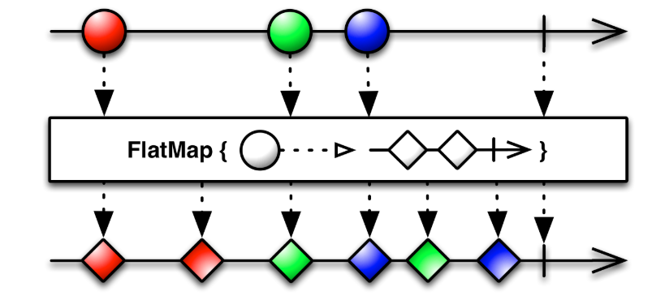

Dưới đây là cách giải quyết vấn đề:

```java
query("db")
        .flatMap(object : Func1<List<String>, Observable<String>>() {
            fun call(urls: List<String>): Observable<String> {
                return Observable.from(urls)
            }
        })
        .subscribe({ url -> System.out.println(url) })
```

Chúng ta cũng có thể rút gọn gắn code bằng cách sử dụng lambda.

```java
query("db")
        .flatMap({ urls -> Observable.from(urls) })
        .subscribe({ url -> System.out.println(url) })
```

Observable.flatMap() ở đây trả về một Subscriber và chúng ta nhìn thấy nó không trả về 1 List<String> mà nó nhận 1 chuỗi các String độc lập bởi Observable.from().

Điểm khác biệt chính giữa Map và FlatMap là FlatMap bản thân nó sẽ trả về một Observable. Nó được dùng để map trên các hoạt động bất đồng bộ

flatMap hoàn toàn có thể được dùng để thay thế map. Điểm khác biệt giữa 2 hàm này là:

* map trả về 1 Object thuộc type T
* flatMap trả về Observable<T>

Ví dụ với đoạn code dùng map có thể được viết lại như sau:

```java
searchMovie("Doctor Strange")
  .flatMap(json -> {
     try {
      return Observable.defer(() -> Observable.just(parse(json)));
    } catch(JSONException e) {
      return Observable.error(e);
    }
  })
  .subscribeOn(Schedulers.io())
  .observeOn(AndroidSchedulers.mainThread())
  .subscribe(new Subscriber<List<Movie>>() {
                    @Override
                    public void onCompleted() {

                    }

                    @Override
                    public void onError(Throwable e) {
                        showError();
                    }

                    @Override
                    public void onNext(List<Movie> movies) {
                        list.clear();
                        list.addAll(movies);
                        adapter.notifyDataSetChanged();
                    }
  });
```

Trong trường hợp xảy ra lỗi, chúng ta chỉ đơn giản là gọi hàm error và truyền vào lỗi. Hàm này sẽ gửi lỗi đến onError của Subscriber và chúng ta sẽ dễ dàng xử lý ở đó.

Việc có return type là Observable<T> làm cho flatMap linh hoạt hơn rất nhiều so với map. flatMap có thể thay đổi số lượng item được phát ra. Khi bạn truyền 1 item vào map, nó sẽ trả về 1 item có cùng hoặc khác type. Đối với flatMap thì bạn có thể dùng nó để không phát ra item nào, phát ra chính xác 1 item, phát ra nhiều item hay phát ra 1 lỗi.

Đến đây thì bài cũng khá dài rồi nhưng khách hàng lại vừa gọi điện cho tôi và họ yêu cầu app phải có thêm 1 chức năng mới, đó là hàm searchMovie chỉ trả về những phim có rating lớn hơn 5.0. Để làm được điều này thực chất thì khá đơn giản, nhưng tôi đã nói với họ đây là 1 chức năng khó và yêu cầu thêm tiền + estimate để trang trải chi phí nhân lực.

## Introducing filter

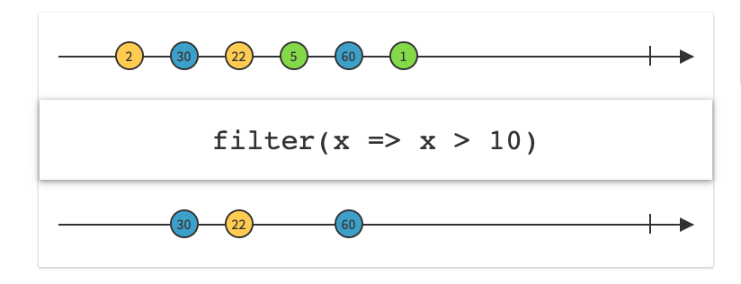
>Tiếp đến sẽ là Filter trả ra những items thoả mãn với điều kiện kiểm tra.

Ví dụ về filter dưới đây sẽ lọc ra những items % 2 == 0.

```java
Observable.just(1, 2, 3, 4, 5, 6, 7, 8, 9, 10)
        .filter({ i -> i % 2 == 0 })
        .subscribe({ i -> Log.v("Result", "Numbers = [ $i ]") })
```
Ví dụ dưới sẽ kết hợp filter và take.

```java
Observable.just(1,2,3,4,5,6,7,8,9,10)
        .filter({ i -> i %2 == 0 })
        .take(2)
        .subscribe({ title -> System.out.println(i) })
```

Có lẽ bạn khi đọc tên của Operator này cũng hiểu nó có tác dụng gì rồi đúng không ạ? Vâng, nó dùng để lọc các item phát ra bởi 1 Observable dựa trên những điều kiện mà chúng ta định nghĩa. Tuy nhiên với đoạn code mà chúng ta đang có thì sau khi flatMap được gọi, nó sẽ trả về 1 Observable phát ra 1 List<Movie>. Như đã nói ở trên thì Operator sẽ hoạt động trên Observable trả về từ Operator đứng trước nó, vậy nên nếu không có gì thay đổi thì chúng ta sẽ truyền vào hàm filter 1 List<Movie>. Điều này là không ổn bởi vì chúng ta muốn lọc từng Movie nằm trong List chứ không phải là cả List.

Ở đây tôi sẽ chứng minh tại sao flatMap lại là 1 trong những Operator linh hoạt và được sử dụng nhiều nhất trong thế giới Rx:

```java
searchMovie("Doctor Strange")
  .flatMap(json -> {
     try {
      return Observable.defer(() -> Observable.just(parse(json)));
    } catch(JSONException e) {
      return Observable.error(e);
    }
  })
  .flatMap(movies -> Observable.from(movies))
  .subscribeOn(Schedulers.io())
  .observeOn(AndroidSchedulers.mainThread())
  .subscribe(new Subscriber<Movie>() {
                    @Override
                    public void onCompleted() {

                    }

                    @Override
                    public void onError(Throwable e) {
                        showError();
                    }

                    @Override
                    public void onNext(Movie movie) {
                    }
  });
```

Tôi đã nối 1 flatMap khác vào flatMap mà chúng ta đang có*. Như đã nói ở phần 1 thì hàm from khi nhận vào 1 List hay 1 Array thì nó sẽ phát ra từng item trong List/Array đó. Điểm mấu chốt ở đây là bây giờ Subscriber sẽ nhận vào những Movie riêng lẻ chứ không phải là List<Movie> nữa (onNext sẽ được gọi với số lần bằng với số item trong List/Array). Rất tuyệt đúng không? Với flatMap chúng ta có thể nhận vào 1 item (List<Movie>) và trả ra nhiều item (nhiều Movie).

>Thực chất thì bạn không cần nối 2 flatMap lại như trên. Bạn có thể dùng from thay cho just ngay từ flatMap đầu tiên cũng sẽ cho ra output tương tự. Mục đích ở đây là tôi muốn demonstrate rằng bạn có thể return các Operator trực tiếp từ trong flatMap nên nó rất tiện trong việc setup các logic phức tạp. Giới hạn duy nhất là ở bản thân chúng ta mà thôi

Giờ thì chúng ta đã có đủ điều kiện để sử dụng hàm filter:

```java
searchMovie("Doctor Strange")
  .flatMap(json -> {
     try {
      return Observable.defer(() -> Observable.just(parse(json)));
    } catch(JSONException e) {
      return Observable.error(e);
    }
  })
  .flatMap(movies -> Observable.from(movies))
  .filter(movie -> movie.rating > 5.0)
  .subscribeOn(Schedulers.io())
  .observeOn(AndroidSchedulers.mainThread())
  .subscribe(new Subscriber<Movie>() {
                    @Override
                    public void onCompleted() {

                    }

                    @Override
                    public void onError(Throwable e) {
                        showError();
                    }

                    @Override
                    public void onNext(Movie movie) {
                    }
  });

```

Ở đây thì filter sẽ nhận vào từng Movie và dựa trên rule chúng ta định nghĩa (movie.rating > 5.0) nó sẽ trả về 1 boolean là true hoặc false. Nếu là true, Movie đó sẽ được đi tiếp xuống dưới đến tay Subscriber. Nếu false, Movie đó sẽ đi vào thùng rác.

Như vậy là chúng ta đã hoàn thành được requirement mới của khách hàng :^).

Chờ đã, hình như có gì đó không ổn. Subscriber của chúng ta hiện giờ vẫn đang nhận vào từng Movie riêng lẻ chứ không phải là 1 List<Movie> để chúng ta có thể gọi notify của Adapter.

## Take 
>Take sẽ định nghĩa số items được trả ra. Nếu số lượng items nhỏ hơn số lượng đã định nghĩa thì nó sẽ kết thúc nhanh hơn.

## GroupBy

>Chia các item của Observable thành tập hợp Observables mà mỗi 1 loại trả ra là 1 tập hợp các items của Observable.

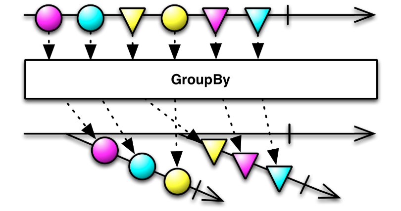

```java
Observable.just(1, 2, 3, 4, 5, 6, 7, 8, 9, 10)
        .groupBy({ i -> i % 2 == 0 })
        .subscribe({ grouped ->
            grouped.toList()
                    .subscribe({ integers -> Log.v("Result", integers + "Even(" + grouped.getKey() + ")") })
        })
```

Kết quả:

```java
Result: [1, 3, 5, 7, 9]Even(false)
Result: [2, 4, 6, 8, 10]Even(true)
```

## Introducing toList

```java
searchMovie("Doctor Strange")
  .flatMap(json -> {
     try {
      return Observable.defer(() -> Observable.just(parse(json)));
    } catch(JSONException e) {
      return Observable.error(e);
    }
  })
  .flatMap(movies -> Observable.from(movies))
  .filter(movie -> movie.rating > 5.0)
  .toList()
  .subscribeOn(Schedulers.io())
  .observeOn(AndroidSchedulers.mainThread())
  .subscribe(new Subscriber<List<Movie>>() {
                    @Override
                    public void onCompleted() {

                    }

                    @Override
                    public void onError(Throwable e) {
                        showError();
                    }

                    @Override
                    public void onNext(List<Movie> movies) {
                        list.clear();
                        list.addAll(movies);
                        adapter.notifyDataSetChanged();
                    }
  });
```

Bởi vì operator trong RxJava là serial execution, sau khi filter chạy xong chúng ta sẽ có rất nhiều Movie riêng lẻ. Ở đây hàm toList sẽ đơn giản là lấy tất cả chúng và cho vào trong 1 List. Rất tiện đúng không?
##  Map
Map sẽ chuyển đổi các item được phát ra bởi 1 Observable bằng cách áp dụng mỗi hàm cho mỗi item, dễ hiểu hơn thì nó dùng để chuyển đối 1 item thành 1 item khác.
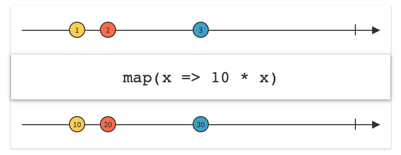

```java
Observable.just(1, 2, 3)
        .map({ i -> 10 * i })
        .subscribe({ i -> Log.v("Result", "" + i) })Kết quả: 
Result: 10, 20, 30
```
## First

>Trả ra item đầu tiên bởi Observable.

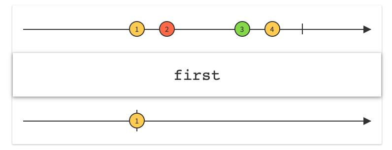

```java
Observable.just(1, 2, 3, 4, 5, 6)
        .first().subscribe({ i -> Log.v("Result", "" + i) })Kết quả: 
Result: 1
```

## Last

>Trả ra item cuối cùng bởi Observable.

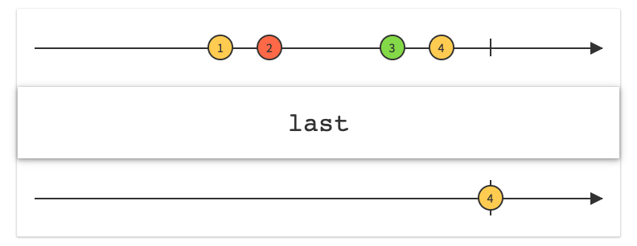

```java
Observable.just(1, 2, 3, 4, 5, 6)
        .last().subscribe({ i -> Log.v("Result", "" + i) })Kết quả: 
Result: 6
```

## Reduce

>Áp dụng chức năng cho tường item trả ra theo tuần tự cho đến giá trị cuối cùng( như ví dụ dưới đây mình viết là cộng chuỗi).

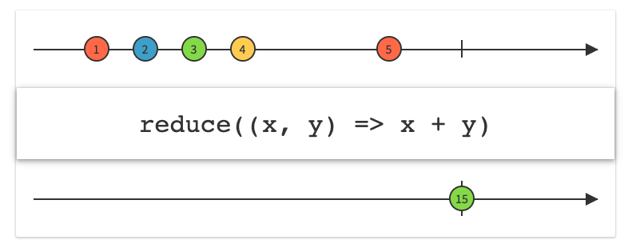

```java
Observable.just("abc", "123", "321", "1345")
        .reduce { t1, t2 ->
            return@reduce t1 + t2
        }
        .subscribe(getObserver())private fun getObserver(): MaybeObserver<String> {
    return object : MaybeObserver<String> {
        override fun onSuccess(t: String) {
            Log.d("Result", " onSuccess : value : $t")
        }
        override fun onSubscribe(d: Disposable) {
            Log.d("Result", " onSubscribe : " + d.isDisposed)
        }
        override fun onError(e: Throwable) {
            Log.d("Result", " onError : " + e.message)
        }

        override fun onComplete() {
            Log.d("Result", " onComplete")
        }
    }
}
```

Kết quả: Result:  onSuccess : value : abc1233211345

## Concat

>Nó sẽ ghép 2 hay nhiều Observable lại với nhau rồi thực hiện tuần tự từ Observable đầu tiên đến hết Observable cuối cùng và trả về chung 1 kết quả trong 1 danh sách mảng.

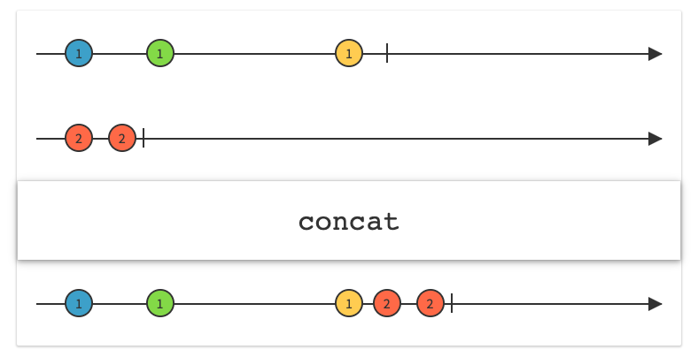

```java
val aStrings = arrayOf("A1", "A2", "A3", "A4")
val bStrings = arrayOf("B1", "B2", "B3")

val aObservable = Observable.fromArray(*aStrings)
val bObservable = Observable.fromArray(*bStrings)

Observable.concat(aObservable, bObservable)
        .subscribe(getObserver())private fun getObserver(): Observer<String> {
    return object : Observer<String> {
        override fun onSubscribe(d: Disposable) {
            Log.d("Result", " onSubscribe : " + d.isDisposed)
        }

        override fun onNext(value: String) {
            Log.d("Result", " onNext : value : $value")
        }

        override fun onError(e: Throwable) {
            Log.d("Result", " onError : " + e.message)
        }

        override fun onComplete() {
            Log.d("Result", " onComplete")
        }
    }
}
```
Kết quả:
```java 
Result:  onNext : value : A1
Result:  onNext : value : A2
Result:  onNext : value : A3
Result:  onNext : value : A4
Result:  onNext : value : B1
Result:  onNext : value : B2
Result:  onNext : value : B3
Result:  onComplete
```

Như các bạn thấy ở aObservable và bObservable kết quả trả về của nó là dữ liệu từ 2 nguồn khác nhau, nhưng kết quả chúng ta nhận được là 1 danh sách dữ liệu được hợp từ 2 nguồn khác nhau.

## Merge

>Sử dụng toán tử merge để hợp nhất Observable.

Hàm merge trong RxJava giúp chúng ta thực hiện đồng thời nhiều Observable và trả về riêng lẻ các kết quả của Observable sau khi thực hiện xong Observable đó.
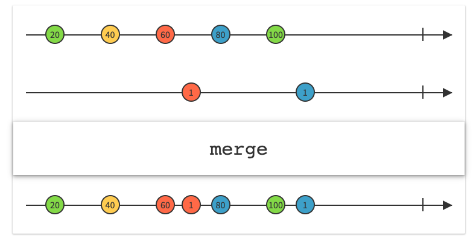

```java
class UserTest(var name: String)Observable
        .merge(getAObservable(), getBObservable())
        .observeOn(AndroidSchedulers.mainThread())
        .subscribeWith(object : Observer<UserTest> {
            override fun onSubscribe(d: Disposable) {}

            override fun onNext(user: UserTest) {
                Log.e("Result", user.name)
            }

            override fun onError(e: Throwable) {}

            override fun onComplete() {}
        })private fun getAObservable(): Observable<UserTest> {
    val names = arrayOf("A1", "A2", "A3")
    val users = ArrayList<UserTest>()
    for (name in names) {
        users.add(UserTest(name))
    }
    return Observable
            .create(ObservableOnSubscribe<UserTest> { emitter ->
                for (user in users) {
                    if (!emitter.isDisposed) {
                        Thread.sleep(1000)
                        emitter.onNext(user)
                    }
                }
                if (!emitter.isDisposed) {
                    emitter.onComplete()
                }
            }).subscribeOn(Schedulers.io())
}private fun getBObservable(): Observable<UserTest> {
    val names = arrayOf("B1", "B2", "B3", "B4")
    val users = ArrayList<UserTest>()
    for (name in names) {
        users.add(UserTest(name))
    }
    return Observable
            .create(ObservableOnSubscribe<UserTest> { emitter ->
                for (user in users) {
                    if (!emitter.isDisposed) {
                        Thread.sleep(500)
                        emitter.onNext(user)
                    }
                }
                if (!emitter.isDisposed) {
                    emitter.onComplete()
                }
            }).subscribeOn(Schedulers.io())
}
```
Kết quả: 
```java
Result:  B1
Result:  A1
Result:  B2
Result:  B3
Result:  A2
Result:  B4
Result:  A3
```

Ở đây trong hàm onNext() chúng ta thấy RxJava trả về từng phần tử sau khi đã thực hiện xong các Observable.

Kết quả Merge trả ra tổng 7 items và không theo thứ tự.”B1", “A1”, “B2”, “B3”, “A2”, “B4”, “A3” hoặc cũng có thể là 1 kết quả nào đó.

## Zip

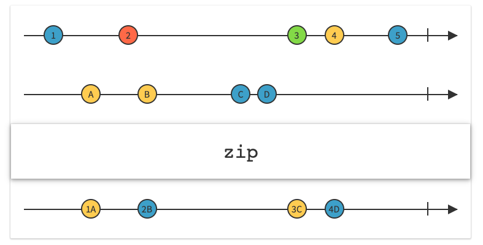
Zip trong RxJava giúp bạn thực hiện đồng thời nhiều Observable và gộp các kết quả của các Observable lại trong một kết quả trả về.


```java
val indexes = Arrays.asList(0, 1, 2, 3, 4)
val letters = Arrays.asList("a", "b", "c", "d", "e")
val indexesObservable = Observable.fromIterable<Int>(indexes)
val lettersObservable = Observable.fromIterable<String>(letters)
Observable.zip(indexesObservable, lettersObservable, mergeEmittedItems())
        .subscribe(object : Observer<String> {
            override fun onSubscribe(d: Disposable) {}
            override fun onNext(value: String) {
                Log.e("Result", value)
            }
            override fun onError(e: Throwable) {}
            override fun onComplete() {}
        })private fun mergeEmittedItems(): BiFunction<Int, String, String> {
    return object : BiFunction<Int, String, String> {
        override fun apply(t1: Int, t2: String): String {
            return "[$t1] $t2"
        }
    }
}
```
Kết quả:
```java
Result:  [0] a
Result:  [1] b
Result:  [2] c
Result:  [3] d
Result:  [4] e
```

## Debounce

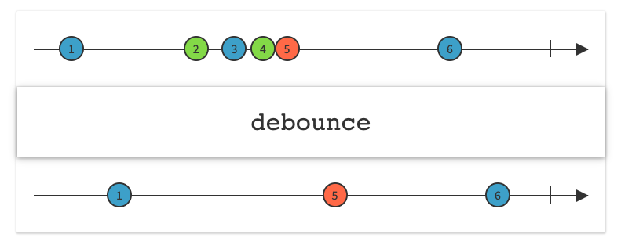
>Observable chỉ phát ra tín hiệu sau khi đã qua 1 khoảng thời gian được xác định và trong khỏang thời gian đó nó không thể phát ra tín hiệu nào.

```java
RxTextView.textChanges(edtTest)
        .debounce(2000, TimeUnit.MILLISECONDS)
        .map { charSequence ->
            charSequence.toString()
        }
        .subscribe { string ->
            //todo something
        }
```

## Throttle

>Throttle giới hạn số lần gọi hàm trong một khoảng thời gian. Khi một hàm dùng throttle, throttle sẽ gọi hàm này nhiều nhất 1 lần mỗi X mili giây với X là khoảng thời gian mà ta cài đặt.

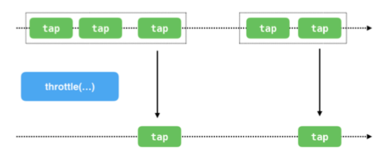

```java
RxTextView.textChanges(edtTest)
        .throttleFirst(2000, TimeUnit.MILLISECONDS)
        .map { charSequence ->
            charSequence.toString()
        }
        .subscribe { string ->
            //todo something
        }
```

## Count

>Đếm số lượng items trả ra bởi Observable và chỉ trả ra giá trị đếm.

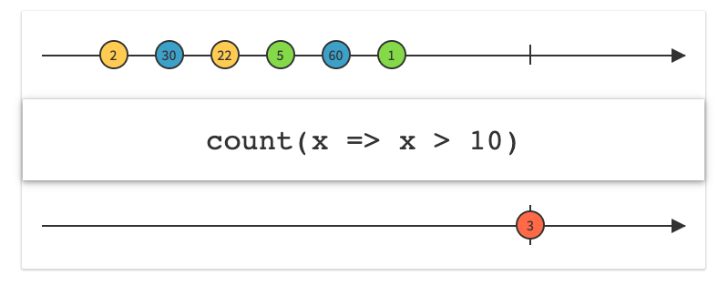

```java
Observable.just(1, 2, 3, 4, 5,7)
        .count()
        .subscribe(object : SingleObserver<Long> {
            override fun onSuccess(t: Long) {
                Log.d("Result", "Count: $t")
            }
            override fun onSubscribe(d: Disposable) {}
            override fun onError(e: Throwable) {}
        })
```
Kết quả: 
Result:  Count: 6

## Max

>Trả ra item Observable có giá trị lớn nhất.

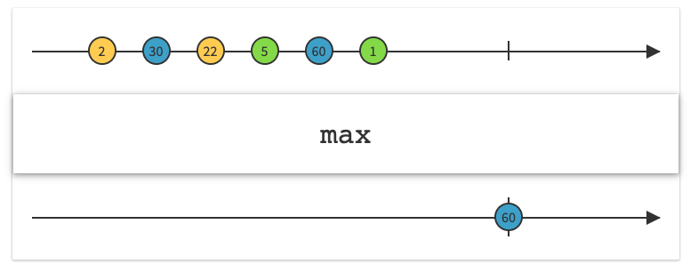

```java
Integer[] numbers = {2, 30, 22, 5, 60, 1}

Observable<Integer> observable = Observable.from(numbers)

MathObservable
        .max(observable)
        .subscribe(new Subscriber<Integer>() {
            @Override
            public void onCompleted() {}
            @Override
            public void onError(Throwable e) {}
            @Override
            public void onNext(Integer integer) {
                Log.d("Result", "Max value: " + integer)
            }
        });Trả ra item Observable có giá trị nhỏ nhất.

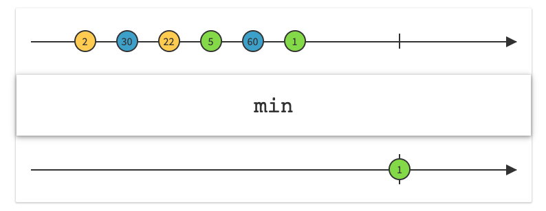

```java
Integer[] numbers = {2, 30, 22, 5, 60, 1};

Observable<Integer> observable = Observable.from(numbers);

MathObservable
        .min(observable)
        .subscribe(new Subscriber<Integer>() {
            @Override
            public void onCompleted() {}
            @Override
            public void onError(Throwable e) {}
            @Override
            public void onNext(Integer integer) {
                Log.d("Result", "Min value: " + integer);
            }
        });
```
Kết quả: 
Result:  Min value: 1


## Kết

RxJava còn có rất nhiều Operator khác mà tôi đảm bảo rằng nó đáp ứng 96% nhu cầu của bạn. ReactiveX cung cấp cho chúng ta decision tree để có thể chọn đúng Operator mà bạn cần, xem ở đây http://reactivex.io/documentation/operators.html .

Có thể đọc xong bài này bạn vẫn chưa hoàn toàn bị thuyết phục và có thể còn cảm thấy khó khăn nhưng một khi đã vượt qua được giai đoạn này và bắt đầu hiểu hơn 1 chút về concept của RxJava, mọi thứ sẽ trở nên rất tự nhiên và bạn sẽ code nhanh và ít lỗi hơn rất nhiều. Bạn chỉ cần nhớ là "Practice makes perfect".

# Làm chức năng search sử dụng RxJava operator. 
Ngày nay thì gần như bất cứ ứng dụng nào cũng có hỗ trợ chức năng tìm kiếm, giúp cho bạn tìm thấy thứ mình cần 1 cách nhanh chóng. Do đây là 1 chức năng rất quan trọng nên chúng ta cần phải tìm ra cách để implement nó 1 cách tốt nhất có thể. Trong bài này, chúng ta sẽ cùng tìm hiểu cách để làm chức năng search sử dụng các operator của RxJava.

Dưới đây là 1 số khái niệm mà chúng ta sẽ sử dụng để implement tính năng này:

* PublishSubject
* Filter Operator
* Debounce Operator
* DistinctUntilChanged Operator
* SwitchMap Operator

Để bắt đầu thì đầu tiên chúng ta phải làm thế nào đó để có thể theo dõi được sự kiện text thay đổi trong SearchView. Chúng ta có thể làm điều này bằng cách sử dụng PublishSubject. Với view thì bạn có thể dùng loại view khác ví dụ như EditText, nhưng ở đây thì tôi sẽ dùng luôn SearchView của Android và implement text change listener của view này.

```java
public class RxSearchObservable {

    public static Observable<String> fromView(SearchView searchView) {

        final PublishSubject<String> subject = PublishSubject.create();

        searchView.setOnQueryTextListener(new SearchView.OnQueryTextListener() {
            @Override
            public boolean onQueryTextSubmit(String s) {
                subject.onComplete();
                return true;
            }

            @Override
            public boolean onQueryTextChange(String text) {
                subject.onNext(text);
                return true;
            }
        });

        return subject;
    }
}
```

OK, với đoạn code trên thì khi người dùng gõ 1 chữ thì chúng ta sẽ nhận được event onNext() từ PublishSubject, còn khi user bấm submit (enter) trên bàn phím thì nhận được event onCompleted(). Chúng ta sẽ sử dụng class này kết hợp với các operator khác để hoàn thành chức năng này như sau:

```java
RxSearchObservable.fromView(searchView)
                .debounce(300, TimeUnit.MILLISECONDS)
                .filter(new Predicate<String>() {
                    @Override
                    public boolean test(String text) throws Exception {
                        if (text.isEmpty()) {
                            return false;
                        } else {
                            return true;
                        }
                    }
                })
                .distinctUntilChanged()
                .switchMap(new Function<String, ObservableSource<String>>() {
                    @Override
                    public ObservableSource<String> apply(String query) throws Exception {
                        return dataFromNetwork(query);
                    }
                })
                .subscribeOn(Schedulers.io())
                .observeOn(AndroidSchedulers.mainThread())
                .subscribe(new Consumer<String>() {
                    @Override
                    public void accept(String result) throws Exception {
                        textViewResult.setText(result);
                    }
                });
               
```

Giờ thì đã đến lúc chúng ta trả lời câu hỏi là tại sao phải dùng những operator này và kết hợp chúng lại với nhau thì sẽ ra được kết quả như thế nào:

* debounce() : operator Debounce được sử dụng với 1 hằng số thể hiện thời gian. Operator này được dùng để xử lý case khi người dùng gõ "a", "ab", "abc" trong 1 khoảng thời gian ngắn => Nó sẽ tạo quá nhiều request tới server. Nhưng do người dùng chỉ quan tâm tới kết quả cuối cùng thôi ("abc"), cho nên chúng ta cần phải loại bỏ kết quả của "a" và "ab". Tốt hơn nữa là chúng ta không cần phải search với từ khoá "a" và "ab" luôn. Debounce sẽ chờ cho đến khi hết khoảng thời gian chúng ta cung cấp trước khi làm bất cứ thứ gì, nên nếu có bất kì chữ nào được gõ trong khoảng thời gian đấy thì nó sẽ bỏ qua những chữ ở đằng trước và lại reset khoảng thời gian chờ. Ví dụ ở trên thì khi người dùng gõ "a", nó sẽ bắt đầu chờ 300ms, nếu trong khoảng 300ms đấy lại có chữ "b" xuất hiện thì nó sẽ bỏ qua chữ "a" đầu tiên và lại bắt đầu chờ 300ms tiếp. Chỉ khi hết 300ms trôi qua mà ko có chữ nào được gõ thêm thì nó mới bắt đầu dùng đoạn text cuối cùng để search.


* filter(): Cái này thì chắc là quá quen thuộc rồi, nhưng ở đây chúng ta dùng là để loại bỏ những kí tự thừa (ví dụ như toàn là dấu cách hoặc dấu cách ở cuối) để đỡ phải tạo request.

* distinctUntilChanged(): Chúng ta sử dụng operator này để tránh việc tạo các request trùng nhau. Ví dụ kết quả search hiện tại đang cho từ khoá "abc", nhưng người dùng nó lại xoá chữ c đi và lại gõ chữ c vào (trong khoảng thời gian 300ms) thì cuối cùng PublishSubject vẫn sẽ emit ra chuỗi "abc" mà thôi, cho nên chúng ta chả cần phải search lại làm gì cả.
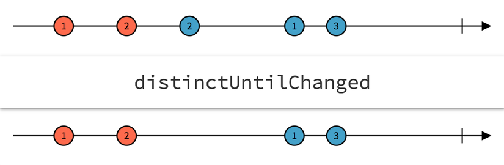


* switchMap(): operator này được dùng để tránh việc chúng ta cho hiển thị những kết quả search mà không còn cần thiết nữa. Tưởng tượng trường hợp là khi mà người dùng gõ "ab" xong lại ngập ngừng 1 lúc quá 300ms mới gõ "c" thì trong lúc đó chúng ta đã tạo 1 request lên server với query là "ab" rồi. Nhưng lúc này thì chúng ta không còn quan tâm đến kết quả của "ab" trả ra gì nữa vì cuối cùng thì ông người dùng chỉ quan tâm đến "abc" thôi. Sử dụng switchMap() ở chỗ này sẽ giúp chúng ta luôn hiện được kết quả search cho query gần nhất được gõ vào và bỏ qua tất cả những kết quả cho các query khác.

Yeah, vậy là chúng ta đã làm xong chức năng này rồi. Thử tưởng tượng xem nó sẽ mất thời gian và công sức đến mức nào nếu không có RxJava.

Bài viết xin được dừng tại đây. Nếu bạn quan tâm đến code mẫu thì hãy xem ở <a href='https://github.com/amitshekhariitbhu/RxJava2-Android-Samples'>repo này nhé</a>.

Bài viết được dịch từ <a href='https://blog.mindorks.com/implement-search-using-rxjava-operators-c8882b64fe1d'>Implement Search Using RxJava Operators</a> của tác giả Amit Shekhar.

# RxJava Operators – Just, From, Range and Repeat
## Giới thiệu

Như các bạn đã biết về Operator dùng để tạo ra Observable. Ngoài ra thì chúng ta còn có rất nhiều Operator khác và được ReactiveX cho vào các category như Transformation, Just, From, Range and Repeat, .. nhằm phục vụ cho các use case khác nhau. Hôm này mình xin tìm hiểu về các case Just, From, Range and Repeat chi tiết hơn nhé.

### 1. Just()

Toán tử Just () lấy danh sách các đối số và chuyển đổi các mục thành các mục có thể quan sát được. Nó đưa ra các đối số từ 1 đến 10.
Hãy xem xét ví dụ dưới đây. Ở đây, một Observable được tạo bằng cách sử dụng just () từ một loạt các số nguyên. Giới hạn của just() là, bạn không thể vượt qua hơn 10 đối số.

```java
Observable.just(1, 2, 3, 4, 5, 6, 7, 8, 9, 10)
                .subscribeOn(Schedulers.io())
                .observeOn(AndroidSchedulers.mainThread())
                .subscribe(new Observer<Integer>() {
                    @Override
                    public void onSubscribe(Disposable d) {
 
                    }
 
                    @Override
                    public void onNext(Integer integer) {
                        Log.d(TAG, "onNext: " + integer);
                    }
 
                    @Override
                    public void onError(Throwable e) {
 
                    }
 
                    @Override
                    public void onComplete() {
 
                    }
                });
```

```java
Output:

onNext: 1
onNext: 2
.
.
onNext: 9
onNext: 10
```

Ví dụ dưới đây tạo ra một Observable từ một mảng. Ở đây bạn nên chú ý rằng mảng được phát ra dưới dạng một mục thay vì các số riêng lẻ.
Observer phát ra mảng onNext(Integer[] integers)

```java
Integer[] numbers = {1, 2, 3, 4, 5, 6, 7, 8, 9, 10, 11, 12};
 
Observable.just(numbers)
                .subscribeOn(Schedulers.io())
                .observeOn(AndroidSchedulers.mainThread())
                .subscribe(new Observer<Integer[]>() {
                    @Override
                    public void onSubscribe(Disposable d) {
 
                    }
 
                    @Override
                    public void onNext(Integer[] integers) {
                        Log.d(TAG, "onNext: " + integers.length);
 
                        // you might have to loop through the array
                    }
 
                    @Override
                    public void onError(Throwable e) {
 
                    }
 
                    @Override
                    public void onComplete() {
 
                    }
                });
```

Output:

```java
onNext: 12
```

### 2. From()

* Không giống như just(). From() tạo ra một Observable từ việc set items sử dụng Iterable, có nghĩa là các item được trả ra cùng một lúc.
* Lưu ý là trong RxJava2 chúng ta sẽ sử dụng fromArray() chứ không phải from() như trước nữa.

```java
Integer[] numbers = {1, 2, 3, 4, 5, 6, 7, 8, 9, 10, 11, 12};

 
Observable.fromArray(numbers)
                .subscribeOn(Schedulers.io())
                .observeOn(AndroidSchedulers.mainThread())
                .subscribe(new Observer<Integer>() {
                    @Override
                    public void onSubscribe(Disposable d) {
 
                    }
 
                    @Override
                    public void onNext(Integer integer) {
                        Log.d(TAG, "onNext: " + integer);
                    }
 
                    @Override
                    public void onError(Throwable e) {
 
                    }
 
                    @Override
                    public void onComplete() {
 
                    }
                });
```

Output :

```java
onNext: 1
onNext: 2
.
.
onNext: 11
onNext: 12
```

>Sự khác biệt giữa Just() và From(): Dường như chỉ khác nhau về số lượng items được đẩy ra output. Với Just: onNext(Integer[] integers) còn From: onNext(Integer integer).

### 3. Range()

Range () tạo ra một Observable từ một chuỗi các số nguyên. Nó tạo ra chuỗi số nguyên bằng cách lấy số bắt đầu và độ dài . Vì vậy, các ví dụ tương tự ở trên có thể được sửa đổi là Observable.range (1, 10) .

```java
Observable.range(1, 10)
                .subscribeOn(Schedulers.io())
                .observeOn(AndroidSchedulers.mainThread())
                .subscribe(new Observer<Integer>() {
                    @Override
                    public void onSubscribe(Disposable d) {
 
                    }
 
                    @Override
                    public void onNext(Integer integer) {
                        Log.d(TAG, "onNext: " + integer);
                    }
 
                    @Override
                    public void onError(Throwable e) {
 
                    }
 
                    @Override
                    public void onComplete() {
 
                    }
                });
```

Output:

```java
onNext: 1
onNext: 2
.
.
onNext: 9
onNext: 10
```

### 4. Repeat()

Repeat tạo ra một Observable phát ra một item hoặc một loạt các items liên tục.

```java
Observable
         .range(1, 4)
         .repeat(3)
         .subscribe(new Observer<Integer>() {
             @Override
             public void onSubscribe(Disposable d) {
                 Log.d(TAG, "Subscribed");
             }
 
             @Override
             public void onNext(Integer integer) {
                 Log.d(TAG, "onNext: " + integer);
             }
 
             @Override
             public void onError(Throwable e) {
 
             }
 
             @Override
             public void onComplete() {
                 Log.d(TAG, "Completed");
             }
         });
```

Output:

```java
Subscribed
onNext: 1
onNext: 2
onNext: 3
onNext: 4
onNext: 1
onNext: 2
onNext: 3
onNext: 4
onNext: 1
onNext: 2
onNext: 3
onNext: 4
Completed
```

Bài viết tới đây là hết. Cảm ơn các bạn đã đọc. Chúc các bạn thành công trên con đường trinh phục code của minh.
Tham khảo:

* https://www.androidhive.info/RxJava/rxjava-operators-just-range-from-repeat/#just


@see

* https://viblo.asia/p/cung-hoc-rxjava-phan-1-gioi-thieu-aRBeXWqgGWE
* https://viblo.asia/p/cung-hoc-rxjava-phan-2-threading-concept-MgNeWWwXeYx
* https://medium.com/seesaavntech/rxjava-c%C3%A1c-operator-hay-s%E1%BB%AD-d%E1%BB%A5ng-ad2074a9333f