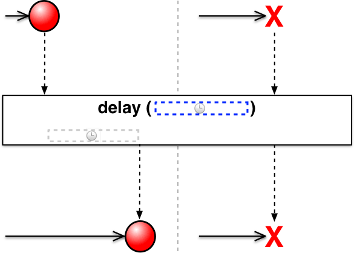

# Single

RxJava (and its derivatives like RxGroovy & RxScala) has developed an Observable variant called “Single.”

>A Single is something like an Observable, but instead of emitting a series of values — anywhere from none at all to an infinite number — it always either emits one value or an error notification.

For this reason, instead of subscribing to a Single with the three methods you use to respond to notifications from an Observable (onNext, onError, and onCompleted), you only use two methods to subscribe:

onSuccess
>a Single passes this method the sole item that the Single emits

onError
>a Single passes this method the Throwable that caused the Single to be unable to emit an item

A Single will call only one of these methods, and will only call it once. Upon calling either method, the Single terminates and the subscription to it ends.
Composition via Single Operators

Like Observables, Singles can be manipulated by means of a variety of operators. Some operators also allow for an interface between the Observable world and the Single world so that you can mix the two varieties:

|operator	|returns|	description|
|-----------|--------|--------------|
|compose	|Single	|allows you create a custom operator|
|concat and concatWith|	Observable	|concatenates the items emitted by multiple Singles as Observable emissions|
|create|	Single	|create a Single from scratch by calling subscriber methods explicitly|
|delay|	Single	|move the emission of an item from a Single forward in time|
|doOnError	|Single	|returns a Single that also calls a method you specify when it calls onError
|doOnSuccess	|Single|returns a Single that also calls a method you specify when it calls onSuccess
|error	|Single	|returns a Single that immediately notifies subscribers of an error
|flatMap|	Single	|returns a Single that is the result of a function applied to an item emitted by a Single
|flatMapObservable	|Observable	|returns an Observable that is the result of a function applied to an item emitted by a Single
|from	|Single	|converts a Future into a Single
|just	|Single	|returns a Single that emits a specified item
|map	|Single	|returns a Single that emits the result of a function applied to the item emitted by the source Single
|merge	|Single|	converts a Single that emits a second Single into a Single that emits the item emitted by the second Single
|merge and mergeWith|Observable	|merges the items emitted by multiple Singles as Observable emissions
|observeOn	|Single|	instructs the Single to call the subscriber methods on a particular Scheduler|
|onErrorReturn|	Single|	converts a Single that makes an error notification into a Single that emits a specified item|
|subscribeOn	|Single|	instructs the Single to operate on a particular Scheduler|
|timeout	|Single	|returns a Single that makes an error notification if the source Single does not emit a value in a specified time period
|toSingle	|Single	|converts an Observable that emits a single item into a Single that emits that item
|toObservable	|Observable	|converts a Single into an Observable that emits the item emitted by the Single and then completes
|zip and zipWith	|Single	|returns a Single that emits an item that is the result of a function applied to items emitted by two or more other Singles

The following sections of this page will give marble diagrams that explain these operators schematically. This diagram explains how Singles are represented in marble diagrams: 


## compose
### concat
Concat emits the emissions from two or more Observables without interleaving them. It will maintain the order of the observables while emitting the items. It means that it will emit all the items of the first observable and then it will emit all the items of the second observable and so on.

Let's understand it clearly by an example.


```java
package com.rxjava3.reactivex.io.single;

import io.reactivex.rxjava3.core.Observable;
import io.reactivex.rxjava3.core.ObservableEmitter;
import io.reactivex.rxjava3.core.ObservableOnSubscribe;
import io.reactivex.rxjava3.core.Observer;
import io.reactivex.rxjava3.disposables.Disposable;
import io.reactivex.rxjava3.schedulers.Schedulers;

import java.util.ArrayList;
import java.util.List;
import java.util.concurrent.TimeUnit;

import org.apache.log4j.Logger;

import com.rxjava3.utils.Utils;

import concurrencies.utilities.Log4jUtils;

/**
 * java concurrency
 * 
 * @author EMAIL:vuquangtin@gmail.com , tel:0377443333
 * @version 1.0.0
 * @see <a
 *      href="https://github.com/vuquangtin/concurrency">https://github.com/vuquangtin/concurrency</a>
 *
 */
public class ComposeConcatExample {
	static Logger logger = Logger.getLogger(ComposeConcatExample.class
			.getName());

	public static void main(String[] args) {
		logger = Log4jUtils.initLog4j();
		try {
			Observable.concat(getMaleObservable(), getFemaleObservable())
					.observeOn(Schedulers.newThread())
					.subscribe(new Observer<User>() {
						@Override
						public void onSubscribe(Disposable d) {
						}

						@Override
						public void onNext(User user) {
							logger.info(user.getName() + ", "
									+ user.getGender());
							//System.out.println(user.getName() + ", "
							//		+ user.getGender());
						}

						@Override
						public void onError(Throwable e) {

						}

						@Override
						public void onComplete() {

						}
					});
		} catch (Exception ex) {
			ex.printStackTrace();
		}
		logger.info("Observable.concat");
//		Observable.concat(
//				Observable.interval(1, TimeUnit.SECONDS).map(id -> "A" + id),
//				Observable.interval(1, TimeUnit.SECONDS).map(id -> "B" + id))
//				.subscribe(System.out::println);
		Utils.sleep(10000);
	}

	public static Observable<User> getFemaleObservable() {
		String[] names = new String[] { "Lucy", "Scarlett", "April" };

		final List<User> users = new ArrayList<>();
		for (String name : names) {
			User user = new User();
			user.setName(name);
			user.setGender("female");
			users.add(user);
		}
		return Observable.create(new ObservableOnSubscribe<User>() {
			@Override
			public void subscribe(ObservableEmitter<User> emitter)
					throws Exception {
				for (User user : users) {
					if (!emitter.isDisposed()) {
						Thread.sleep(1000);
						emitter.onNext(user);
					}
				}

				if (!emitter.isDisposed()) {
					emitter.onComplete();
				}
			}
		}).subscribeOn(Schedulers.newThread());
	}

	public static Observable<User> getMaleObservable() {
		String[] names = new String[] { "Mark", "John", "Trump", "Obama" };

		final List<User> users = new ArrayList<>();

		for (String name : names) {
			User user = new User();
			user.setName(name);
			user.setGender("male");

			users.add(user);
		}
		return Observable.create(new ObservableOnSubscribe<User>() {
			@Override
			public void subscribe(ObservableEmitter<User> emitter)
					throws Exception {
				for (User user : users) {
					if (!emitter.isDisposed()) {
						Thread.sleep(500);
						emitter.onNext(user);
					}
				}

				if (!emitter.isDisposed()) {
					emitter.onComplete();
				}
			}
		}).subscribeOn(Schedulers.newThread());
	}
}

```

As we are using Concat Operator, it will maintain the order and emit the values as A1, A2, A3, A4, B1, B2, B3.

### and concatWith

It is also possible to use the concatWith() operator, just like we have seen with merging.
Notice that the order of the emissions is always the same:

There is also an instance version of this operator: 


```java
package com.rxjava3.reactivex.io.single;

import io.reactivex.rxjava3.core.Observable;
import io.reactivex.rxjava3.functions.Function;

/**
 * java concurrency
 * 
 * @author EMAIL:vuquangtin@gmail.com , tel:0377443333
 * @version 1.0.0
 * @see <a
 *      href="https://github.com/vuquangtin/concurrency">https://github.com/vuquangtin/concurrency</a>
 *
 */
public class ComposeConcatWithExample {
	public static void main(String[] args) {
		Observable.just(foo()).concatWith(bar().map(new IntMapper()))
				.subscribe(System.out::println);
	}

	static int foo() {
		System.out.println("foo");
		return 0;
	}

	static Observable<Integer> bar() {
		System.out.println("bar");
		return Observable.just(1, 2);
	}

	static class IntMapper implements Function<Integer, Integer> {

		@Override
		public Integer apply(Integer integer) throws Throwable {
			System.out.println("IntMapper " + integer);
			return integer + 5;
		}
	}
}
```

### create


We can use Flowable.create(…) to implement the emissions of events by calling onNext(val), onComplete(), onError(throwable)

When subscribing to the Observable / Flowable with flowable.subscribe(…) the lambda code inside create(…) gets executed. Flowable.subscribe(…) can take 3 handlers for each type of event - onNext, onError and onCompleted.

When using Observable.create(…) you need to be aware of backpressure and that Observables created with ‘create’ are not BackPressure aware
Create Operator: create an Observable from scratch by means of a function.


Using Create Operator, we can do a task and keep emitting values one by one and finally completes. Let's see with an example


```java
package com.rxjava3.reactivex.io.single;

import io.reactivex.rxjava3.core.BackpressureStrategy;
import io.reactivex.rxjava3.core.Flowable;

import org.apache.log4j.Logger;

import concurrencies.utilities.Log4jUtils;
import concurrencies.utilities.LogTest;
import rx.Observable;
import rx.schedulers.Schedulers;

/**
 * 
 We can use Flowable.create(…) to implement the emissions of events by calling
 * onNext(val), onComplete(), onError(throwable)
 * 
 * When subscribing to the Observable / Flowable with flowable.subscribe(…) the
 * lambda code inside create(…) gets executed. Flowable.subscribe(…) can take 3
 * handlers for each type of event - onNext, onError and onCompleted.
 * 
 * When using Observable.create(…) you need to be aware of backpressure and that
 * Observables created with ‘create’ are not BackPressure aware
 * 
 * @author EMAIL:vuquangtin@gmail.com , tel:0377443333
 * @version 1.0.0
 * @see <a
 *      href="https://github.com/vuquangtin/concurrency">https://github.com/vuquangtin/concurrency</a>
 *
 */
public class CreateExample {
	static Logger logger = Logger.getLogger(LogTest.class.getName());

	public static void main(String[] args) {
		logger = Log4jUtils.initLog4j();
		Observable<Integer> stream = Observable.create(subscriber -> {
			logger.info("Started emitting");

			logger.info("Emitting 1st");
			subscriber.onNext(1);

			logger.info("Emitting 2nd");
			subscriber.onNext(2);

			subscriber.onCompleted();
		});

		// Flowable version same Observable but with a BackpressureStrategy
		// that will be discussed separately.
		Flowable<Integer> streamFlowable = Flowable.create(subscriber -> {
			logger.info("Started emitting");

			logger.info("Emitting 1st");
			subscriber.onNext(1);

			logger.info("Emitting 2nd");
			subscriber.onNext(2);

			subscriber.onComplete();
		}, BackpressureStrategy.MISSING);

		stream.subscribe(val -> logger.info("Subscriber received: " + val),
				err -> logger.error("Subscriber received error", err),
				() -> logger.info("Subscriber got Completed event"));

		streamFlowable.subscribe(
				val -> logger.info("Subscriber received: " + val),
				err -> logger.error("Subscriber received error", err),
				() -> logger.info("Subscriber got Completed event"));

	}
}
```

It will print "One" and "Two".
### delay()

>With the help of the delay() operator emissions can be shifted forward in time.

It is possible to delay the error notifications as well, you just need to pass a boolean value as a third parameter.



```java
package com.rxjava3.reactivex.io.single;

import io.reactivex.rxjava3.core.Observable;

import java.util.concurrent.CountDownLatch;
import java.util.concurrent.TimeUnit;

/**
 * With the help of the delay() operator emissions can be shifted forward in
 * time.
 * 
 * @author EMAIL:vuquangtin@gmail.com , tel:0377443333
 * @version 1.0.0
 * @see <a
 *      href="https://github.com/vuquangtin/concurrency">https://github.com/vuquangtin/concurrency</a>
 *
 */
public class DelayExample {

	public static void main(String[] args) {
		Observable<String> myObservable = Observable.just("a", "b", "c");
		CountDownLatch countDown = new CountDownLatch(1);

		myObservable.delay(2, TimeUnit.SECONDS).subscribe(System.out::println,
				(e) -> {
				}, () -> {
					countDown.countDown();
				});
		try {
			countDown.await();
		} catch (InterruptedException e1) {
			// TODO Auto-generated catch block
			e1.printStackTrace();
		}
		// Utils.sleep10000();

	}
}
```


There is also a version of this operator that allows you to perform the delay on a particular Scheduler: 


### doOnError


```java
package com.rxjava3.reactivex.io.single;

import rx.Observable;
import rx.Subscriber;

/**
 * java concurrency
 * 
 * @author EMAIL:vuquangtin@gmail.com , tel:0377443333
 * @version 1.0.0
 * @see <a
 *      href="https://github.com/vuquangtin/concurrency">https://github.com/vuquangtin/concurrency</a>
 *
 */
public class OnErrorExample {
	public static void main(String[] args) {

		// 观察者
		Observable<String> observable = (Observable<String>) Observable
				.create(new Observable.OnSubscribe<String>() {

					public void call(Subscriber<? super String> sub) {
						sub.onNext("--- Hello world ---");
						sub.onError(new Exception());
						sub.onCompleted();
					}
				});

		// 订阅者
		Subscriber<String> sub = new Subscriber<String>() {
			public void onNext(String arg0) {
				System.out.println(arg0);
			}

			public void onError(Throwable arg0) {
				System.out.println(arg0);
			}

			public void onCompleted() {
				System.out.println("---completed---");
			}
		};

		observable.subscribe(sub);
	}

}

```

### doOnSuccess


### error


### flatMap
Lets start with a simple Java unit test that is testing flatMap operator. First we create list of Strings, then transform each object of this list into an Observable using operator from. Then each item is flapMapped into an observable that adds “x” letter at the end of the string. Next the observable is delayed by na random number of seconds (line 9). Last thing is advancing in time by 1 minute (line 17), just to be sure that everything will have the time to emit. (If we would not do this, the test would end before any emission).


```java
package com.rxjava3.reactivex.io.single;

import io.reactivex.rxjava3.core.Observable;
import io.reactivex.rxjava3.schedulers.Schedulers;

import java.util.List;
import java.util.concurrent.TimeUnit;

import com.google.common.collect.Lists;
import com.rxjava3.utils.Utils;

/**
 * java concurrency
 * 
 * @author EMAIL:vuquangtin@gmail.com , tel:0377443333
 * @version 1.0.0
 * @see <a
 *      href="https://github.com/vuquangtin/concurrency">https://github.com/vuquangtin/concurrency</a>
 *
 */
public class FlatMapExample {

	public static void main(String[] args) {
		final List<String> items = Lists.newArrayList("a", "b", "c", "d", "e",
				"f");

		Observable
				.fromIterable(items)
				.flatMap(
						s -> {
							final int delay = new java.util.Random()
									.nextInt(10);
							return Observable.just(s + "x").delay(delay,
									TimeUnit.SECONDS, Schedulers.io());
						}).toList().subscribe(System.out::println);

		Utils.sleep10000();

	}
}
```

Lets run this test to see its result:

```java
 [cx, ex, fx, bx, dx, ax]
```

Surprised? You shouldn’t be because as documentation points out:

>Note that FlatMap merges the emissions of these Observables, so that they may interleave.

So what actually happened here is operator flatMap does not care about the order of the items. It creates a new observable for each item and that observable lives its own life. Some of them will emit faster, and others slower because we delay each of them for a random amount of seconds. Similar effect will happen without delaying, but it was added for the sake of an argument.

### flatMapObservable
>Applies the given io.reactivex.functions.Function to the item emitted by a Maybe or Single, where that function returns an io.reactivex.ObservableSource, and returns an Observable that emits the items emitted by this ObservableSource.


```java 
package com.rxjava3.reactivex.io.single;

import io.reactivex.rxjava3.core.Observable;
import io.reactivex.rxjava3.core.Single;

/**
 * java concurrency
 * 
 * @author EMAIL:vuquangtin@gmail.com , tel:0377443333
 * @version 1.0.0
 * @see <a
 *      href="https://github.com/vuquangtin/concurrency">https://github.com/vuquangtin/concurrency</a>
 *
 */
public class FlatMapObservableExample{
	public static void main(String[] args) {
		Single<String> source = Single.just("Kirk, Spock, Chekov, Sulu");
		Observable<String> names = source.flatMapObservable(text -> {
			return Observable.fromArray(text.split(",")).map(
					String::toUpperCase);
		});

		names.subscribe(name -> System.out.println("onNext: " + name));

		// prints:
		// onNext: KIRK
		// onNext: SPOCK
		// onNext: CHEKOV
		// onNext: SULU
	}
}

```

### from
Constructs a sequence from a pre-existing source or generator type.

>Note: These static methods use the postfix naming convention (i.e., the argument type is repeated in the method name) to avoid overload resolution ambiguities.


There is also a variety that takes a Scheduler as an argument: 


```java
package com.rxjava3.reactivex.io.single;

import io.reactivex.rxjava3.core.Observable;

import java.util.ArrayList;
import java.util.Arrays;
import java.util.List;

/**
 * Constructs a sequence from a pre-existing source or generator type.
 * 
 * @author EMAIL:vuquangtin@gmail.com , tel:0377443333
 * @version 1.0.0
 * @see <a
 *      href="https://github.com/vuquangtin/concurrency">https://github.com/vuquangtin/concurrency</a>
 *
 */
public class FromExample {

	public static void main(String[] args) {
		List<Integer> list = new ArrayList<>(Arrays.asList(1, 2, 3, 4, 5, 6, 7,
				8));

		Observable<Integer> observable = Observable.fromIterable(list);

		observable.subscribe(item -> System.out.println(item),
				error -> error.printStackTrace(),
				() -> System.out.println("Done"));

	}

}
```

### just

### Merge
>Merge combines multiple Observables into one by merging their emissions. It will not maintain the order while emitting the items.


