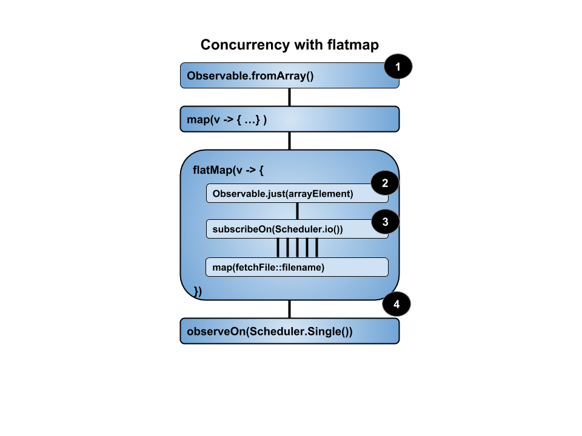

# RxJava2: Schedulers 101 or simplified concurrency
Today, we’re going to talk about Scheduler but first, let’s clarify that they have nothing to do with a hockey game or a dentist appointment. Schedulers, in the asynchronous/reactive universe, are objects that simplify concurrency management. To summarize the definition provided by RxJava2 Javadoc, a Scheduler is basically an API used to “schedule” a unit of work to be processed by an underlying execution scheme, be it a Thread, an event loop, an Executor or an Actor.
However, don’t let the title fool you into thinking that, all of a sudden, concurrency management has become a trivial given. Schedulers have simplified the concurrency management API but one still has to understand and reason about what’s going on underneath.
Note: This post will only address cold Observables stream constructs. We’ll look at hot Observables in a future post.

## 1. Schedulers
Basically, a Scheduler closely resembles a Java Executor or a thread pool. RxJava2 provides ready-made Schedulers, each of which being configured for a specific type of work. They have their own specification regarding numbers of Threads and job order. Few links where you can get detailed documentation for each type are provided as you read. For now, we’ll simply enumerate the provided Schedulers with a brief description of their respective behavior;

1. Schedulers.computation: used for expensive CPU computations, as many threads as CPUs
2. Schedulers.io: used for high-latency I/O operations like I/O, unbounded thread pool
3. Schedulers.single: performs task sequentially and in order on a single Thread
4. Schedulers.trampoline: used for recursive operations to avoid stack overrun
5. Schedulers.newThread: creates a new Thread for each scheduled unit of work
6. Schedulers.from(Executor executor): creates and returns a Scheduler backed by the provided executor.

## 2. Operators
Now, let’s get familiar with stream operators that provide control over the Schedulers.
subscribe(): this might sound strange but it is of utmost importance to understand that any Observables stream is, by default, executed on the thread from which subscribe() is called.
subscribeOn(): configures the subscription Scheduler on which the source Observables will emit on. It can be positioned anywhere in the stream as it is only applied when subscribe() is called.
observeOn(): changes the emitting Scheduler from its declared stream position and for all downstream operators. Can be applied as many times as required in a stream and is often used to avoid processing operators on the UI thread.
Now we’ll look at some practical aspects of the theory we just learned. First, let’s code a stream we’ll use in all our subsequent examples:

```java
Observable<Member> getEachMemberAsObservableItem(File source)
  throws IOException {
    return Observable.<Member>create(emitter -> {
        try {
            ObjectMapper mapper = new ObjectMapper();   //---1---
            List<Member> list = mapper.readValue(source,
              new TypeReference<List<Member>>() {});
            list.forEach(member -> {                    //---2---
                printThread(
                  String.format("Emitter for %s = ",
                    member.getEmail()));
                emitter.onNext(member);
            });
        } catch (IOException e) {
            printThread("Emitter for onError = ");
            emitter.onError(e);
            return;
        }
        printThread("Emitter for onComplete = ");
        emitter.onComplete();
    });
}
void printThread(String title) {
    System.out.println(String.format("%s thread: %s",
      title, Thread.currentThread().getName()));
}
```

1. Using a Jackson’s ObjectMapper, we synchronously extract individual members from member.json into a list from which we emit members individually.
2. We record the emitting thread for each member emission, including their email so we can track each Observable<members> in the subscription.
I’ll let it the reader as an exercise to rewrite that part to load data asynchronously. You can refer to the same article sections mentioned below for examples.
All examples will subscribe to this Observable stream with various subscribeOn() and observeOn() configuration and expose their results.

### 2.1. SubscribeOn
A reactive stream must be fed somehow with data. The most frequently seen methods are:

1. A source operator ( from…(), just(), etc.)
2. An input from another stream
3. Building an adapter using Observables.create(-> emitter{…})

>Note: For examples of above items 2 and 3, see section 3.2 and 3.3 here

Subscription is the trigger that starts the execution of a cold Observables stream construct. Calling subscribe() on a stream sends an upstream subscription signal that eventually reaches the stream source and triggers its downstream execution. That’s fine and dandy but, what does this has to do with Schedulers? Well, we mentioned earlier that the default thread on which the Observables emits is the same thread subscribe() is called from. As we’ll see, this is not always the best choice.
Selecting the right Scheduler to subscribe on is quite important if, for instance, you need to build an emitting adapter with a long initializing process. The point is that all the code contained by the Observables.create(emitter -> {…}) is executed on the subscriber’s thread. For instance, it might not be a good idea to synchronously fetch a large local file or do a remote API call if subscribing from the UI thread. We’ll see below that we may define a stream in a thread and subscribe on another one. As for source operators, bear in mind that they are an adapter as well and use a create()function internally.
That is where the subscribeOn() operator comes in handy. By carefully setting the Scheduler on which the source operator will start emitting data, we avoid bloating a Scheduler assigned to some other task type than the one at hand. Again, one must still select wisely so as not to bloat Scheduler with an unbounded Executor thread pool (e.g. I/O). These can grow quite large and ultimately degrade performance.
Let’s look at some examples, but bear in mind that the result order shown here might not be the same on your setup. Just make sure each the emission has a corresponding reception.
First, no subscribeOn() nor observeOn():

```java
@Test
public void givenSubscribeOnMain_whenNoChange_thenResult()
  throws IOException, InterruptedException {
    CountDownLatch latch = new CountDownLatch(1);
    printThread("Subscribe thread = ");
    sample.getEachMemberAsObservableItem(memberFile)
      .subscribe(member -> {
          printThread(String.format(
            "Observer for %s = thread: ", member.getEmail()));
        },
        Throwable::getMessage,
        () -> latch.countDown());
    latch.await();
}
```

The results are:

```java
Subscribe thread = main
Emitter for Newton.Thiel@kenny.name =  thread: main
Observer for Newton.Thiel@kenny.name = thread: main
Emitter for Gerardo@addison.co.uk =  thread: main
Observer for Gerardo@addison.co.uk = thread: main
Emitter for George@nedra.co.uk =  thread: main
Observer for George@nedra.co.uk = thread: main
Emitter for onComplete =  thread: main
```

As we observe, everything happens on the calling thread, “main” in this case.
Let’s use subscribeOn() to use the Schedulers.io since we read on disk:

```java
@Test
public void givenSubscribeOnIo_whenNoChange_thenResult()
  throws IOException, InterruptedException {
    CountDownLatch latch = new CountDownLatch(1);
    printThread("Subscribe");
    sample.getEachMemberAsObservableItem(memberFile)
      .subscribeOn(Schedulers.io())  //---1---
      .subscribe(member -> {
            printThread(String.format(
              "Observer for %s = thread: ", member.getEmail()));
        },
        Throwable::getMessage,
        () -> latch.countDown());
    latch.await();
}
```

We declared a subscribeOn() just before subscribing and here is the effect:

```java
Subscribe main
Emitter for Newton.Thiel@kenny.name =  thread: RxCachedThreadScheduler-1
Observer for Newton.Thiel@kenny.name = thread:  RxCachedThreadScheduler-1
Emitter for Gerardo@addison.co.uk =  thread: RxCachedThreadScheduler-1
Observer for Gerardo@addison.co.uk = thread:  RxCachedThreadScheduler-1
Emitter for George@nedra.co.uk =  thread: RxCachedThreadScheduler-1
Observer for George@nedra.co.uk = thread:  RxCachedThreadScheduler-1
Emitter for onComplete =  thread: RxCachedThreadScheduler-1
```

Interestingly, the first message declares “Subscribe thread: main” while we positioned the subscribeOn(Schedulers.io) before subscribe(). Well, as explained earlier, subscribe() sends a signal that moves upstream to the stream source, so it’s only after the message has reached the subscribeOn() that the Scheduler is switched to io. Consequently, the subscribe() itself is executed in the main thread.
We can verify that on the second line where the first emission is sent on the RxCachedThreadScheduler-1 from the Schedulers.io. That same thread is used for all downstream operators since we have not yet used observeOn() to switch Scheduler as we roll.

>A more detailed explanation is that many source operators and, of course the create() static function, typically produce side-effects. They need to reach outside of their own scope to establish a connection with the actual data source. Conversely, most instance operators such as map(), filter(), take(), etc. are pure as they only subscribe to their direct upstream and call their direct downstream operators. Also, there are many blogs that posits there is no effects for having many subscribeOn() in the stream since only the highest one close to the source will apply. Well, there are some side-effects edge cases for which this is not really true. Check this post for more details.

### 2.2. ObserveOn
Choosing the right subscribing Scheduler is important, but the stream might not ideally process all it’s operators there. Let’s now see how we can change the Scheduler as we progress downstream. The observeOn() operator changes the stream’s effective Scheduler from where it is declared until either another observeOn() is declared or the final subscribe() is reached.
There are not much more to say besides “with great power comes great responsibility”. Selecting the right Scheduler for the next operator’s job(s) in the stream is important to maintain the performance of the overall application. In our example, it wouldn't be wise to keep processing the stream on the io thread. So we’ll switch to the Schedulers.single until the end of the stream.
Let’s now look at observeOn() in action:

```java
@Test
public void givenSubscribeOnIo_whenChangeToSingle_thenResult()
 throws IOException, InterruptedException {
   CountDownLatch latch = new CountDownLatch(1);
   printThread("Subscribe");
   sample.getEachMemberAsObservableItem(memberFile)
     .subscribeOn(Schedulers.io())  //---1---
     .observeOn(Schedulers.single())
     .subscribe(member -> {
           printThread(String.format(
             "Observer for %s = thread: ", member.getEmail()));
       },
       Throwable::getMessage,
       () -> latch.countDown());
   latch.await();
}
```

Let’s check the results:

```java
Subscribe main
Emitter for Newton.Thiel@kenny.name =  thread: RxCachedThreadScheduler-1
Emitter for Gerardo@addison.co.uk =  thread: RxCachedThreadScheduler-1
Emitter for George@nedra.co.uk =  thread: RxCachedThreadScheduler-1
Emitter for onComplete =  thread: RxCachedThreadScheduler-1
Observer for Newton.Thiel@kenny.name = thread:  RxSingleScheduler-1
Observer for Gerardo@addison.co.uk = thread:  RxSingleScheduler-1
Observer for George@nedra.co.uk = thread:  RxSingleScheduler-1
```

The subscription is on main and we now know why. All ‘Emitter onNext’ are from the same Schedulers.io as before. However, the Observer thread is now TxSingleScheduler-1

## 3. Conclusion
Conclusion??? What about concurrency? All that was shown is how to change thread as we move downstream to the final subscription. No concurrency at all… everything is sequential, going from one Scheduler to another.


# RxJava2: Schedulers 101 or simplified concurrency, part 2.

## 1. Overview
This post is the second installment of a series on RxJava2 Schedulers and concurrency. The first part covered the Schedulers management basic operators with subscribe(), subscribeOn() and observeOn(). We’ve seen that these operators were used to dynamically switch Scheduler at various points of the stream but alas, were still inherently sequential.
Often times, Reactive programming is perceived as being concurrent by default. This is far from the truth as reactive streams are inherently asynchronous but sequential. Like with standard Java, concurrency has to be explicitly configured and managed, but the Reactive APIs greatly simplifies the coding and how to reason about it. Briefly, a stream is sequential at its ends but has the powerful capability to be concurrent in its core.

## 2. Sequential reactive
To demonstrate the sequential nature of the reactive streams as well as their capability to quickly morph into a concurrent animal, we’ll extend our previous article Member examples. The member.json file has been split into three files, each representing a region’s membership.

Let’s first look at the basic file fetching functions from the SyncSampleStream class (which instance is referred to in the tests as “sample”). Basically, it uses Apache-Common-IOUtils FileUtils to synchronously load the file.

>Note: The code is structured to support a pedagogic objective and might not be as compact and expeditive as could be. The same approach explains using @Test to expose results instead of assertions. User that will clone the Github repo will be able to easily explore alternatives simply by removing, adding or modifying a single line in the tests.

```java
public class SyncSampleStream {
    void printThread(String title) {
        System.out.println(String.format("%s thread: %s",
          title, Thread.currentThread().getName()));
    }
    File getFileObject(String filename) {
        ClassLoader cl = getClass().getClassLoader();
        return new File(cl.getResource(filename).getFile());
    }
    String fetchFileAsString(String filename) throws IOException {
        printThread(String.format("Fetching %s from ", filename));
        return FileUtils.readFileToString(getFileObject(filename),
          StandardCharsets.UTF_8);
    }
}
```

The first test goal is to demonstrate that Observables are implicitly sequential:

```java
@Test
public void testingScheduling_Sequential()
  throws IOException, InterruptedException {
    //given...
    String[] regions = {"East", "West", "Down"};
    CountDownLatch latch = new CountDownLatch(1);
    Observable<String> observable = Observable.fromArray(regions)
      .map(region -> String.format("members-%swood.json",
        region.toLowerCase()))
      .doOnEach(regionName -> sample.printThread(
        String.format("Submit region: %s", regionName.getValue())))
      .observeOn(Schedulers.io())
      .map(regionName ->
        sample.fetchFileAsString(regionName))
      .subscribeOn(Schedulers.single())
      .observeOn(Schedulers.single());
    sample.printThread(
      "From testingScheduling_Sequential subscribe");
    observable
      //when...
      .subscribe(list -> {       //then...
          System.out.println(list);
        },
        Throwable::getMessage,
        () -> latch.countDown()
      );
    latch.await();
}
```

We have a Test function that creates an Observable construct

1. Applies a map() transformations to provide a full file name such as “members-eastwood.json”
2. Switch to Schedulers.io before calling the I/O bound functions
3. Subscribe on and observe on Schedulers.single()

Then, the test subscribes to the Observable construct, turning it into a live stream

>Note: It might seem peculiar that the subscribeOn() be immediately followed by the observeOn() in the Observable construct. Remember that the subscribeOn() is bubbling up the stream at subscription time while the observeOn() is applied as the stream executes top to bottom.

And here are the results:

```java
From testingScheduling_Sequential subscribe thread: main
Submit region members-eastwood.json thread: RxSingleScheduler-1
Submit region members-westwood.json thread: RxSingleScheduler-1
Fetching members-eastwood.json from thread: RxCachedThreadScheduler-1
Submit region members-downwood.json thread: RxSingleScheduler-1
Printing members... thread: RxSingleScheduler-1
Fetching members-westwood.json from thread: RxCachedThreadScheduler-1
Fetching members-downwood.json from thread: RxCachedThreadScheduler-1
[
  {
    "city": "Eastwood",
    "firstName": "Rosalyn Cartwright",
    "lastName": "Honduras",
    "email": "Newton.Thiel@kenny.name",
    "id": 0
  } ...
]
Printing members... thread: RxSingleScheduler-1
[
  {
    "city": "WestWood",
    "firstName": "Elwyn Kiehn",
    "lastName": "Christmas Island",
    "email": "Vida@hilario.biz",
    "id": 3
  } ...
]
Printing members... thread: RxSingleScheduler-1
[
  {
    "city": "DownWood",
    "firstName": "Amari Herman",
    "lastName": "Vietnam",
    "email": "Marquis@gaetano.net",
    "id": 6
  } ...
]
```

>Note: Message ordering might be different on your system. Just verify that all messages are printed.

As we observe for each file, the first map() “Submit…” is executed from Schedulers.single. Then, Schedulers.io is used for fetching the files, but even if io is backed by multiple threads, all files are loaded sequentially on the same thread. Finally, we switch back to Schedulers.single to output the results.
So, even if we provided a multi-threaded Scheduler, the stream had not automatically taken advantage of it. This means that concurrency requires explicit setup. The next section will explain how to configure concurrency in the stream construct.

## 3. Concurrent reactive
The dreaded FlatMap operator (background evil laugh)
From the official ReactiveX documentation:

>The FlatMap operator transforms an Observable by applying a function that you specify to each item emitted by the source Observable(1), where that function (2) returns an Observable that itself emits items. FlatMap then merges the emissions (4) of these resulting Observables, emitting these merged results as its own sequence.

Not quite easy to figure out how this description will lead to concurrency so let’s refer to this diagram with succinct comments below.



1. The source Observable at the top of the primary stream emits items on the source stream
2. In the flatMap() operator, you configure a new Observable construct that transforms the source emissions (file names) into their file content.
3. Aaaa…Haaaa!!!
4. Then, flatMap() merges the internal Observable stream emissions, emitting them sequentially on the source stream.

Let’s now create the code that applies all the nice things we just learned. As usual and for experimentation convenience, we’ll shape it as a test:

```java
@Test
public void testingScheduling_Concurrent() throws InterruptedException {
    //given
    String[] regions = {"East", "West", "Down"};
    CountDownLatch latch = new CountDownLatch(1);
    //given...
    Observable<String> observable = Observable.fromArray(regions)
      .map(region -> String.format("members-%swood.json",
        region.toLowerCase()))
      .doOnEach(regionName ->
        sample.printThread(String.format("Submit region  %s",
                    regionName.getValue())))
      .flatMap(regionName ->
          Observable.just(regionName)
            .subscribeOn(Schedulers.io())
            .map(new Function<String, String>() {
                @Override
                public String apply(String regionName) throws Exception {
                    return sample.fetchFileAsString(t);
                }
            })
      ).observeOn(Schedulers.single());
    //when...
    sample.printThread("From testingScheduling_Concurrent subscribe");
    observable
      .subscribeOn(Schedulers.computation())
      .subscribe(list -> {  //then...
            sample.printThread("Printing member list from: ");
            System.out.println(list);
        },
        Throwable::getMessage,
        () -> latch.countDown()
      );
    latch.await();
}
```

OK, the “given” defines the observable variable. We start with the same mapping but then, we change our previous map() to a flatMap(). The “function you specify” is an Observable construct that emits the region name received from the source stream, immediately followed by the concurrency required subscribeOn(Schedulers.io). From that point, flatMap() will concurrently subscribe to all subsequent operator’s output until the last one. Then, the final flatMap() merging step is applied.
Now let’s run this and look at the results.

```java
From testingScheduling_Concurrent subscribe thread: main
  Submit town  members-eastwood.json thread: RxComputationThreadPool-1
  Submit town  members-westwood.json thread: RxComputationThreadPool-1
  Fetching members-eastwood.json on  thread: RxCachedThreadScheduler-1
  Fetching members-westwood.json on  thread: RxCachedThreadScheduler-2
  Submit town  members-downwood.json thread: RxComputationThreadPool-1
  Submit town  null thread: RxComputationThreadPool-1
  Fetching members-downwood.json on  thread: RxCachedThreadScheduler-3
  Printing member list from:  thread: RxSingleScheduler-1
  [
    {
      "city": "Eastwood",
      "firstName": "Rosalyn Cartwright",
      "lastName": "Honduras",
      "email": "Newton.Thiel@kenny.name",
      "id": 0
    }
    ...
  ]
  Printing member list from:  thread: RxSingleScheduler-1
  [
   {
     "city": "WestWood",
     "firstName": "Elwyn Kiehn",
     "lastName": "Christmas Island",
     "email": "Vida@hilario.biz",
     "id": 3
   }
   ...
  ]
  Printing member list from:  thread: RxSingleScheduler-1
  [
    {
      "city": "DownWood",
      "firstName": "Amari Herman",
      "lastName": "Vietnam",
      "email": "Marquis@gaetano.net",
      "id": 6
    }
    ...
  ]
```

Let’s check the results:

1. Submits are run on the computation, all on the same thread… Check
2. Fetches are run on different threads from the io… Check
3. Prints are all run on the same thread on single… Check

A flatMap() is a strange beast. Technically, the “function that you specify” transforms an Observable<input> into a stream of sub-streams of Observable<output> which is equivalent to an Observable<Observable<output>>. Then, flatMap() immediately subscribes to these sub-streams ALL AT ONCE which means that if a concurrent context is available (ie, we are running on a multi-threaded backed Scheduler), the sub-streams will be processed concurrently.
To test this assertion, just comment out the subscribeOn(Schedulers.io()) line, run the test and we’re back to sequential where all fetches are on the same thread. Finally, flatMap() only subscribes to the first 128 sub-streams (maxConcurrency parameter). However, this is configurable by inserting a maxConcurrency parameter in the stream.
Few things to remember:

1. Use the right Scheduler for the task. In this case, Schedulers.io was the right choice but switch to another one as soon as you are done with I/O bound work.
2. Make sure to use a multi-threaded backed Scheduler to gain concurrency. The potential Schedulers are io, computation or from(Executor) for which you have to provide your own configured Executor with minimally 2 threads.
3. flatMap does not guarantee the same output ordering as input, but concatMap() works like flatMap() and preserves input order.
4. The Function<String, String> in the flatMap() could be shorthanded with a simple reference call such as: “sample.fetchFileAsString::regionName”.

## 4. Conclusion
As we’ve seen, flatMap() is definitively a precious arrow in the RxJava’s quiver but again, “with great power comes great responsibility and often… complexity”. Once you internalize the concept that flatMap()acts as a container that concurrently dispatches the “function that you specify” and catches/merge its output, things get clearer in our mind.

Concurrency only makes sense for Observable and Flowable stream source since Single, Completable and Maybe only provide a maximum of one single emission which, obviously, does not warrant concurrency at all. We’ve seen how to implement concurrency with an Observable source but is it applicable to Flowable as well? Nope… because of backpressure support.

Backpressure is a beast by itself but RxJava2 API’s are helping to substantially handle it transparently as long as you follow some strict rules. We’ll talk about backpressure handling in future posts but in the meantime, suffice to say that there is a special Parallel operator to handle concurrency on Flowable streams.

