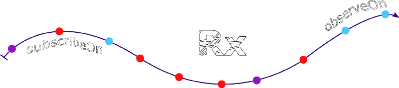

# [Android,Rxjava2,RxAndroid] Phần 1 - observeOn/subscribeOn Là gì
## Đôi Lời
Rxjava , RxAndroid là một trong những kiến thức quan trọng của một lập trình viên Android

Nhưng nó không dễ để tiếp cận với những người mời bắt đâu nên hi vọng qua bài viết này mọi người sẽ hiểu hơn về Rxjava và cũng giúp các bạn không mất quá nhiều thời gian trong những bước đầu chập chững

## Observable/Subsriber
đây là 2 khái niệm cơ bản

Observable phát ra item.

Subscriber sẽ sử dụng những item đó.

## ObserveOn/SubscribeOn



Một trong những điểm mạnh nhất của RxJava là sự đơn giản ,dễ dàng kiểm soát đa luồng (control multi-threading) bằng việc sử dụng 2 operators trên ObserveOn/SubscribeOn :giúp chúng ta quyết định xử lí data thi trên thread nào hay khi trả về data thì đẩy lên thread nào. Chính vì thế hiểu biết về ObserveOn/SubscribeOn sẽ cho phép chúng ta sử nó môt cách chính xác trong việc phân bổ và sử dụng thread

## subscribeOn()
>Operator này để chỉ định thread mà các operator tính toán xử lí tạo thằng Observable(Thằng được quan sát)

Ví dụ : Bạn muốn request một API hay download 1 file từ network rõ ràng bạn phải sử dụng thread để làm việc này vì Android không cho phép thực hiện việc này từ theard chính subscribeOn sẽ quyết định việc request đó sẽ thực hiện trên theard nào (thread được cung cấp bởi Scheduler)

```java
movieObservable
        .subscribeOn(Schedulers.io())
        .subscribe(movie -> {
            // Use your movie item here
        }, throwable -> {
            // Handle the error here
        });
```
Vậy nếu chúng ta sử dụng nhiều subscribeOn cùng một có được không ?

```java
movieObservable
        .subscribeOn(Schedulers.computation())
        .subscribeOn(Schedulers.io())
        .subscribe(movie -> {
            // Use your movie item here
        }, throwable -> {
            // Handle error here
        });
```

Điều này là không được vì subscribeOn chỉ được sử dụng một lần và nó sẽ nhận operator nào gần với Observable nhất (movieObservable) , trong ví dụ trên là subscribeOn(Schedulers.computation())

>subscribeOn thể gọi hàm này ở bất cứ chỗ nào giữa Observable và Subscriber bởi vì nó chỉ có tác dụng khi hàm subscribe() được gọi đến.

## observeOn()
>Sử dụng toán tử này để chỉ định thread mà operator hoặc subscriber được gọi sau nó

Giả sử bạn có một thằng Observable phát ra dữ liệu trên I/O thread và bạn muốn thằng Observer (Thằng đứng quan sát) nhận được dữ liệu và hiểu thị nó trên giao diện.

Nhưng có một vấn đề xảy ra : Android muốn hiểu thị gì trên giao diện thì dữ liệu đó phải ở trên Main Thread (only) vậy dùng cách nào để thưc hiện việc này ??

Để giải quyết vấn đề này ta cần phải sử dụng thằng observeOn()

```java
movieObservable
        .subscribeOn(Schedulers.io())
        .observeOn(AndroidSchedulers.mainThread())
        .subscribe(movie -> {
            // Use your movie item here
        }, throwable -> {
            // Handle error here
        });
```

Sau khi gọi thằng .observeOn(AndroidSchedulers.mainThread()) thì thằng subscribe sẽ chạy trên thread mà nó chỉ định (ở trên là mainThread )

## Gọi nhiều observeOn
Không giống như thằng subscribeOn chỉ sử dụng được một lần duy nhất thì observeOn có thể sử dụng được nhiều lần ,

Các operator hoặc subscriber ở sau sẽ sử dụng thread mà thăng observeOn chỉ định

```java
movieObservable
        .subscribeOn(Schedulers.io())
        .observeOn(Schedulers.computation())
        .flatMap(movie -> truncate(movie.getSynopsis(), 500))
        .observeOn(Schedulers.io())
        .filter(movie -> isInDatabase(movie))
        .observeOn(AndroidSchedulers.mainThread())
        .subscribe(movie -> {
            // Use your movie item here
        }, throwable -> {
            // Handle error here
        });
```
        
Quan sát ví du trên ta thấy observable được tạo trên I/O thread (.subscribeOn(Schedulers.io()))

chúng ta sử thread computation để thực hiện flatMap data mà observable phát ra()

Sau đó chúng ta thực hiện filter trên I/O thread (Schedulers.io())

và cuối cùng chúng ta đây data cần lên mainThread (AndroidSchedulers.mainThread(AndroidSchedulers.mainThread()))

Chỉ trong 7 dòng code, chúng ta đã thực hiện luồng đa mà có thể mất rất nhiều thời gian và công sức nếu chúng ta phải làm điều đó theo cách