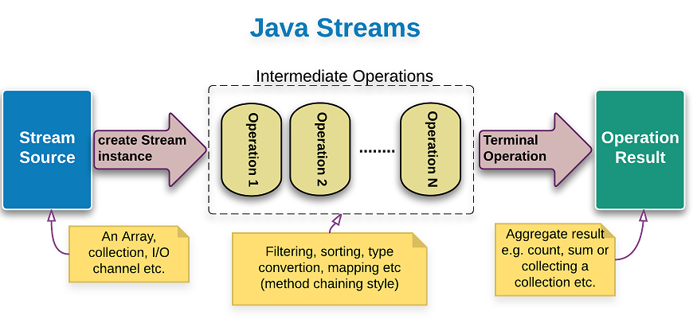
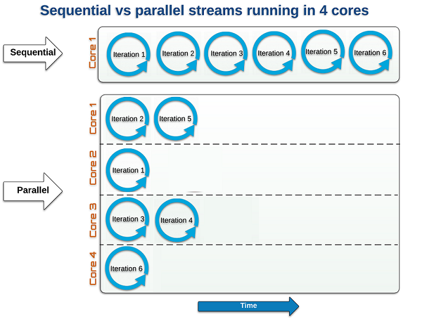
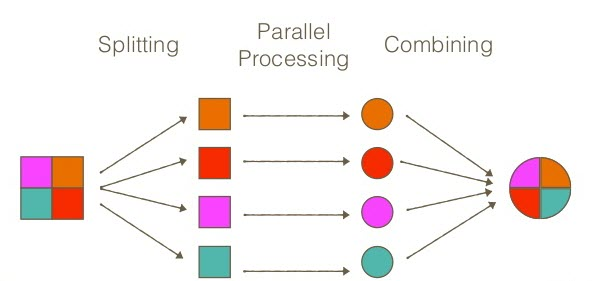

# Stream API trong Java 8

Trong bài này chúng ta tiếp tục một tính năng mới trong Java 8 khác là Stream API. Nếu bạn chưa quen với các Lambda Expression, Functional Interface và Method Reference, thì bạn nên xem các bài viết đó trước khi bắt đầu với bài giới thiệu này.

- [1. Giới thiệu về Stream trong Java 8] (#sub-heading)
- [1.1 Ví dụ sử dụng Stream] (#content11)
- 1.2 Một số phương thức của Stream
- 1.3 Các đặc điểm của Java Stream
- 1.4 So sánh Streams với Collections
- 1.5 Cách làm việc với Stream trong Java
- 2 Một vài ví dụ về Stream
- 2.1 Tạo Stream
- 2.1.1 Tạo Stream cho những kiểu primitive
- 2.1.2 Tạo Stream từ các cấu trúc dữ liệu khác
- 2.1.3 Tạo Stream sang các cấu trúc dữ liệu khác
- 2.2 Ví dụ Intermediate operations
- 2.2.1 Sử dụng filter()
- 2.2.2 Sử dụng skip(), limit()
- 2.2.3 Sử dụng map()
- 2.2.4 Sử dụng sorted()
- 2.3 Ví dụ Terminal Operations
- 2.3.1 Sử dụng forEach()
- 2.3.2 Sử dụng collect()
- 2.3.3 Sử dụng anyMatch(), allMatch(), noneMatch()
- 2.3.4 Sử dụng count()
- 2.3.5 Sử dụng min(), max()
- 2.3.6 Sử dụng summaryStatistics()
- 2.3.7 Sử dụng reduce()
- 3 Stream API với I/O
- 4 Luồng song song – Parallel Streams
- 5 Hạn chế của Stream

## 1. Giới thiệu về Stream trong Java 8 <a class="sub-heading"></a>
Stream (luồng) là một đối tượng mới của Java được giới thiệu từ phiên bản Java 8, giúp cho việc thao tác trên collection và array trở nên dễ dàng và tối ưu hơn.

Một Stream đại diện cho một chuỗi các phần tử hỗ trợ các hoạt động tổng hợp tuần tự (sequential) và song song (parallel).

Tất cả các class và interface của Stream API nằm trong gói java.util.stream. Bằng cách sử dụng các stream, chúng ta có thể thực hiện các phép toán tổng hợp khác nhau trên dữ liệu được trả về từ các collection, array, các hoạt động Input/Output. Trước khi chúng ta thấy cách Stream API có thể được sử dụng trong Java như thế nào, hãy xem ví dụ sau để hiểu cách sử dụng Stream:
### 1.1 Ví dụ sử dụng Stream <a name="content11"></a>

```java
package com.streams.examples;

import java.util.Arrays;
import java.util.List;

public class StreamExample {

	static List<Integer> numbers = Arrays.asList(7, 2, 5, 4, 2, 1);

	public static void main(String[] args) {
		withoutStream();
		withStream();
	}

	public static void withoutStream() {
		long count = 0;
		for (Integer number : numbers) {
			if (number % 2 == 0) {
				count++;
			}
		}
		System.out.printf("There are %d elements that are even", count);
	}

	public static void withStream() {
		long count = numbers.stream().filter(num -> num % 2 == 0).count();
		System.out.printf("\nThere are %d elements that are even", count);
	}

}
```
Thực thi chương trình trên ta thấy cả hai phương thức đều cho kết quả giống nhau. Tuy nhiên có một sự khác biệt lớn giữa 2 cách này là cú pháp sử dụng stream sẽ ngắn gọn hơn, hiệu suất sử dụng stream tốt hơn.

Với phương thức withoutStream(), chúng ta đang lặp lại toàn bộ danh sách để tìm các số chẵn. Không có xử lý song song trong phương thức này.

Với phương thức withStream(), phương thức stream() trả về một luồng của tất cả các number, phương thức filter() trả về một stream các số chẵn, phương thức count() trả về số phần tử là số chẵn của stream. Tất cả các hoạt động này đang xảy ra song song, có nghĩa là chúng ta có thể thực hiện song song code với sự trợ giúp của stream. Việc thực hiện song song các hoạt động sử dụng stream nhanh hơn thực thi tuần tự mà không cần sử dụng stream.

### 1.2 Một số phương thức của Stream
Trong Java 8, Collection interface được hỗ trợ 2 phương thức để tạo ra Stream bao gồm:

* <b>stream()</b> : trả về một stream sẽ được xử lý theo tuần tự.
* <b>parallelStream()</b> : trả về một Stream song song, các xử lý sau đó sẽ thực hiện song song.

### 1.3 Các đặc điểm của Java Stream
* Stream không lưu trữ các phần tử của collection hay array. Nó chỉ thực hiện các phép toán tổng hợp (chẳng hạn như filter() và count() mà chúng ta đã thấy trong ví dụ trên để có được stream dữ liệu mong muốn.
* Stream không phải là một cấu trúc dữ liệu (data structure).
* Stream là immutable object. Các hoạt động tổng hợp mà chúng ta thực hiện trên Collection, Array hoặc bất kỳ nguồn dữ liệu nào khác không làm thay đổi dữ liệu của nguồn, chúng chỉ trả lại stream mới. Chúng ta đã thấy ở ví dụ trên là thực hiện filter() các các số chẵn bằng cách sử dụng các hoạt động của stream nhưng nó không thay đổi các phần tử của List numbers.
* Tất cả các hoạt động stream là lazy (lười biếng), có nghĩa là chúng không được thực hiện cho đến khi cần thiết. Để làm được điều này, hầu hết các thao tác với Stream đều return lại một Stream mới, giúp tạo một mắc xích bao gồm một loạt các thao tác nhằm thực thi các thao tác đó một cách tối ưu nhất. Mắc xích này còn được gọi là pipeline.
* Các phần tử của luồng chỉ được truy cập một lần trong suốt vòng đời của Stream. Giống như một Iterator, một Stream mới phải được tạo ra để duyệt lại các phần tử của dữ liệu nguồn.
* Stream không dùng lại được, nghĩa là một khi đã sử dụng nó xong, chúng ta không thể gọi nó lại để sử dụng lần nữa.
* Chúng ta không thể dùng index để truy xuất các phần tử trong Stream.
* Stream hỗ trợ thao tác song song các phần tử trong Collection hay Array.

### 1.4 So sánh Streams với Collections
Chúng ta sử dụng Stream hoặc Collection khi chúng ta phải làm việc theo danh sách các phần tử.

* Collection là cấu trúc dữ liệu chứa các phần tử trong bộ nhớ. Những phần tử này sẽ được tính toán trước khi chúng thực sự được thêm vào Collection.

* Ngược lại, Stream không phải là một cấu trúc dữ liệu. Stream là một luồng thực hiện tính toán các phần tử theo yêu cầu. Vì vậy, nó có thể được xem rằng các Collection có các yếu tố tính tức thời (eager), trong khi các Stream có yếu tố tính lười biếng (lazy).

Mặc dù chúng ta có thể tạo Stream từ Collection và sử dụng một số phương thức trên Collection. Tuy nhiên, Collection gốc vẫn không thay đổi. Do đó, Stream không thể thay đổi dữ liệu.

Và một đặc điểm quan trọng của Stream là chúng có thể chuyển đổi dữ liệu, vì các hoạt động trên Stream có thể tạo ra một cấu trúc dữ liệu khác, như map() và collect() như trong các ví dụ trên.

### 1.5 Cách làm việc với Stream trong Java
Như chúng ta đã thấy trong ví dụ trên, hoạt động của luồng có thể được giải thích theo ba giai đoạn:

* Tạo Stream (stream source).
* Thực hiện các thao tác trung gian (intermediate operations) trên stream ban đầu để chuyển đổi nó thành một stream khác và tiếp tục thực hiện các hoạt động trung gian khác. Trong ví dụ trên, hoạt động filter() là hoạt động trung gian. Có thể có nhiều hoạt động trung gian.
* Thực hiện thao tác đầu cuối (terminal operation) trên stream cuối cùng để nhận kết quả và sau đó bạn không thể sử dụng lại chúng. Trong ví dụ trên, phép tính count() là hoạt động đầu cuối.

Một Stream pipeline bao gồm:

* 1 stream source, 
* 0 hoặc nhiều intermediate operation, 
* và 1 terminal operation.

Hình dưới minh họa các thao tác với Stream:



## 2. Một vài ví dụ về Stream
### 2.1 Tạo Stream
Interface ```Stream ``` trong package java.util.stream là interface đại diện cho một Stream. Interface này chỉ làm việc với kiểu dữ liệu là Object.

Với các kiểu primitive hì các bạn có thể sử dụng các đối tượng Stream dành cho những kiểu primitive đó, ví dụ như IntStream, LongStream hay DoubleStream.

#### 2.1.1 Tạo Stream cho những kiểu primitive

```java
package com.streams.examples;

import java.util.stream.DoubleStream;
import java.util.stream.IntStream;
import java.util.stream.LongStream;

public class PrimitiveStreamExample {

	public static void main(String[] args) {
		IntStream.range(1, 4).forEach(System.out::println); // 1 2 3

		IntStream.of(1, 2, 3).forEach(System.out::println); // 1 2 3

		DoubleStream.of(1, 2, 3).forEach(System.out::println); // 1.0 2.0 3.0

		LongStream.range(1, 4).forEach(System.out::println); // 1 2 3

		LongStream.of(1, 2, 3).forEach(System.out::println); // 1 2 3
	}
}
```

#### 2.1.2 Tạo Stream từ các cấu trúc dữ liệu khác

```java
package com.streams.examples;

import java.util.ArrayList;
import java.util.Arrays;
import java.util.List;
import java.util.regex.Pattern;
import java.util.stream.Stream;

public class ConvertToStreamExample {
	public static void main(String[] args) {
		streamFromArray();
		streamFromCollection();
		streamUsingGenerate();
		streamUsingIterate();
		streamUsingRegex();
	}

	// Generate Streams from Arrays using .stream or Stream.of
	public static void streamFromArray() {
		String[] languages = { "Java", "C#", "C++", "PHP", "Javascript" };

		// Get Stream using the Arrays.stream
		Stream<String> testStream1 = Arrays.stream(languages);
		testStream1.forEach(x -> System.out.println(x));

		// Get Stream using the Stream.of
		Stream<String> testStream2 = Stream.of(languages);
		testStream2.forEach(x -> System.out.println(x));
	}

	// Generate Streams from Collections
	public static void streamFromCollection() {
		List<String> items = new ArrayList<>();
		items.add("Java");
		items.add("C#");
		items.add("C++");
		items.add("PHP");
		items.add("Javascript");

		items.stream().forEach(item -> System.out.println(item));
	}

	// Generate Streams using Stream.generate()
	public static void streamUsingGenerate() {
		Stream<String> stream = Stream.generate(() -> "gpcoder").limit(3);
		String[] testStrArr = stream.toArray(String[]::new);
		System.out.println(Arrays.toString(testStrArr)); // [gpcoder, gpcoder,
															// gpcoder]
	}

	// Generate Streams using Stream.iterate()
	public static void streamUsingIterate() {
		Stream<Long> iterateNumbers = Stream.iterate(1L, n -> n + 1).limit(5);
		iterateNumbers.forEach(System.out::print); // 12345
	}

	// Generate Streams from APIs like Regex
	public static void streamUsingRegex() {
		String str = "Welcome,to,gpcoder";
		Pattern.compile(",").splitAsStream(str).forEach(System.out::print);// Welcometogpcoder
	}
}
```
 
#### 2.1.3 Tạo Stream sang các cấu trúc dữ liệu khác
 
```java
package com.streams.examples;

import java.util.Arrays;
import java.util.List;
import java.util.stream.Collectors;
import java.util.stream.Stream;
 
public class ConvertFromStreamExample {
	public static void main(String[] args) {
		getCollectionUsingStreamCollection();
		getArrayUsingStreamToArray();
	}
 
    // Get Collections using stream.collect(Collectors.toList())
    public static void getCollectionUsingStreamCollection() {
        Stream<String> stream = Stream.of("Java", "C#", "C++", "PHP", "Javascript");
        List<String> languages = stream.collect(Collectors.toList());
        System.out.println(languages);
    }
 
    // Get arrays using stream.toArray(EntryType[]::new)
    public static void getArrayUsingStreamToArray() {
        Stream<String> stream = Stream.of("Java", "C#", "C++", "PHP", "Javascript");
        String[] languages = stream.toArray(String[]::new);
        System.out.println(Arrays.toString(languages));
    }
}
```

### 2.2 Ví dụ Intermediate operations
Có thể sử dụng 0 hoặc nhiều intermediate operations để chuyển đổi Stream ban đầu thành những Stream mới. Mặc dù chúng ta có thể định nghĩa nhiều intermediate operation nhưng chúng không thực thi các thao tác đó ngay lập tức, chỉ khi terminal operation được gọi thì toàn bộ các thao tác đó mới được thực thi,

#### 2.2.1 Sử dụng filter()
>Stream filter() giúp loại bỏ các phần tử dựa trên các tiêu chí nhất định.

Ví dụ sử dụng để lọc các số chia hết cho 3.

```java
package com.streams.examples;

import java.util.stream.Stream;

public class FilterStreamExample {

	// filter() operation helps eliminate elements based on certain criteria
	public static void main(String[] args) {
		Stream.iterate(1, count -> count + 1) //
				.filter(number -> number % 3 == 0) //
				.limit(6) //
				.forEach(System.out::println);
	}

}
```
#### 2.2.2 Sử dụng skip(), limit()
Ý nghĩa của Stream skip(), limit() hoàn toàn tương tự với OFSET và LIMIT trong SQL.

* Stream limit() được sử dụng để loại bỏ các phần tử n đầu tiên của Stream . Nếu Stream này chứa ít hơn n phần tử thì luồng trống sẽ được trả lại.
* Stream limit() được sử dụng để cắt giảm kích thước của Stream. Kết quả trả về các phần tử của Stream đã được cắt giảm để không vượt quá maxSize (tham số đầu vào của phương thức).

```java
package com.streams.examples;

import java.util.Arrays;
import java.util.List;

public class LimitStreamExample {

	// limit() Returns a stream consisting of the elements of this stream,
	// truncated
	// to be no longer than maxSize in length.
	public static void main(String[] args) {
		List<String> data = Arrays.asList("Java", "C#", "C++", "PHP", "Javascript");

		data.stream() //
				.skip(1) //
				.limit(3) //
				.forEach(System.out::print); // C#C++PHP
	}
}
```
#### 2.2.3 Sử dụng map()
>Stream map() giúp ánh xạ các phần tử tới các kết quả tương ứng.

```java
package com.streams.examples;

import java.util.Arrays;
import java.util.List;

public class MapStreamExample {

	// map() operation helps map elements to the corresponding results
	public static void main(String[] args) {
		List<String> data = Arrays.asList("Java", "C#", "C++", "PHP", "Javascript");

		data.stream() //
				.map(String::toUpperCase) // convert each element to upper case
				.forEach(System.out::println);
	}
}
```
#### 2.2.4 Sử dụng sorted()
>Stream sorted() giúp sắp xếp các phần tử theo một thứ tự xác định.

```java
package com.streams.examples;

import java.util.Arrays;
import java.util.List;
 
public class SortedStreamExample {
 
    // sorted() operation helps sort elements based on certain criteria
    public static void main(String[] args) {
        List<String> data = Arrays.asList("Java", "C#", "C++", "PHP", "Javascript");
 
        // sorted according to natural order
        data.stream() //
                .sorted() //
                .forEach(System.out::println);
 
        // sorted according to the provided Comparator
        data.stream() //
                .sorted((s1, s2) -> s1.length() - s2.length()) //
                .forEach(System.out::println);
    }
}
```

### 2.3 Ví dụ Terminal Operations
>Sử dụng terminal operation lấy về kết quả từ những intermediate operations đã định nghĩa.

Chúng ta có thể dễ dàng xác định đâu là intermediate operation, đâu là terminal operation bởi vì terminal operation sẽ trả về void hoặc non-Stream object.

Sau khi terminal operation được gọi, Stream sẽ không sử dụng được nữa.

#### 2.3.1 Sử dụng forEach()
>Phương thức forEach() giúp duyệt qua các phần tử của Stream.

```java
package com.streams.examples;

import java.util.stream.Stream;

public class ForEachStreamExample {
 
    // foreach operations helps iterate the elements of the Stream
    public static void main(String[] args) {
        Stream.iterate(1, count -> count + 1) //
                .filter(number -> number % 3 == 0) //
                .limit(6) //
                .forEach(System.out::println);
    }
}
```

#### 2.3.2 Sử dụng collect()
>Phương thức collect() giúp thu thập kết quả Stream sang một Collection.

```java
 
package com.streams.examples;

import java.util.List;
import java.util.stream.Collectors;
import java.util.stream.Stream;
 
public class CollectStreamExample {
 
    // collect() operation helps to collect the stream result in a collection like
    // list
    public static void main(String[] args) {
        Stream<String> stream = Stream.of("Java", "C#", "C++", "PHP", "Javascript");
        List<String> languages = stream.collect(Collectors.toList());
        System.out.println(languages);
    }
}
```

#### 2.3.3 Sử dụng anyMatch(), allMatch(), noneMatch()
>Phương thức anyMatch() trả về một boolean tùy thuộc vào điều kiện được áp dụng trên Stream dữ liệu. Phương thức này trả về true ngay khi phần tử đầu tiên thõa mãn điều kiện, những phần tử còn lại sẽ không được kiểm tra.

```java
package com.streams.examples;


import java.util.Arrays;
import java.util.List;
 
public class MatchStreamExample {
 
    // match() operation returns a boolean depending upon the condition applied on
    // stream data
    public static void main(String[] args) {
        List<String> data = Arrays.asList("Java", "C#", "C++", "PHP", "Javascript");
        boolean result = data.stream().anyMatch((s) -> s.equalsIgnoreCase("Java"));
        System.out.println(result); // true
    }
}
```

Tương tự chúng ta có:

* allMatch() : Phương thức này trả về true nếu tất cả phần tử đều thõa mãn điều kiện. Nếu một phần tử không thõa điều kiện, những phần tử còn lại sẽ không được kiểm tra.
* noneMatch() : Ngược lại với allMatch(), pương thức này trả về true nếu tất cả phần tử đều không thõa mãn điều kiện. Nếu một phần tử thõa điều kiện, những phần tử còn lại sẽ không được kiểm tra.

#### 2.3.4 Sử dụng count()
>Phương thức count() trả về tổng số phần tử cho dữ liệu luồng.

```java
package com.streams.examples;

import java.util.Arrays;
import java.util.List;
 
public class CountStreamExample {
 
    // count() operation return the aggregate count for stream data
    public static void main(String[] args) {
 
        List<Integer> data = Arrays.asList(2, 3, 5, 4, 6);
 
        long count = data.stream().filter(num -> num % 3 == 0).count();
        System.out.println("Count = " + count);
    }
}
```

#### 2.3.5 Sử dụng min(), max()
>Stream.max(), Stream.max() chấp nhận đối số là một Comparator sao cho các item trong stream có thể được so sánh với nhau để tìm tối thiểu (min) hoặc tối đa (max).

Ví dụ sử dụng min(), max() với các class wrapper của kiểu dữ liệu nguyên thủy (primitive type):

```java
package com.streams.examples;

import java.util.Arrays;
import java.util.Comparator;
import java.util.List;
import java.util.stream.Stream;

public class MinMaxStreamExample1 {

	public static void main(String[] args) {
		Integer[] numbers = { 1, 8, 3, 4, 5, 7, 9, 6 };

		// Find max, min with Array ====================

		// Max = 9
		Integer maxNumber = Stream.of(numbers).max(Comparator.comparing(Integer::valueOf)).get();
		System.out.println("Max:" + maxNumber);
		// Min = 1
		Integer minNumber = Stream.of(numbers).min(Comparator.comparing(Integer::valueOf)).get();
		System.out.println("Min:" + minNumber);
		// Find max, min with Collection ====================
		List<Integer> listOfIntegers = Arrays.asList(numbers);

		// Max = 9
		Integer max = listOfIntegers.stream().mapToInt(v -> v).max().getAsInt();
		System.out.println("Max:" + max);
		// Min = 1
		Integer min = listOfIntegers.stream().mapToInt(v -> v).min().getAsInt();
		System.out.println("Min:" + min);
	}
}
```

Ví dụ sử dụng min(), max() với các class Object:

```java
package com.streams.examples;

import java.util.Arrays;
import java.util.Comparator;
import java.util.List;
 
class Programing {
    private String name;
    private int exp;
 
    public Programing(String name, int age) {
        super();
        this.name = name;
        this.exp = age;
    }
 
    public String getName() {
        return name;
    }
 
    public int getExp() {
        return exp;
    }
}
 
public class MinMaxStreamExample2 {
 
    public static void main(String[] args) {
 
        List<Programing> students = Arrays.asList( //
                new Programing("Java", 5), //
                new Programing("PHP", 2), //
                new Programing("C#", 1) //
        );
 
        // Max = 5
        Programing maxByExp = students.stream()
                .max(Comparator.comparing(Programing::getExp))
                .get(); 
         
        // Min = 1
        Programing minByExp = students.stream()
                .min(Comparator.comparing(Programing::getExp))
                .get(); 
    }
}
```

 

#### 2.3.6 Sử dụng summaryStatistics()
>Phương thức summaryStatistics() được sử dụng để lấy giá trị count, min, max, sum và average với tập dữ liệu số.

```java
package com.streams.examples;

import java.util.Arrays;
import java.util.IntSummaryStatistics;
import java.util.List;

public class IntSummaryStatisticsExample {

	public static void main(String[] args) {
		List<Integer> primes = Arrays.asList(2, 3, 5, 7, 10);

		IntSummaryStatistics stats = primes.stream().mapToInt((x) -> x).summaryStatistics();
		System.out.println("Count: " + stats.getCount());
		System.out.println("Max: " + stats.getMax());
		System.out.println("Min: " + stats.getMin());
		System.out.println("Sum: " + stats.getSum());
		System.out.println("Average: " + stats.getAverage());
	}
}
```

#### 2.3.7 Sử dụng reduce()
>Phương thức reduce() kết hợp các phần tử luồng thành một bằng cách sử dụng một BinaryOperator.

```java 
 
package com.streams.examples;

import java.util.stream.IntStream;

public class ReduceStreamExample {
 
    // reduce() operation combines the stream elements into one using a
    // BinaryOperator
    public static void main(String[] args) {
 
        int result = IntStream.of(1, 2, 3, 4).reduce(0, (a, b) -> a + b);
        System.out.println(result); // 10
    }
}
```
## 3. Stream API với I/O
Như chúng tôi đã đề cập trước đây, Stream API không chỉ hỗ trợ các thao tác với các Collection, Array. Các hoạt động I/O trên tập tin như đọc file văn bản theo từng dòng (line) cũng có thể áp dụng với Stream API. Hãy xem ví dụ sau:

Chúng ta cần đọc những dòng dữ liệu có chữ bắt đầu là line3 của tập tin line.txt sau:

```txt
line1
line2
line3
line3.1
line3.2
line4
```

Chương trình của chúng ta như sau:

```java
package com.streams.examples;

import java.io.IOException;
import java.nio.file.Files;
import java.nio.file.Paths;
import java.util.stream.Stream;
 
public class ReadFileWithStreamExample {
 
    public static void main(String args[]) {
 
        String fileName = "java/src/resources/lines.txt";
 
        // read file into stream, try-with-resources
        try (Stream<String> stream = Files.lines(Paths.get(fileName))) {
 
            stream //
                    .onClose(() -> System.out.println("Done!")) //
                    .filter(s -> s.startsWith("line3")) //
                    .forEach(System.out::println);
 
        } catch (IOException e) {
            e.printStackTrace();
        }
    }
}
```

Phương thức onClose() trong đoạn code trên được gọi khi phương thức close() được gọi trên Stream.

## 4. Luồng song song – Parallel Streams
Như đã đề cập ở trên, các stream có thể là tuần tự (sequential) hoặc song song (parallel). Các thao tác trên các stream tuần tự được thực hiện trên một luồng đơn (single thread) trong khi các phép toán trên các stream song song được thực hiện đồng thời trên nhiều luồng (multi-thread).



Cách hoạt động của Parallel Streams:



Chúng ta thường sử dụng Parallel Streams trong môi trường multi-thread khi mà chúng ta cần hiệu suất xử lý nhanh.

Hãy xem ví dụ sau:đầu tiên chúng ta sẽ tạo một danh sách dữ liệu lớn, sau đó chúng ta sẽ sắp xếp danh sách này sử dụng stream() và parallelStream().

### 4.1 Sequential Stream

```java
 
package com.streams.examples;

import java.util.ArrayList;
import java.util.List;
import java.util.UUID;
import java.util.concurrent.TimeUnit;
 
public class SequentialStreamExample {
 
    public static void main(String[] args) {
        List<String> values = createDummyData();
 
        long startTime = System.nanoTime();
 
        long count = values.stream().sorted().count();
        System.out.println(count);
 
        long endTime = System.nanoTime();
 
        long millis = TimeUnit.NANOSECONDS.toMillis(endTime - startTime);
 
        System.out.println(String.format("sequential sort took: %d ms", millis));
        // sequential sort took: 804 ms
 
    }
 
    public static List<String> createDummyData() {
        int max = 1000000;
        List<String> values = new ArrayList<>(max);
        for (int i = 0; i < max; i++) {
            UUID uuid = UUID.randomUUID();
            values.add(uuid.toString());
        }
        return values;
    }
}
```

### 4.2 Parallel Stream

```java
package com.streams.examples;

import java.util.ArrayList;
import java.util.List;
import java.util.UUID;
import java.util.concurrent.TimeUnit;
 
public class ParallelStreamExample {
 
    public static void main(String[] args) {
        List<String> values = createDummyData();
 
        long startTime = System.nanoTime();
 
        long count = values.parallelStream().sorted().count();
        System.out.println(count);
 
        long endTime = System.nanoTime();
 
        long millis = TimeUnit.NANOSECONDS.toMillis(endTime - startTime);
 
        System.out.println(String.format("parallel sort took: %d ms", millis));
        // parallel sort took: 489 ms
 
    }
 
    public static List<String> createDummyData() {
        int max = 1000000;
        List<String> values = new ArrayList<>(max);
        for (int i = 0; i < max; i++) {
            UUID uuid = UUID.randomUUID();
            values.add(uuid.toString());
        }
        return values;
    }
}
```

Như bạn thấy cả hai đoạn code gần giống nhau nhưng sắp xếp song song nhanh hơn gần 50%. Tất cả những gì bạn phải làm là thay stream() thành parallelStream().

## 5. Hạn chế của Stream
Stream không thể tái sử dụng một khi đã gọi Terminal Operations:

```java
 
package com.streams.examples;

import java.util.stream.Stream;

public class ErrorStreamExample {
 
    public static void main(String[] args) {
        Stream<String> stream = Stream.of("Java", "C#", "C++", "PHP", "Javascript") //
                .filter(s -> s.startsWith("J"));
 
        stream.anyMatch(s -> true); // ok
        stream.noneMatch(s -> true); // exception
    }
}
```

Thực thi chương trình trên, ta nhận được thông báo lỗi như sau:

```java
Exception in thread "main" java.lang.IllegalStateException: stream has already been operated upon or closed
    at java.util.stream.AbstractPipeline.evaluate(AbstractPipeline.java:229)
    at java.util.stream.ReferencePipeline.noneMatch(ReferencePipeline.java:459)
    at com.gpcoder.stream.intro.ErrroStreamExample.main(ErrroStreamExample.java:12)
```

Để khắc phục hạn chế này, chúng ta phải tạo một Stream mới cho mọi hoạt động của thiết bị đầu cuối mà chúng ta muốn thực thi. Chương trình trên có thể viết lại như sau:

```java
 
package com.streams.examples;

import java.util.function.Supplier;
import java.util.stream.Stream;
 
public class WithoutErrorStreamExample {
 
    public static void main(String[] args) {
        Supplier<Stream<String>> streamSupplier = //
                () -> Stream.of("Java", "C#", "C++", "PHP", "Javascript") //
                        .filter(s -> s.startsWith("J"));
 
        streamSupplier.get().anyMatch(s -> true); // ok
        streamSupplier.get().noneMatch(s -> true); // ok
    }
}
```

Trên đây là bài viết giới thiệu về Stream API trong Java 8 và một số phương thức phổ biến nhất để các bạn cùng tham khảo. Nếu như bạn muốn tìm hiểu các phương thức khác để làm việc hiệu quả thông qua Stream có thể tham khảo trang chủ của Oracle. Hy vọng bài viết này giúp ích cho các bạn. Cám ơn các bạn đã quan tâm và theo dõi bài viết. Hẹn gặp lại ở bài viết tiếp theo.