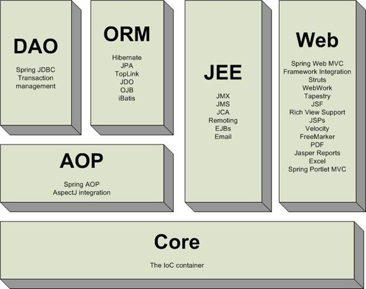
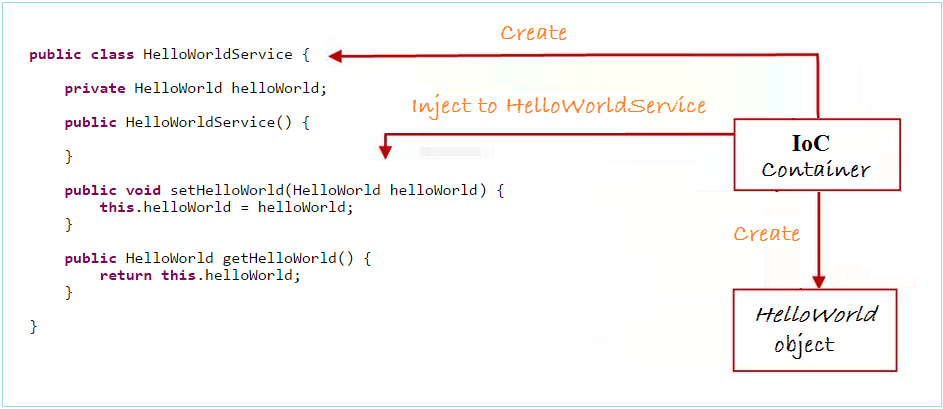
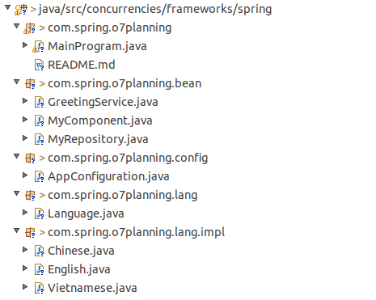
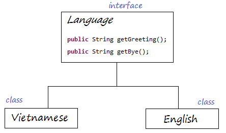
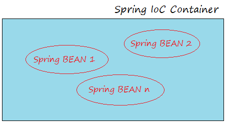
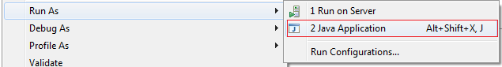
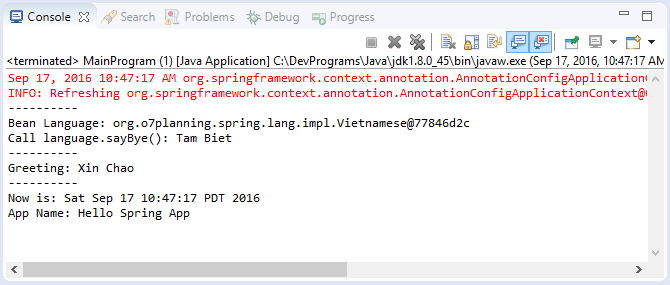
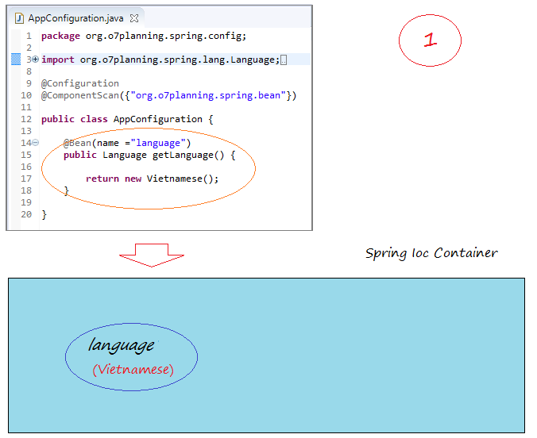
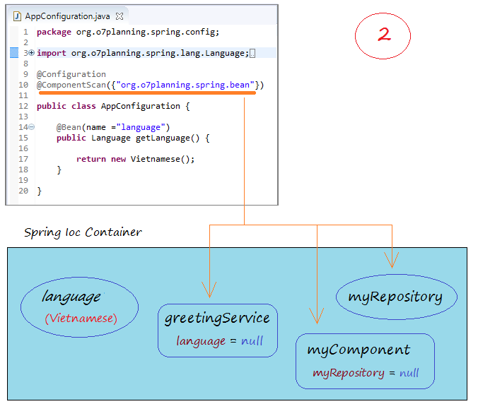
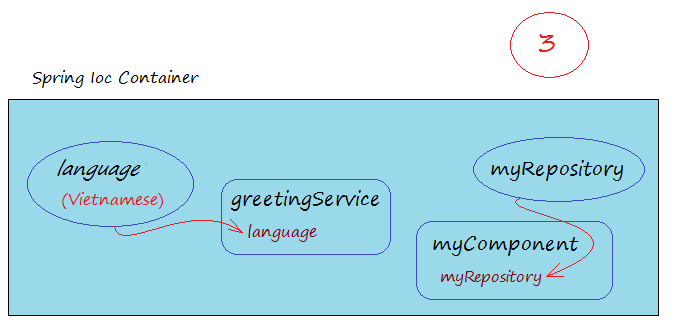

# Lập trình Spring

## 1- Giới thiệu
Tài liệu này viết dựa trên:

* Spring Framework 4.x
* Eclipse 4.6 NEON (ok for Eclipse 4.5 MARS)

Trong tài liệu này tôi sử dụng Maven để khai báo các thư viện Spring sẽ sử dụng, thay vì download Spring và khai báo thư viện theo cách thông thường.

Maven là một công cụ giúp bạn quản lý các thư viện một cách tự động và hiệu quả, và nó đã trở thành thông dụng mà bất cứ một lập trình viên Java nào đều phải biết.

Trong trường hợp bạn muốn download Spring và khai báo thư viện theo cách truyền thống bạn có thể xem phụ lục ở phía cuối tài liệu.

## 2- Spring Framework

Hình minh họa dưới đây mô tả cấu trúc của Spring Framework.




1. <b>IoC Container</b>: Đây là phần quan trọng nhất và cũng là phần cơ bản, nền tảng của Spring. Nó giữ vai trò về cấu hình và quản lý vòng đời (Lifecycle) của các đối tượng java. Bài hôm nay chúng ta sẽ tìm hiểu về phần này.
2. <b>DAO, ORM, AOP, WEB</b>: Các module này là tool hoặc là framework có sẵn được tích hợp vào Spring.


## 2.1- Khái niệm Inversion of Control & Dependency Injection
Để hiểu vấn đề này chúng ta xem một vài class dưới đây:

```java
// Đây là một interface
public interface HelloWorld {
     public void sayHello();
}
 
// Class thi hành interface HelloWorld
public class SpringHelloWorld implements HelloWorld {
    public void sayHello()  {
            System.out.println("Spring say Hello!");
    }
}
 
// Một class khác thi hành Interface HelloWorld
public class StrutsHelloWorld implements HelloWorld {
    public void sayHello()  {
            System.out.println("Struts say Hello!");
    }
}
 
 
// Và một class dịch vụ
public class HelloWorldService {
      
      // Một trường có kiểu HelloWorld
      private HelloWorld helloWorld;
      
      // Cấu tử tạo đối tượng HelloWorldService
      // Nó khởi tạo giá trị cho trường 'helloWorld'
      public HelloWorldService()  {
            this.helloWorld = new StrutsHelloWorld();
      }
 
}
```


Có thể nhận thấy một điều rằng lớp HelloWorldService quản lý việc tạo ra đối tượng HelloWorld.

* Trong trường hợp trên khi một đối tượng HelloWorldService được tạo ra từ phương thức khởi tạo (constructor) của nó, đối tượng HelloWorld cũng được tạo ra, và nó được tạo từ StrutsHelloWorld.

Câu hỏi đặt ra là bạn muốn tạo ra đối tượng HelloWorldService đồng thời đối tượng HelloWorld được tạo, nhưng nó phải là SpringHelloWorld.

Như vậy ở đây là HelloWorldService đang điều khiển "object creation" của HelloWorld. Tại sao chúng ta không chuyển việc tạo HelloWorld cho một bên thứ 3 xử lý thay vì làm ở HelloWorldService. Chúng ta có khái niệm "inversion of control" nghĩa là "Sự đảo ngược điều khiển" (IoC).

Và IoC Container sẽ đóng vai trò người quản lý việc tạo ra cả HelloWorldService lẫn HelloWorld.

>IoC = Inversion of Control 




<strong>IoC Container</strong> tạo ra đối tượng
<strong>HelloWorldService </strong>và đối tượng
<em><strong>HelloWorld </strong></em>sau đó pass
<em><strong>HelloWorld </strong></em>vào
<strong>HelloWorldService </strong>thông qua setter. Việc
<strong>IoC Container</strong> đang làm chính là
<em>"tiêm sự phụ thuộc"</em> (
<strong>Dependency Injection</strong>) vào
<strong>HelloWorldService </strong>. Sự phụ thuộc ở đây nghĩa là sự phụ thuộc giữa các object :
<strong>HelloWorldService </strong>và
<em>HelloWorld</em>.
<br>
<br> Tới đây ta đã xác định được rõ thế nào là
<strong>IoC</strong>&amp;
<strong>DI</strong>. Hãy cùng làm ví dụ
<strong>HelloWorld </strong>để hiểu rõ hơn.

## 3- Tạo Maven project

* File/New/Other...

## 4- Khai báo các thư viện Spring cơ bản

Đây là ví dụ HelloWorld Spring, vì vậy chúng ta chỉ sử dụng thư viện Spring cơ bản (Core). Mở file pom.xml khai báo các thư viện sẽ sử dụng: 

```xml
<project xmlns="http://maven.apache.org/POM/4.0.0"
  xmlns:xsi="http://www.w3.org/2001/XMLSchema-instance"
  xsi:schemaLocation="http://maven.apache.org/POM/4.0.0
  http://maven.apache.org/xsd/maven-4.0.0.xsd">
  <modelVersion>4.0.0</modelVersion>
 
  <groupId>org.o7planning</groupId>
  <artifactId>HelloSpringAnnotation</artifactId>
  <version>0.0.1-SNAPSHOT</version>
  <packaging>jar</packaging>
 
  <name>HelloSpringAnnotation</name>
  <url>http://maven.apache.org</url>
 
  <properties>
    <project.build.sourceEncoding>UTF-8</project.build.sourceEncoding>
  </properties>
 
    <dependencies>
 
        <dependency>
            <groupId>junit</groupId>
            <artifactId>junit</artifactId>
            <version>3.8.1</version>
            <scope>test</scope>
        </dependency>
 
        <!-- Spring Core -->
        <!-- http://mvnrepository.com/artifact/org.springframework/spring-core -->
        <dependency>
            <groupId>org.springframework</groupId>
            <artifactId>spring-core</artifactId>
            <version>4.1.4.RELEASE</version>
        </dependency>
 
        <!-- Spring Context -->
        <!-- http://mvnrepository.com/artifact/org.springframework/spring-context -->
        <dependency>
            <groupId>org.springframework</groupId>
            <artifactId>spring-context</artifactId>
            <version>4.1.4.RELEASE</version>
        </dependency>
 
    </dependencies>
  
</project>
```

## 5- Code Project
Dưới đây là hình minh họa cấu trúc của project:





```java
package com.spring.o7planning.lang;

/**
 * java concurrency
 * 
 * @author EMAIL:vuquangtin@gmail.com , tel:0377443333
 * @version 1.0.0
 * @see <a
 *      href="https://github.com/vuquangtin/concurrency">https://github.com/vuquangtin/concurrency</a>
 *
 */

public interface Language {

	// get a greeting
	public String getGreeting();

	// get a bye
	public String getBye();
}
```

```java
package com.spring.o7planning.lang.impl;

import com.spring.o7planning.lang.Language;

/**
 * java concurrency
 * 
 * @author EMAIL:vuquangtin@gmail.com , tel:0377443333
 * @version 1.0.0
 * @see <a
 *      href="https://github.com/vuquangtin/concurrency">https://github.com/vuquangtin/concurrency</a>
 *
 */

public class English implements Language{

	@Override
	public String getGreeting() {
		// TODO Auto-generated method stub
		return "Hello";
	}

	@Override
	public String getBye() {
		// TODO Auto-generated method stub
		return "Good bye!!!";
	}

}
```

```java
package com.spring.o7planning.lang.impl;

import com.spring.o7planning.lang.Language;

/**
 * java concurrency
 * 
 * @author EMAIL:vuquangtin@gmail.com , tel:0377443333
 * @version 1.0.0
 * @see <a
 *      href="https://github.com/vuquangtin/concurrency">https://github.com/vuquangtin/concurrency</a>
 *
 */

public class Vietnamese implements Language{

	@Override
	public String getGreeting() {	
		// TODO Auto-generated method stub
		return "Xin chào";
	}

	@Override
	public String getBye() {
		// TODO Auto-generated method stub
		return "tạm biệt";
	}

}
```


@Service là một annotation, nó được sử dụng để chú thích trên một class để nói với Spring rằng class đó là một Spring BEAN.

@Autowired được chú thích trên một trường (field) để nói với Spring rằng hãy tiêm (inject) giá trị vào cho trường đó. Chú ý: Từ tiêm ở đây có ý giống với gán giá trị cho trường đó. 

```java
package com.spring.o7planning.bean;

import org.springframework.beans.factory.annotation.Autowired;
import org.springframework.stereotype.Service;

import com.spring.o7planning.lang.Language;

/**
 * java concurrency
 * 
 * @author EMAIL:vuquangtin@gmail.com , tel:0377443333
 * @version 1.0.0
 * @see <a
 *      href="https://github.com/vuquangtin/concurrency">https://github.com/vuquangtin/concurrency</a>
 *
 */
@Service
public class GreetingService {

	@Autowired
	private Language language;
	
	public GreetingService() {
		// TODO Auto-generated constructor stub
	}
	
	public void sayGreeting(){
		String greeting = language.getGreeting();
		
		System.out.println("Greeting: "+greeting);
	}
	int a;
}
```

@Repository là một annotation, nó được sử dụng để chú thích trên một class để nói với Spring rằng class này là một Spring BEAN. 

```java
package com.spring.o7planning.bean;

import java.util.Date;

import org.springframework.stereotype.Repository;

/**
 * java concurrency
 * 
 * @author EMAIL:vuquangtin@gmail.com , tel:0377443333
 * @version 1.0.0
 * @see <a
 *      href="https://github.com/vuquangtin/concurrency">https://github.com/vuquangtin/concurrency</a>
 *
 */
@Repository
public class MyRepository {
	public String getAppName() {
		return "Hello Spring App";
	}

	public Date getSystemDateTime() {
		return new Date();
	}
}

```

@Component là một annotation, nó được chú thích trên một class để nói với Spring rằng class này là một Spring BEAN.

@Autowired được chú thích trên một trường (field) để nói với Spring rằng hãy tiêm (inject) giá trị vào cho trường đó. Chú ý: Từ tiêm ở đây có ý giống với gán giá trị cho trường đó. 

```java
package com.spring.o7planning.bean;

import org.springframework.beans.factory.annotation.Autowired;
import org.springframework.stereotype.Component;

/**
 * java concurrency
 * 
 * @author EMAIL:vuquangtin@gmail.com , tel:0377443333
 * @version 1.0.0
 * @see <a
 *      href="https://github.com/vuquangtin/concurrency">https://github.com/vuquangtin/concurrency</a>
 *
 */
@Component
public class MyComponent {

	@Autowired
	private MyRepository myRepository;
	
	public void showApp() {
		System.out.println("Now is: "+ myRepository.getSystemDateTime());
		System.out.println("App name: "+ myRepository.getAppName());
	}
}
```

>Không có sự khác biệt về cách sử dụng của @Service, @Component và @Repository, bạn sử dụng để chú thích trên các class của bạn nên phù hợp với ý nghĩa và ngữ cảnh trong ứng dụng. 

## 6- Spring @Configuration & IoC 

@Configuration là một annotation, nó được chú thích trên một class, class này sẽ định nghĩa các Spring BEAN.

@ComponentScan - Nói cho Spring các package để tìm kiếm các Spring BEAN khác, Spring sẽ quét (scan) các package đó để tìm kiếm. 

```java
package com.spring.o7planning.config;

import org.springframework.context.annotation.Bean;
import org.springframework.context.annotation.ComponentScan;
import org.springframework.context.annotation.Configuration;

import com.spring.o7planning.lang.Language;
import com.spring.o7planning.lang.impl.Chinese;
import com.spring.o7planning.lang.impl.English;

/**
 * java concurrency
 * 
 * @author EMAIL:vuquangtin@gmail.com , tel:0377443333
 * @version 1.0.0
 * @see <a
 *      href="https://github.com/vuquangtin/concurrency">https://github.com/vuquangtin/concurrency</a>
 *
 */
@Configuration
@ComponentScan({ "com.spring.o7planning.bean" })
public class AppConfiguration {
	@Bean(name = "language")
	public Language getLanguage() {
		return new English();
	}
	
	@Bean(name = "language1")
	public Language getLanguage1(){
		return new Chinese();
	}
}

```

Các Spring BEAN được tạo ra sẽ được quản lý trong Spring IoC Container (Bộ chứa Spring IoC). 



## 7- Spring ApplicationContext 

```java
package com.spring.o7planning;

import org.springframework.context.ApplicationContext;
import org.springframework.context.annotation.AnnotationConfigApplicationContext;

import com.spring.o7planning.bean.GreetingService;
import com.spring.o7planning.bean.MyComponent;
import com.spring.o7planning.config.AppConfiguration;
import com.spring.o7planning.lang.Language;

/**
 * java concurrency
 * 
 * @author EMAIL:vuquangtin@gmail.com , tel:0377443333
 * @version 1.0.0
 * @see <a
 *      href="https://github.com/vuquangtin/concurrency">https://github.com/vuquangtin/concurrency</a>
 *
 */
public class MainProgram {
	public static void main(String[] args) {
		System.out.println();
		ApplicationContext context = new AnnotationConfigApplicationContext(
				AppConfiguration.class);

		System.out.println("---------------");
		Language language = (Language) context.getBean("language");

		System.out.println("Bean Language: " + language);
		System.out.println(("CallLanguage.getBye(): ") + language.getBye());

		System.out.println("----------");

		GreetingService service = (GreetingService) context
				.getBean("greetingService");

		service.sayGreeting();

		System.out.println("----------");

		MyComponent myComponent = (MyComponent) context.getBean("myComponent");

		myComponent.showApp();

		System.out.println("ManhNT");
	}

}
```

Chạy lớp MainProgram



Kết quả: 



## 8- Nguyên tắc hoạt động của Spring 


Bạn tạo một đối tượng ApplicationContext bằng cách đọc các cấu hình trong class AppConfiguration, giống như đoạn code dưới đây.
    
```java
    ApplicationContext context = new AnnotationConfigApplicationContext(AppConfiguration.class);
```

Spring sẽ tạo các Spring BEAN, theo các định nghĩa trong class AppConfiguration, (Chú ý: Class AppConfiguration phải được chú thích bởi @Configuration).





Tiếp theo
<strong>Spring </strong>sẽ tìm kiếm trong package
<strong>"org.o7planning.spring.bean"</strong> để tạo các
<strong>Spring BEAN</strong> khác, (Tạo các đối tượng từ các class được chú thích bởi
<strong>@Service</strong>,
<strong>@Component</strong> hoặc
<strong>@Repository</strong>).




Lúc này các
<strong>Spring BEAN</strong> đã được tạo ra, và được chứa trong
<strong>Spring IoC</strong>. Các trường của các
<strong>Spring BEAN</strong> có chú thích bởi
<strong>@Autowired</strong> sẽ được tiêm các giá trị vào, giống hình minh họa dưới đây:




>Trở về với câu hỏi "IoC là gì?".
>Theo cách truyền thống một đối tượng được tạo ra từ một class, các trường (field) của nó sẽ được gán giá trị từ chính bên trong class đó. Spring đã làm ngược lại với cách truyền thống, các đối tượng được tạo ra và một vài trường của nó được tiêm giá trị từ bên ngoài vào bởi một cái được gọi là IoC.

>IoC viết tắt của "Inversion of Control" - Có nghĩa là "Đảo ngược của sự điều khiển".

>IoC Container là bộ chứa tất cả các Spring BEAN được sử dụng trong ứng dụng.

## 9- Lập trình ứng dụng Web sử dụng Spring Boot
Tiếp theo bạn có thể tìm hiểu lập trình ứng dụng web với Spring Boot:

<a target="_blank" href="/vi/11267/huong-dan-lap-trinh-spring-boot-cho-nguoi-moi-bat-dau" class="target-blank-url">Hướng dẫn lập trình Spring Boot cho người mới bắt đầu</a>


