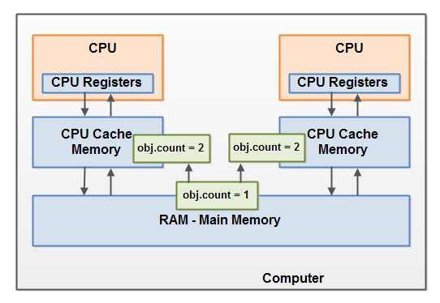

# Java Memory Model
Java memory model (mô hình bộ nhớ của Java) quy định cách thức mà máy ảo Java làm việc với bộ nhớ của máy tính (RAM). Máy ảo Java là mô hình của cả một chiếc máy tính nên đương nhiên nó cũng kèm theo một mô hình bộ nhớ của riêng nó.

Việc hiểu rõ được mô hình này là rất quan trọng trong việc lập trình đa luồng. Mô hình bộ nhớ của Java quy định cách thức và thời điểm mà những thread khác nhau có thể nhìn thấy được những giá trị của các biến dùng chung khi nó được thay đổi bởi các thread khác, và làm thế nào để đồng bộ hoá việc truy cập đến các biến dùng chung này khi cần thiết.

Do mô hình này ban đầu chưa được hoàn thiện, nó đã được cải tiến lại ở Java 1.5 và cho đến hiện nay vẫn còn đang được sử dụng trong Java 8.
Mô hình bộ nhớ nội bộ trong Java

Mô hình bộ nhớ được dùng trong máy ảo Java phân chia bộ nhớ giữa các thread stack và heap. Hình dưới đây minh hoạ mô hình này:


Mỗi thread chạy trong máy ảo Java có thread stack của riêng nó. Thread stack này chứa thông tin về những hàm nào thread cần phải gọi để đến được điểm thực thi hiện tại. Tôi sẽ gọi nó là "call stack". Khi mà thread thực thi code của nó, call stack sẽ thay đổi theo.

Thread stack cũng chứa cả những biến local của từng hàm đang được thực thi (tất cả các hàm trong call stack). Một thread chỉ có thể truy cập thread stack của chính nó. Biến local được tạo ra bởi một thread sẽ không thể được nhìn thấy bởi các thread khác. Kể cả khi 2 thread đang thực thi một đoạn code giống nhau, chúng sẽ đều tự tạo ra những biến local của đoạn code đấy trong thread stack của riêng chúng. Do đó, mỗi thread có 1 phiên bản của từng biến local trong hàm.

Tất cả những biến local thuộc kiểu nguyên thuỷ (boolean, byte, short, char, int, long, float, double) đều được chứa trong thread stack và do đó chúng không thể bị nhìn thấy bởi các thread khác. Một thread có thể đưa một bản copy của biến nguyên thuỷ cho 1 thread khác, nhưng nó không thể share chính cái biến đó được.

Heap thì chứa tất cả các object được tạo trong 1 chương trình Java, không quan trọng việc thread nào tạo những object đó. Cái này bao gồm cả những phiên bản object của kiểu nguyên thuỷ (Boolean, Integer,...). Việc 1 object được tạo và assign cho 1 biến local, hay được tạo như 1 member của 1 object khác cũng không quan trọng, object đó vẫn được chứa trong heap.

Dưới đây là diagram minh hoạ call stack và biến local được lưu trong thread stack, và object được lưu trong heap:


Một biến local có thể thuộc kiểu nguyên thuỷ, trong trường hợp đó thì nó hoàn toàn được lưu trong thread stack.

Một biến local cũng có thể là 1 tham chiếu đến một object. Trong trường hợp đó tham chiếu được lưu trong thread stack, nhưng object được tham chiếu đến vẫn được lưu trong heap.

Một object cũng có thể có chứa nhiều hàm và các hàm đó cũng có thể có những biến local. Những biến local đó cũng được lưu trong thread stack, kể cả khi object chứa những hàm đó được lưu trong heap.

Các biến trong 1 object được lưu trong heap cùng với object đó. Điều này đúng trong 2 trường hợp nếu biến đó thuộc kiểu nguyên thuỷ, hay nếu biến đó là 1 tham chiếu đến object khác.

Object trong heap có thể được truy cập bởi mọi thread có tham chiếu đến object đó. Khi 1 thread có thể truy cập đến 1 object, nó cũng có truy cập đến các biến thuộc object đó. Nếu 2 thread đồng thời gọi 1 hàm thuộc 1 object, cả 2 đều sẽ có khả năng truy cập các biến thuộc object đó, nhưng mỗi thread sẽ có 1 bản copy riêng của những biến local.

Dưới đây là 1 diagram minh hoạ quan điểm trên:


2 thread có 1 loạt các biến local. 1 trong các biến đó (Local Variable 2) trỏ đến 1 object dùng chung trong heap (Object 3). Cả 2 thread đều có những tham chiếu với giá trị khác nhau đến cùng 1 object. Tham chiếu đó là biến local và do đó được lưu trong thread stack của mỗi thread. Tuy 2 biến local này là khác nhau nhưng nó vẫn trỏ đến 1 object.

Chú ý là object dùng chung (Object 3) có tham chiếu đến Object 2 và Object 4 như các biến thuộc về nó. Thông qua những tham chiếu đến các biến này, cả 2 thread trên đều có thể truy cập Object 2 và Object 4.

Diagram này cũng có 1 biến local trỏ đến 2 object khác nhau trong heap. Trong trường hợp này tham chiếu trỏ đến 2 object khác nhau (Object 1 và Object 5), không phải là cùng 1 object. Theo lý thuyết thì cả 2 thread đều có thể truy cập cả Object 1 và Object 5, nếu cả 2 thread có tham chiếu đến 2 object đó. Nhưng theo như diagram trên thì mỗi thread chỉ có tham chiếu đến 1 trong 2 object.

Vậy thì code kiểu gì mà có thể tạo ra memory graph như trên? Chỉ đơn giản thế này thôi:

```java
public class MyRunnable implements Runnable() {

    public void run() {
        methodOne();
    }

    public void methodOne() {
        int localVariable1 = 45;

        MySharedObject localVariable2 =
            MySharedObject.sharedInstance;

        //... làm thêm gì đó với biến local

        methodTwo();
    }

    public void methodTwo() {
        Integer localVariable1 = new Integer(99);

        //... làm thêm gì đó với biến local
    }
}

public class MySharedObject {

    //biến static trỏ đến instance của MySharedObject

    public static final MySharedObject sharedInstance =
        new MySharedObject();


    //các biến trỏ đến 2 object trong heap

    public Integer object2 = new Integer(22);
    public Integer object4 = new Integer(44);

    public long member1 = 12345;
    public long member1 = 67890;
}
```

Nếu 2 thread cùng chạy hàm run() thì kết quả sẽ là diagram ở trên kia. Hàm run() gọi đến methodOne() và methodOne() gọi đến methodTwo().

methodOne() định nghĩa ra 1 biến local thuộc kiểu nguyên thuỷ (localVariable1 thuộc kiểu int) và 1 biến local là tham chiếu đến object (localVariable2).

Mỗi thread chạy hàm run() sẽ tạo riêng phiên bản copy của localVariable1 và localVariable2 trên thread stack tương ứng. Các biến localVariable1 sẽ hoàn toàn không liên quan đến nhau, và chỉ tồn tại trên thread stack của từng thread. Cả 2 thread sẽ không thể nhìn thấy thread kia thay đổi bản copy của biến localVariable1.

Mỗi thread chạy hàm run() cũng sẽ tạo riêng cho mình phiên bản copy của localVariable2. Tuy vậy thì 2 bản copy của localVariable2 vẫn trỏ đến cùng 1 object trong heap. Đoạn code làm cho localVariable2 trỏ đến 1 object được tham chiếu bởi 1 biến static. Chỉ có duy nhất 1 phiên bản của biến static này và nó được lưu trong heap. Do đó, cả 2 bản copy của localVariable2 đều trỏ đến cùng 1 instance của MySharedObject, object mà được trỏ đến bởi biến static. Instance MySharedObject cũng được lưu trong heap. Nó tương ứng với Object 3 ở diagram phía trên.

Chú ý là class MySharedObject cũng chứa 2 biến, và 2 biến này cũng được lưu trong heap cùng với object. 2 biến này trỏ đến 2 object Integer khác. 2 object Integer này tương ứng với Object 2 và Object 4 trong diagram trên.

Cũng chú ý là methodTwo() tạo ra 1 biến local là localVariable1. Biến local này là 1 tham chiếu đến object Integer. Hàm này sẽ set tham chiếu localVariable1 để trỏ đến 1 instance mới của Integer. localVariable1 sẽ được lưu thành 1 bản copy với mỗi thread chạy hàm methodTwo(). 2 object Integer sẽ được lưu trong heap, nhưng vì hàm này tạo ra 1 object Integer mới mỗi khi nó chạy, cho nên 2 thread cùng chạy hàm này sẽ tạo ra những instance khác nhau của Integer. Những object Integer được tạo trong methodTwo() tương ứng với Object 1 và Object 5 trong diagram trên.

Thêm nữa là 2 biến thuộc class MySharedObject có kiểu là long, cũng là 1 kiểu nguyên thuỷ. Do những biến này là biến thành viên, nó vẫn được lưu trong heap cùng với object cha. Chỉ có biến local mới được lưu trong thread stack.
Cấu trúc bộ nhớ phần cứng

Cấu trúc bộ nhớ phần cứng hiện đại cũng có phần nào đó khác với mô hình bộ nhớ của Java. Đây cũng là 1 kiến thức quan trọng mà chúng ta cần biết để hiểu được cách mà mô hình bộ nhớ của Java làm việc với cấu trúc này. Phần này sẽ đề cập đến cấu trúc bộ nhớ phần cứng phổ thông và tương tác giữa nó với mô hình bộ nhớ của Java.

Dưới đây là diagram đơn giản về cấu trúc phần cứng của 1 máy tính hiện đại:


Ngày nay thì 1 máy tính thường có 2 hoặc nhiều hơn CPU. Một vài CPU trong số đó cũng có thể có nhiều nhân. Mấu chốt là trong 1 máy tính hiện đại với 2 hoặc nhiều hơn CPU, chúng ta có thể có nhiều hơn 1 thread chạy cùng lúc. Mỗi CPU có khả năng chạy 1 thread trong 1 khoảng thời gian bất kì. Điều đó có nghĩa là nếu ta có 1 ứng dụng đa luồng, mỗi CPU có thể có 1 thread chạy đồng thời trong ứng dụng đó.

Mỗi CPU chứa 1 bộ các thanh ghi mà cơ bản chúng là bộ nhớ trong của CPU. CPU có thể thực hiện các tính toán một cách cực kì nhanh trên các thanh ghi này so với việc chúng thực hiện trên các biến trong bộ nhớ chính. Sở dĩ có điều này bởi vì CPU có thể truy cập những thanh ghi này nhanh hơn nhiều so với việc truy cập vào bộ nhớ chính.

Mỗi CPU cũng có thể có 1 bộ nhớ đệm. Thật ra thì hầu hết các CPU hiện đại ngày nay đều có 1 bộ nhớ đệm, vấn đề chỉ là kích thước bao nhiêu mà thôi. CPU có thể truy cập bộ nhớ đệm của nó nhanh hơn rất nhiều so với truy cập vào bộ nhớ chính, nhưng thường thì không nhanh bằng việc truy cập vào bộ nhớ trong của nó (thanh ghi). Vậy nên tốc độ của bộ nhớ đệm nằm trong khoảng giữa tốc độ của thanh ghi và tốc độ của bộ nhớ chính. Một vài CPU còn có thể có nhiều bộ đệm (L1 và L2), nhưng không cần thiết phải tìm hiểu nó đối với scope của bài viết này. Chúng ta chỉ cần biết là CPU có thể có một kiểu bộ nhớ đệm nào đó là được.

Một máy tính cũng có thể chứa 1 vùng bộ nhớ chính (RAM). Mọi CPU đều có thể truy cập đến bộ nhớ này. Bộ nhớ chính thường lớn hơn rất nhiều so với bộ nhớ đệm của CPU.

Thường thì khi 1 CPU cần truy cập vào bộ nhớ chính, nó sẽ đọc 1 phần bộ nhớ đó vào bộ đệm của CPU. Nó còn có thể đọc 1 phần của bộ đệm vào các thanh ghi và sau đó thực hiện các tính toán và xử lý trên đó. Khi CPU cần phải lưu lại kết quả lại trong bộ nhớ chính, nó sẽ gửi giá trị từ thanh ghi tới bộ nhớ đệm, và đến một lúc nào đó thì gửi từ bộ nhớ đệm tới bộ nhớ chính.

Các giá trị được lưu trong bộ nhớ đệm được gửi tới bộ nhớ chính khi mà CPU cần phải lưu những thứ khác trong bộ nhớ đệm. Bộ nhớ đệm có thể lưu dữ liệu hay gửi dữ liệu vào từng phần 1 trong bộ nhớ của nó. Nó không cần phải đọc hay ghi tất cả bộ đệm mỗi khi nó được cập nhật. Thường thì bộ đệm được cập nhật trong những khối bộ nhớ nhỏ gọi là cache line. Một hoặc nhiều cache line có thể được tải vào trong bộ nhớ đệm, và 1 hoặc nhiều cache line có thể được ghi trở lại bộ nhớ chính.

## Thu hẹp khoảng cách giữa mô hình bộ nhớ của Java và cấu trúc bộ nhớ phần cứng

Như đã nói ở trên thì mô hình bộ nhớ của Java và cấu trúc bộ nhớ phần cứng là 2 khái niệm khác nhau. Cấu trúc bộ nhớ phần cứng không phân biệt giữa thread stack và heap. Trong phần cứng thì cả thread stack và heap được cấp phát trong bộ nhớ chính. Một phần của thread stack và heap cũng có thể xuất hiện trong bộ nhớ đệm hay thanh ghi. Nó được miêu tả trong diagram dưới đây:


Khi mà object và biến được lưu trong nhiều vùng bộ nhớ khác nhau trong máy tính, một số vấn đề có thể xảy ra. 2 vấn đề chính là:

1. Khi nào thì việc cập nhật các biến dùng chung có thể được nhìn thấy bởi các thread khác.
2. Race condition khi đọc, kiểm tra và ghi biến dùng chung.

2 vấn đề này sẽ được giải thích ở phần dưới đây.

## Visibility của biến dùng chung

Nếu 2 hoặc nhiều hơn thread đang dùng chung 1 object, nếu chúng ta không sử dụng volatile hay synchronization thì thread này có thể sẽ không nhìn thấy thread kia thay đổi giá trị của object đó.

Thử tưởng tượng rằng ban đầu object dùng chung này được lưu trong bộ nhớ chính. Sau đó một thread chạy trên CPU 1 đọc object đó vào bộ nhớ đệm của nó. Tại đây nó thực hiện tính toán và thay đổi giá trị của object này. Cho đến khi bộ nhớ đệm của CPU được gửi trả kết quả lại cho bộ nhớ chính, phiên bản đã thay đổi của object dùng chung sẽ không được nhìn thấy bởi bất kì 1 thread nào đang chạy trên những CPU khác. Điều này có thể gây ra việc mỗi thread có 1 bản copy riêng của object dùng chung, và mỗi bản copy thì tồn tại trên một bộ nhớ đệm khác nhau.

Diagram dưới đây phác hoạ sơ qua tình huống này. Một thread chạy trên CPU bên trái copy object dùng chung vào bộ nhớ đệm CPU của nó, và đổi giá trị của biến count thành 2. Thay đổi này không được nhìn thấy bởi các thread chạy trên CPU bên phải, bởi vì thay đổi tới biến count chưa được ghi lại vào bộ nhớ chính.


Để xử lý vấn đề này, chúng ta có thể sử dụng keyword volatile. Keyword này sẽ đảm bảo việc một biến được cho sẽ được đọc trực tiếp từ bộ nhớ chính, và luôn luôn được ghi vào bộ nhớ chính khi có thay đổi.

## Race Conditions

Khi 2 hay nhiều thread dùng chung 1 object, và nhiều hơn 1 thread thay đổi giá trị của biến nằm trong object đó, race condition có thể xảy ra.

Thử tưởng tượng là thread A đọc giá trị của biến count của object dùng chung vào bộ nhớ đệm. Thread B cũng làm điều tương tự, nhưng lại trong 1 bộ nhớ đệm khác. Giờ thì thread A cộng 1 vào biến count, và thread B cũng làm thế. Lúc đó thì var1 đã được tăng 2 lần, mỗi lần trên 1 bộ nhớ đệm riêng.

Nếu những thay đổi này xảy ra lần lượt, thì biến count sẽ được tăng tổng cộng là 2 lần và có giá trị ban đầu +2 sau đó được lưu vào bộ nhớ chính.

Tuy vậy, những thay đổi đó lại xảy ra đồng thời mà không có bất kì xử lý đồng bộ nào. Không quan trọng là thread A hay B ghi lại giá trị của biến count vào bộ nhớ chính, giá trị sau khi thay đổi chỉ tăng 1 so với giá trị ban đầu dù đáng lẽ nó phải tăng 2.

Diagram dưới đây mô tả tình huống này khi race condition xảy ra:



Để giải quyết vấn đề này, chúng ta có thể dùng block synchonized của Java. Một block synchronized sẽ đảm bảo là chỉ có 1 thread được truy cập vào critical section đã cho trong 1 thời điểm. Block synchronized cũng đảm bảo việc tất cả các biến được truy cập trong block này sẽ được đọc từ bộ nhớ chính, và khi thread rời khỏi block thì mọi thay đổi tới các biến sẽ được ghi vào bộ nhớ chính, không quan trọng việc biến đó có được định nghĩa là volatile hay không.

Bài viết được dịch từ Java Memory Model của tác giả Jakob Jenkov.