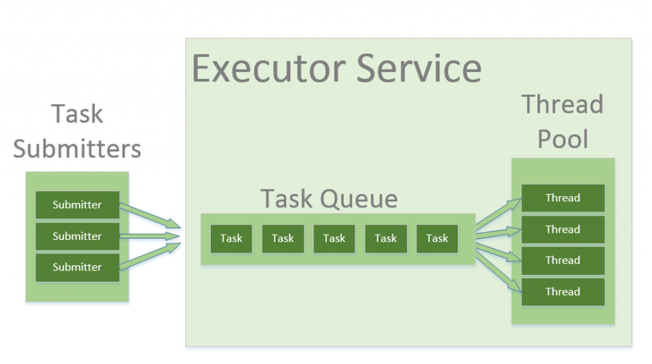
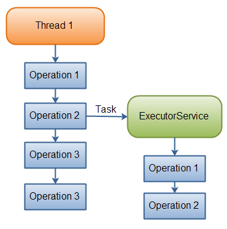
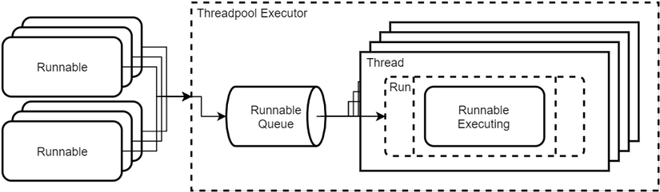

# Thread Pools Trong Java
## I, Giới thiệu
ThreaPool trong java rất hữu ích khi cần giới hạn số lượng Thread được chạy bên trong ứng dụng của bạn cùng 1 thời điểm. Sẽ có vấn đề về hiệu suất khi tạo mới 1 Thread (new Thread) và mỗi thread được tạo ra cũng được phân bổ bộ nhớ cho việc sử dụng.

Ví dụ: Bạn có 100 tập tin cần tải về từ trên mạng, mỗi tệp tin bạn cần 1 thread để download, như vậy sẽ có 100 thread hoạt động cùng 1 thời điểm trong ứng dụng của bạn, sẽ gây ra 1 vấn đề nghiêm trọng về bộ nhớ và hiệu suất và có thể dẫn đến gây lỗi (crash) chương trình.

Thay vì phải tạo mới thread cho mỗi task (nhiệm vụ) được thực hiện đồng thời, các nhiệm vụ cần đưa vào 1 thread pool (hồ bơi dành cho luồng). Và ngay sau khi trong hồ bơi có bất kì luồng nào đang nhàn rỗi (no task) các nhiệm vụ sẽ được gán vào 1 trong số chúng và được thực thi.

Bên trong ThreadPool các nhiệm vụ được chèn vào một Blocking Queue (hàng đợi được khóa) nơi mà các Thread sẽ lấy chúng ra và thực thi lần lượt. Mỗi khi có 1 task mới được thêm vào Queue, sau đó chỉ có 1 thread nhàn rỗi sẽ vào queue và lấy chúng ra, các thread nhàn rỗi còn lại phải chờ sau khi thread trước đó lấy nhiệm vụ ra thành công.

Thread Pool thường xuyên được sử dụng trong các máy chủ thực hiện đa luồng. Mỗi kết nối đến với máy chủ thông qua mạng được bao bọc như là 1 nhiệm vụ (task) và đưa vào thread pool. Các thread trong thread pool sẽ xử lý các yêu cầu về kết nối đồng thời.

<p>Trong <strong>Java 5</strong> Thread Pool đã được xây dựng sẵn (build-in) các lớp trong gói <strong><em>java.util.concurrent</em></strong>, vì vậy bạn không cần triển khai ThreadPool của riêng bạn. Thay vào đó chúng ta cùng đi nghiên cứu về các sử dụng của lớp <strong><em>java.util.concurrent.ExecutorService</em></strong>.</p>

## II, ExecutorService
<p>Kể từ Java 5 trở đi, ThreadPool đã được xây dựng sẵn trong gói <em>java.util.concurrent,</em> vì vậy chúng ta không cần phải tạo một <strong>ThreadPool</strong> mà thay vào đó chúng ta sẽ sử dụng các lớp có sẵn của gói này. Java cung cấp cho chúng ta lớp Executor, interface của lớp Executor là <strong>ExecutorService</strong>. Interface ExecutorService đại diện cho cơ chế thực thi bất đồng bộ có khả năng thực thi các nhiệm vụ trong background.  ExecutorService là một đối tượng chịu trách nhiệm quản lý các luồng và thực hiện các tác vụ Runnable được yêu cầu xử lý. Nó tách riêng các chi tiết của việc tạo Thread, lập kế hoạch (scheduling), … để chúng ta có thể tập trung phát triển logic của tác vụ mà không quan tâm đến các chi tiết quản lý Thread.


<p>Giao diện (interface) <em>java.util.concurrent.ExecutorService</em> đại diện cho cơ chế thực thi bất đồng bộ có khả năng thực thi các nhiệm vụ trong background (nền). <strong>ExecutorService</strong> là tương tự như một Thread Pool. Trong thực tế, việc thực hiện ExecutorService trong gói là một triển khai thread pool.</p>

### 1. Ví dụ
Khi chúng ta viết chương trình tải các tập tin từ Internet, mỗi tập tin cần 1 Thread để thực hiện quá trình tải, giả sử cần tải 10000 tệp âm thanh thì chúng ta phải cần tới 10000 Thread hoạt động cùng một thời điểm trong cùng một chương trình. Điều này sẽ dễ dẫn đến lỗi quá tải của chương trình, làm ảnh hưởng đến bộ nhớ và hiệu suất của chương trình sẽ rất dễ dẫn đến bị crash vì khó kiểm soát.

Vì vậy, để khắc phục hiện tượng này, Java cho phép chúng ta thay vì phải tạo mới Thread cho mỗi nhiệm vụ, quá trình được thực hiện trong cùng một thời điểm thì các nhiệm vụ, quá trình đó có thể được đưa vào trong một ThreadPool để khi trong ThreadPool có bất kỳ Thread nào đang không phải thực hiện một nhiệm vụ nào thì sẽ có nhiệm vụ gán vào một trong số các Thread đó để thực thi. Điều này sẽ giúp khắc phục được sự tắc nghẽn và chương trình sẽ kiểm soát được các luồng thực thi.

Bên trong ThreadPool, các nhiệm vụ sẽ được chèn vào trong một Blocking Queue. Blocking Queue có thể hiểu là nơi chứa các nhiệm vụ mà các Thread sẽ lấy chúng ra và thực thi lần lượt. Mỗi khi có một nhiệm vụ mới được thêm vào Queue và sau đó sẽ chỉ có một Thread đang không phải thực hiện một nhiệm vụ nào vào Queue lấy nhiệm vụ đó ra, còn các Thread còn lại phải chờ đợi cho đến khi Thread đó lấy nhiệm vụ ra thành công.

Sau đây là 1 ví dụ đơn giản về Java ExecutorService:

```java
ExecutorService executorService = Executors.newFixedThreadPool(10);

executorService.execute(new Runnable() {
    public void run() {
        System.out.println("Asynchronous task");
    }
});

executorService.shutdown();
```
Đầu tiên, ExecutorService là được tạo bằng cách sử dụng phương thức newFixedThreadPool(). Việc này tạo ra 1 thread pool với 10 thread dành cho việc thực thi các nhiệm vụ.

Tiếp đó, một triển khai của giao diện Runnable được đưa vào phương thức execute() như 1 nhiệm vụ. Điều này làm cho Runnable được thực thi bởi một trong các thread có trong ExcutorService.

### 2. Task Delegation (Sự ủy thác nhiệm vụ)
Dưới đây là một sơ đồ minh họa một thread ủy thác 1 nhiệm vụ tới ExecutorService cho việc thực thi bất đồng bộ:



Một khi Thread giao nhiệm vụ cho ExecutorService, nó sẽ tiếp tục thực hiện công việc riêng của nó độc lập với việc thực thi nhiệm vụ của ExecutorService.

## III. Triển khai ExecutorService
Sau đây là tạo ExecutorService và cách sử dụng các phương thức của nó.

### 3.1 Tạo ra 1 ExecutorService
Ta có thể tạo các thread pool thông qua ExecutorService, các “tác vụ” (task) sẽ gửi vào pool và sẽ được sử lý bằng một trong những phương thức mà Executor cung cấp như sau:

* Single Thread Executor : Trong ThreadPool chỉ có 1 Thread và các task sẽ được sử lý một cách tuần tự. Tên method “newSingleThreadExecutor()”

* Cached ThreadPool : Trong ThreadPool sẽ có rất nhiều Thread, và các task sẽ được sử lý một cách song song. Các Thread cũ sau khi sử lý xong sẽ được sử dụng lại cho tác vụ mới. Mặc định nếu một Thread không được sử dụng trong vào 60 giây thì Thread đó sẽ được hủy (shut down). Tên method “newCachedThreadPool()”

* Fixed Thread Pool : Trong ThreadPool sẽ được cố định (fixed) số lượng các Thread. Nếu một task mới được đưa vào mà các thread đều đang “bận rộn” thì task đó sẽ được gửi vào Blocking Queue và ngay sau khi một Thread đã thực thi xong nhiệm vụ của nó thì nhiệm vụ đang ở trong Queue đó sẽ được push ra khỏi Queue và được Thread đó xử lý tiếp. Method “newFixedThreadPool()”

* Scheduled Thread Pool : Tương tự như “Cached Thread Pool” nhưng sẽ có khoảng delay giữa các Thread. Method “newScheduledThreadPool()”

* Single Thread Scheduled Pool : Tương tự như “Single Thread Executor” nhưng sẽ có khoảng delay giữa các Thread. Method “newSingleThreadScheduledExecutor()”

Bạn có thể sử dụng lớp Executors (factory class) trong gói java.util.concurrent để tạo ra 1 thể hiện của ExecutorService. Dưới đây là 1 vài ví dụ cho việc tạo một ExecutorService:

```java
ExecutorService executorService1 = Executors.newSingleThreadExecutor();

ExecutorService executorService2 = Executors.newFixedThreadPool(10);

ExecutorService executorService3 = Executors.newScheduledThreadPool(10);
```
### 3.2 Cách sử dụng ExecutorService
Có một vài cách khác nhau để giao nhiệm vụ tới một ExecutorService:

```java
execute(Runnable)
submit(Runnable)
submit(Callable)
invokeAny(...)
invokeAll(...)
```

Sau đây là cách sử dụng các phương thức trên và tác dụng của chúng:

```java
execute(Runnable)
```

Phươngthức execute(Runnable) đưa vào một đối tượng java.lang.Runnable và thực thi chúng bất đồng bộ. Đây là một ví dụ cho việc thực thi a Runnable với một ExcutorService:

```java
ExecutorService executorService = Executors.newSingleThreadExecutor();

executorService.execute(new Runnable() {
    public void run() {
        System.out.println("Asynchronous task");
    }
});

executorService.shutdown();

```

Với việc sử dụng phương thức này không có cách nào để thu được kết quả của việc thực hiện Runnable (k có callback hoặc giá trị trả về khi thực hiện xong nhiệm vụ). Bạn sẽ phải sử dụng 1 Callable cho việc đó. Xem submit(Callable).

>submit(Runnable) 

Phương thức submit(Runnable) cũng đưa vào 1 Runnable nhưng nó trả về một đối tượng Future. Đối tượng Future có thể được sử dụng để kiểm tra nếu Runnable đã hoàn tất việc thực thi.

```java
Future<T> future = executorService.submit(new Runnable() {
    public void run() {
        System.out.println("Asynchronous task");
    }
}, T.class);

future.get(); // Trả về đối tượng T mà bạn truyền vào, dựa vào đây xác đây nhiệm đã hòan tất
```

>submit(Callable) 

Phương thức submit(Callable) tương tự như submit(Runnable) ngoại trừ việc hàm call() của nó cần 1 giá trị trả về để xác định kết quả thu được sau khi hòan thành nhiệm vụ còn phương thức Runnable.run() không thể trả lại kết quả.

Kết quả của Callable có thể thu được thông qua đối tượng Future được trả về bởi phương thức submit(Callable). Dưới đây là ví dụ:

```java
Future<T> future = executorService.submit(new Callable(){
    public Object call() throws Exception {
        System.out.println("Asynchronous Callable");
        return T;
    }
});

System.out.println("future.get() = " + future.get()); // Return T object (callable result)
```

Sử dụng phương thức future.get() để thu được kết quả. Chú ý phương thực này được thực thi đồng bộ (Asynchronous - tức là sau khi callable hòan thành nhiệm vụ kết quả được trả về nó mới được thực thi).

>invokeAny(Collection<?> extends Callable<T> tasks)

Phương thức invokeAny() nhận một tập hợp (collection) của các đối tượng Callable hoặc các lớp được kế thừa từ Callable chúng. Gọi phương thức này không trả về một Future, nhưng trả về kết quả của một trong những đối tượng Callables. Bạn không đảm bảo về kết nào bạn sẽ nhận được từ callable. Chỉ cần một trong số chúng hòan thành (Tức là ko cần tất cả các thread hòan thành, chỉ cần 1 task hòan thành phương thức get() sẽ nhận được kết quả.

Nếu 1 trong số task hòan thành (hoặc ném ra 1 ngoại lệ), phần còn lại của Callable sẽ được hủy bỏ (cancelled).

Đây là ví dụ:

```java
ExecutorService executorService = Executors.newSingleThreadExecutor();

Set<Callable<String>> callables = new HashSet<Callable<String>>();

callables.add(new Callable<String>() {
    public String call() throws Exception {
        return "Task 1";
    }
});
callables.add(new Callable<String>() {
    public String call() throws Exception {
        int b = 3 / 0;
        return "Task 2";
    }
});
callables.add(new Callable<String>() {
    public String call() throws Exception {
        return "Task 3";
    }
});

String result = executorService.invokeAny(callables);

System.out.println("result = " + result);

executorService.shutdown();
```

Đoạn mã trên sẽ in ra các kết quả được trả về từ 1 trong những Callable trong tập hợp. Chạy nó vài lần bạn sẽ nhận được những kết quả khác nhau. Thỉnh thoảng là “Task 1” hoặc “Task 3”.

>invokeAll(Collection<?> extends Callable<T> tasks) 

Phương thức invokeAll() gọi tất cả đối tượng Callable bạn đẩy vào trong tập hợp. Phương thức này trả về 1 danh sách các đối tượng Future (list of Future) mà được trả về từ việc thực thi các Callables.

Hãy nhớ rằng một công việc có thể hòan thành do một ngoại lệ, vì vậy có nghĩa nó có thể không “thành công” nhiệm vụ. Không có cách nào để biết sự khác biệt trên đối tượng Future.

```java
ExecutorService executorService = Executors.newSingleThreadExecutor();

Set<Callable<String>> callables = new HashSet<Callable<String>>();

callables.add(new Callable<String>() {
    public String call() throws Exception {
        return "Task 1";
    }
});
callables.add(new Callable<String>() {
    public String call() throws Exception {
        return "Task 2";
    }
});
callables.add(new Callable<String>() {
    public String call() throws Exception {
        return "Task 3";
    }
});

List<Future<String>> futures = executorService.invokeAll(callables);

for(Future<String> future : futures){
    System.out.println("future.get = " + future.get());
}

executorService.shutdown();
```
## IV. ThreadPoolExecutor



<p>Ở đây chúng ta có thể thấy rằng các đối tượng <strong>ThreadPool Executor</strong> chấp nhận Runnable và đặt nó vào một <strong>Runnable Queue</strong>. Hàng đợi này đại diện cho tất cả các nhiệm vụ được gửi để được thực thi bởi Threadpool. Bản thân <strong>ThreadPool</strong> nó là một chuỗi các luồng đang chờ để kéo Runnables ra khỏi hàng đợi và thực hiện chúng theo các  phương thức run() riêng của chúng .
Khi ThreadPool running, hay nói cách khác, các luồng trong ThreadPool vẫn còn sống và sẵn sàng thực thi runnables. Khi có một Runnable mới trong hàng đợi, một trong các luồng sẽ kéo nó ra và gọi  phương thức run()  của Runnable.</p>

### 4.1. Ví dụ
Ví dụ dưới đây sẽ minh họa cách tạo ThreadPool bằng cách sử dụng ThreadPoolExecutor:

```java
public class Run implements Runnable{
    int id;
      
    public Run(int id) {
        this.id = id;
    }
    
    @Override
    public void run() {
        System.out.println("Tiến trình đang được thực thi " + id);
        try {
            Thread.sleep(1000);
        } catch (InterruptedException e) {
            e.printStackTrace();
        }
        System.out.println("Tiến trình đã được thực thi" + id);
    }
}
```

```java
public class TestThreadPool {
    public static void main(String[] args) {
        int corePoolSize = 5;
        int maximumPoolSize = 10;
        long keepAliveTime = 500;
        TimeUnit unit = TimeUnit.SECONDS;
        
        ArrayBlockingQueue<Runnable> workQueue = new ArrayBlockingQueue<>(100);
        
        RejectedExecutionHandler handler = new ThreadPoolExecutor.CallerRunsPolicy();
        
        ThreadPoolExecutor threadPoolExecutor = new ThreadPoolExecutor(corePoolSize,
                maximumPoolSize, keepAliveTime, unit, workQueue, handler);
         for (int i = 0; i < 10; i++) {
            threadPoolExecutor.execute(new Run(i));
        }
    }
}
```
### 4.2. Cách hoạt động của ThreadPoolExecutor
Giải thích hoạt động của chương trình trên

Trong dòng code khởi tạo ThreadPoolExecutor:

```java
ThreadPoolExecutor threadPoolExecutor = new ThreadPoolExecutor(corePoolSize, maxPoolSize, keepAlive, unit, workQueue, handler);
```

chúng ta có 6 tham số:

* Đối số 1: (corePoolSize) là số lượng Thread tối thiểu trong ThreadPool. Khi khởi tạo, số lượng Thread có thể là 0. Khi nhiệm vụ được thêm vào thì Thread mới được tạo ra và kể từ đây, nếu số lượng Thread ít hơn corePoolSize thì những Thread mới sẽ được tạo ra đến khi số Thread bằng giá trị của corePoolSize.
* Đối số 2: (maximumPoolSize) là số lượng tối đa các Thread trong ThreadPool.
* Đối số 3: (keepAliveTime): khi số Thread lớn hơn corePoolSize thì keepAliveTime là thời gian tối đa mà 1 Thread "nhàn rỗi" chờ nhiệm vụ. Khi hết thời gian chờ mà Thread đó chưa có nhiệm vụ thì nó sẽ bị hủy.
* Đối số 4: (unit) là đơn vị thời gian của keepAliveTime. Trong ví dụ này thì unit của tôi là TimeUnit.SECONDS.
* Đối số 5: (workQueue) là hàng đợi dùng để chứa các nhiệm vụ mà các Thread sẽ lấy chúng ra và thực thi lần lượt, ở đây tôi dùng ArrayBlockingQueue.
* Đối số 6: (handler): Hành động khi một request (task) bị từ chối (rejected)

Ở đây bạn có thể thấy mình sử dụng ThreadPoolExecutor.CallerRunsPolicy, đây là một trong số các error handler rất hay của ThreadPoolExecutor, chúng ta hãy cùng tìm hiểu: CallerRunsPolicy: Đây là một error handler được gọi đến khi một task vì lý do gì đó bị từ chối (có thể là do queue trong Thread pool đã đầy …), nó sẽ được chạy lại bởi một thread mới khác (khi ThreadPool có một thread đang rảnh rỗi), trừ khi executor đã bị shutdown, hoặc task đó đã bị hủy. Có nghĩa là khi sử dụng CallerRunsPolicy bạn sẽ không bao giờ sợ chương trình lỡ một một task được gửi đi mà không được sử lý. Ngoài ra ta cũng có thể dùng các “policy” cho RejectedExecutionHandler như sau:

* ThreadPoolExecutor.AbortPolicy: Khi một task bị từ chối chương trình sẽ throw ra một runtime RejectedExecutionException.
* ThreadPoolExecutor.DiscardPolicy: Khi một task bị từ chối nó đơn gian là sẽ bị “bỏ qua” (discard), lỗi lầm gì đó cũng sẽ không bị throw ra.
* ThreadPoolExecutor.DiscardOldestPolicy: Khi một task bị từ chối, chương trình sẽ hủy task “cũ nhất” (oldest) trong queue mà chưa được sử lý, sau đó gửi task vừa bị từ chối vô queue và cố gắng sử lý lại task đó.

## V. Cách kết thúc ExecutorService

### shutdown() 
Khi bạn đã thêm vào các nhiệm vụ cần thiết bạn nên tắt ExcutorService bằng phương thức shutdown(). Khi bạn gọi phương thức này có nghĩa ExcutorService sẽ từ chối nhận thêm các nhiệm vụ (Task), và một khi tất cả các nhiệm vụ đã được thêm vào trước đó đã hòan thành. Sau đó Executor sẽ được tắt (Có nghĩa tất cả các task được thêm vào trước khi gọi shutdown() đều sẽ được thực thi).

Dưới đây là một ví dụ về cách gọi ExecutorService shutdow():

>executorService.shutdown();

### ShutdownNow() 
Nếu bạn muốn tắt ExecutorService ngay lập tức, bạn có thể gọi phương thức shutdownNow(). Điều này sẽ cố gắng ngắn chặn tất cả các nhiệm vụ ngay lập tức và loại bỏ các nhiệm vụ đã được đưa vào Queue nhưng chưa được thực thi. Không có gì đảm bảo về việc tắt các nhiệm vụ đang chạy hòan tòan, nhưng phương thức này là nỗ lực tốt nhất để tắt chúng.

Dưới đây là một ví dụ về cách gọi ExecutorService shutdowNow():

>executorService.shutdownNow();

### awaitTermination() 
Phương thức ExecutorService awaitTermination () sẽ chặn luồng gọi nó cho đến khi ExecutorService tắt hoàn toàn hoặc cho đến khi hết thời gian nhất định. Phương thức awaitTermination () thường được gọi sau khi gọi shutdown () hoặc shutdownNow ().

Dưới đây là một ví dụ về cách gọi ExecutorService awaitTermination ():

```java
executorService.shutdown();
executorService.awaitTermination();
```

>Lưu ý: Bạn nên shutdown một ThreadPool bằng cách gọi phương thức shutdown() bởi vì ta không thể chắc chắn được rằng máy ảo Java có thể tự động làm điều đó

(Gợi ý: Sử dụng phương thức shutdownNow() cũng tương tự việc sử dụng interupt() trong Thread. Để an tòan và chắc chắn hơn khi stop các nhiệm vụ đang được thực thi bạn nên thêm vào 1 biến flag chung cho các nhiệm vụ, khi bạn 1 tắt thread sử dụng kèm cả shutdownNow() và set giá trị cho biến flag khiến quá trình dừng lại).