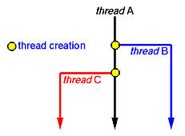
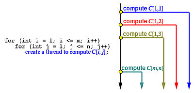
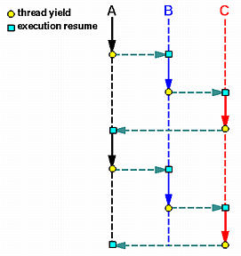

# Java Thread Tutorial: Creating Threads and Multithreading in Java
Unlike many other computer languages, Java provides built-in support for multithreading. Multithreading in Java contains two or more parts that can run concurrently. A Java thread is actually a lightweight process.

This blog will introduce you to all the Java Thread concepts which many people find tricky to use and understand. So let us get started then, shall we? 

In this Java Thread blog, I would be covering following topics:

1. What is a Java Thread?
2. The Java Thread Model
3. Multithreading in Java
4. Main Java Thread
5. How to Create a Java Thread?

You can go through this Java Threads video lecture where our Java Training expert is discussing each & every nuance of the technology.

Before we proceed with the first topic of this  Java Thread blog, consider this example:- 

Imagine a stockbroker application with lots of complex capabilities.These are few of its functions:

* To download the last stock option prices
* To check prices for warnings
* Analyze historical data for company XYZ

These are time-consuming functions. In a single-threaded runtime environment, these actions execute one after another. The next action can happen only when the previous one is finished.

Now, if a historical analysis takes half an hour, and the user selects to perform a download and check afterward, the warning may come too late to, buy or sell stock as a result. We just imagined the sort of application that cries out for multithreading. Ideally, the download should happen in the background (that is, in another thread). That way, other processes could happen at the same time so that, for example, a warning could be communicated instantly. All the while, the user is interacting with other parts of the application. The analysis, too, could happen in a separate thread, so the user can work with the rest of the application while the results are being calculated.

This is where Java thread helps. Let us understand Java Thread first:

## What is a Java Thread?

A thread is actually a lightweight process. Unlike many other computer languages, Java provides built-in support for multithreaded programming. A multithreaded program contains two or more parts that can run concurrently. Each part of such a program is called thread and each thread defines a separate path of execution. Thus, multithreading is a specialized form of multitasking.

Next concept in this Java Thread blog is integral to the concept Threads and Multithreading.

## The Java Thread Model

The Java run-time system depends on threads for many things. Threads reduce inefficiency by preventing the waste of CPU cycles.

Threads exist in several states. Following are those states:  

* New – When we create an instance of Thread class, a thread is in a new state.
* Runnable – The Java thread is in running state.
* Suspended – A running thread can be suspended, which temporarily suspends its activity. A suspended thread can then be resumed, allowing it to pick up where it left off.
* Blocked – A java thread can be blocked when waiting for a resource.
* Terminated – A thread can be terminated, which halts its execution immediately at any given time. Once a thread is terminated, it cannot be resumed.

So, this was all about the Java Thread states. Now, let us jump to most important topic of Java threads i.e. thread class and runnable interface. We will discuss these one by one below.  

## Multithreading in Java : Thread Class and Runnable Interface

Java’s multithreading system is built upon the Thread class, its methods, and its companion interface, Runnable. To create a new thread, your program will either extend Thread or implement the Runnable interface.

The Thread class defines several methods that help manage threads.The table below displays the same:

|Method|Meaning|
|---|---|
|getName	|Obtain thread’s name|
|getPriority|	Obtain thread’s priority
|isAlive	|Determine if a thread is still running
|join	|Wait for a thread to terminate
|run	|Entry point for the thread
|sleep|	Suspend a thread for a period of time
|start|	Start a thread by calling its run method

Now let us see how to use a  Thread which begins with the main java thread, that all Java programs have.
## Main Java Thread

Now let us see how to use Thread and Runnable interface to create and manage threads, beginning with the main java thread, that all Java programs have. So, let us discuss the main thread.
## Why is Main Thread so important?

* Because this thread effects the other ‘child’ threads
* Because it performs various shutdown actions
* It is created automatically when your program is started.

So, this was the main thread. Let’s see how we can create a java thread?
How to Create a Java Thread? 

Java lets you create thread in following two ways:- 

* By implementing the Runnable interface.
* By extending the Thread

Let’s see how both the ways help in implementing Java thread.

## Runnable Interface

The easiest way to create a thread is to create a class that implements the Runnable interface.

To implement Runnable interface, a class need only implement a single method called run( ), which is declared like this:

```
	
public void run( )
```
Inside run( ), we will define the code that constitutes the new thread

Example:

```java
public class MyClass implements Runnable {
public void run(){
System.out.println("MyClass running");
   } 
}
```

To execute the run() method by a thread, pass an instance of MyClass to a Thread in its constructor(A constructor in Java is a block of code similar to a method that’s called when an instance of an object is created). Here is how that is done:

```java
Thread t1 = new Thread(new MyClass ());
t1.start();
```

When the thread is started it will call the run() method of the MyClass instance instead of executing its own run() method. The above example would print out the text “MyClass running“.

## Extending Java Thread

The second way to create a thread is to create a new class that extends Thread, then override the run() method and then to create an instance of that class. The run() method is what is executed by the thread after you call start(). Here is an example of creating a Java Thread subclass:

```java
public class MyClass extends Thread {
     public void run(){
     System.out.println("MyClass running");
   }
}
```
To create and start the above thread you can do like this:

```java
MyClass t1 = new MyClass ();
T1.start();
```
When the run() method executes it will print out the text “MyClass running“.

>So far, we have been using only two threads: the main thread and one child thread. However, our program can affect as many threads as it needs. Let’s see how we can create multiple threads.

Creating Multiple Threads

```java
class MyThread implements Runnable {
String name;
Thread t;
    MyThread (String thread){
    name = threadname; 
    t = new Thread(this, name);
System.out.println("New thread: " + t);
t.start();
}
 
 
public void run() {
 try {
     for(int i = 5; i > 0; i--) {
     System.out.println(name + ": " + i);
      Thread.sleep(1000);
}
}catch (InterruptedException e) {
     System.out.println(name + "Interrupted");
}
     System.out.println(name + " exiting.");
}
}
 
class MultiThread {
public static void main(String args[]) {
     new MyThread("One");
     new MyThread("Two");
     new NewThread("Three");
try {
     Thread.sleep(10000);
} catch (InterruptedException e) {
      System.out.println("Main thread Interrupted");
}
      System.out.println("Main thread exiting.");
      }
}
```
The output from this program is shown here:

```java

New thread: Thread[One,5,main]
 New thread: Thread[Two,5,main]
 New thread: Thread[Three,5,main]
 One: 5
 Two: 5
 Three: 5
 One: 4
 Two: 4
 Three: 4
 One: 3
 Three: 3
 Two: 3
 One: 2
 Three: 2
 Two: 2
 One: 1
 Three: 1
 Two: 1
 One exiting.
 Two exiting.
 Three exiting.
 Main thread exiting.
```

This is how multithreading in java works. This brings us to the end of Java Thread blog. I hope this was informative and helpful to you. In the next blog of Java Tutorial Blog Series, you will learn about Java Collection. 

# Basic Thread Management

 There are four basic thread management operations: 
 >thread creation, thread termination, thread join, and thread yield.

## Thread Creation

We have discussed the creation of threads in a previous page. Basically, we can split the execution thread into two. After this, both threads execute concurrently. The creating thread is the parent thread, and the created thread is a child thread. Note that any thread, including the main program which is run as a thread when it starts, can create child threads at any time. In the following diagram, Thread A runs initially. Sometime later, it creates Thread B as indicated by a yellow dot. After this creation, Thread A and Thread B runs concurrently. Later on, Thread A may create one more thread Thread C. After Thread C is created, there are three threads running concurrently, all of which compete to use the CPUs. However, which thread is run at a particular time is not known to any one of them. The quicksort example discussed on a previous page employs this scheme, where Thread A receives an array segment, partitions it into two segments, creates Thread B to sort the left segment, and then creates Thread C to sort the right one. Or, after the given array segment is partitioned into two, Thread A creates Thread B to sort the left segment and sorts the right segment by itself. In this way, two threads, one parent - Thread A - and one child - Thread B - would be sufficient. 



In the matrix multiplication example, the main thread (i.e., the main program) must create a number of threads, one for each entry of the resulting matrix. A possibility is shown below. Two for statements are used to create m×n threads. We shall see more examples that dynamically create threads later. 



## Thread Termination

For most of the cases, threads are not created and run forever. After finish their work, threads terminate. In the quicksort example, after both array subsegments are sorted, the threads created for sorting them terminate. In fact, the thread that creates these two child threads terminates too, because its assigned task completes. In the merging example, the threads created to determine the position of array elements a[i] and b[j] in the merged array terminate once the final positions are computed. Similarly, in the matrix multiplication example, once the value of C[i,j] is computed, the corresponding thread terminates. In general, when the assigned task of a thread completes, the thread may be terminated.

Moreover, if the parent thread terminates, all of its child threads terminate as well. Why is this important? We briefly mentioned in a previous page that the child threads share resources with the parent thread, including variables. When the parent thread terminates, all of its variables are gone, and, as a result, the child threads will not be able to access to those resources that the parent thread owns. Thus, if the parent thread runs faster and terminates earlier than its child threads do, we have a problem! This is why we need the third thread management feature: thread join.

## Thread Join

Imagine the following scenario. You are preparing for tomorrow's final examine and feel a little hungry. So, you give your younger brother ten bucks and ask him to buy a pizza for you. In this case, you are the main thread and your brother is a child thread. Once your order is given, both you and your brother are doing their job concurrently (i.e., studying and buying a pizza). Now, we have two cases to consider. First, your brother brings your pizza back and terminates while you are studying. In this case, you can stop studying and enjoy the pizza. Second, you finish your study early and sleep (i.e., your assigned job for today - study for tomorrow's final exam - is done) before the pizza is available. Of course, you cannot sleep; otherwise, you won't have a chance to eat the pizza. What you are going to do is to wait until your brother brings the pizza back. This is exactly the problem and solution we mentioned at the end of the previous section.

Thread join is designed to solve this problem. A thread can execute a thread join to wait until the other thread terminates. In our case, you - the main thread - should execute a thread join waiting for your brother - a child thread - to terminate. In general, thread join is for a parent to join with one of its child threads. Thread join has the following activities, assuming that a parent thread P wants to join with one of its child threads C.

* When P executes a thread join in order to join with C, which is still running, P is suspended until C terminates. Once C terminates, P resumes.
* When P executes a thread join and C has already terminated, P continues as if no such thread join has ever executed (i.e., join has no effect).

A parent thread may join with many child threads created by the parent. Or, a parent only join with some of its child threads, and ignore other child threads. In this case, those child threads that are ignored by the parent will be terminated when the parent terminates.

## Thread Yield

Suppose you run a number of programs at the same time on a computer. It is possible that some CPU hogs keep eating up the CPU cycles so that other programs may hardly run. Well, this may be a problem of the scheduling policy of the operating system. However, when we write our programs with multiple threads, we have to make sure that some threads will not occupy the CPU forever, or for a very long time, without relinquishing it. Otherwise, we will end up in the situation where one or two threads keep running while the others simply wait there for their turns. That is, we run our threads in a very ``polite'' way that once a while a thread takes some rest so that the CPU can be used by other threads. This is achieved by thread yield.

When a thread executes a thread yield, the executing thread is suspended and the CPU is given to some other runnable thread. This thread will wait until the CPU becomes available again. Technically, in process scheduler's terminology, the executing thread is put back into the ready queue of the processor and waits for its next turn. The following shows an example, where a small circle indicates the execution of a thread yield, a small square means the control is transferred back, a solid arrow indicates thread execution, and a dashed line segment depicts a thread waiting for execution. Suppose we have three threads A, B and C. Initially, A is running and executes a thread yield sometime later. This causes A is suspended temporarily and the CPU is given to the next thread, say B. Then, B runs for a while and executes a thread yield. Because there are two threads that are ready to run, A and C, the thread system picks one to run. Suppose it is C. When C executes a thread join, the control may switch back to A or B; however, the diagram shows the control is given back to A. In this way, threads execute in a cooperative way. 



## Thread Suspend and Resume

Thread suspend and resume are two more thread management features. When a thread executes a thread suspend to suspend the execution of itself or another thread, the indicated thread will be suspended until the execution of a thread resume that releases the indicated thread. For example, suppose we have three threads A, B and C running concurrently. Then, thread A execute a thread suspend to suspend the execution of thread B. After this, we have only two threads A and C running concurrently. Note that even though both A and C are waiting for the completion of their own I/O activities and no thread is running, the suspended thread B cannot run. To run thread B again, one of the other threads must execution a corresponding thread resume. For example, thread C may execute a thread resume to resume thread B's execution. After this, all three threads are running concurrently.

Both thread yield and thread suspend cause the execution of a thread to be suspended. What is the difference? The difference is a big one! With thread yield, the yielding thread is put back to the ready queue and will run when its turn comes. Thus, a yielding thread is runnable if the CPU becomes free in the future, although it is suspended. With a thread suspend, the suspended thread is not in the ready queue, and, as a result, the scheduler will not be able to pick it up and let it run when the CPU becomes free. Instead, the execution of a suspended thread can be resumed only by a specific thread resume call.

Thread suspend/resume can be very useful. For example, suppose a program must handle five different tasks. The main program may create five threads, one for each task. Initially, all threads are suspended by the main program. Once a task comes, the main program just resumes the corresponding thread. After handling the task, the thread simply suspends itself. This may be more efficient that creating a new thread to handle the task and then terminating the thread. However, thread suspend and resume could post some problem. Suppose a thread acquire a lock so that it becomes the only thread that can access to a shared resource. If before the thread releases the lock, it is suspended by another thread. Should this happen, no other thread can access the shared resource until a thread resume the suspended thread for it to release the lock. Because of this potential problem, which may lead to a system deadlock, the use of thread suspend and resume is usually not recommended. Some systems such as the Pthread do not support thread suspend and resume. 